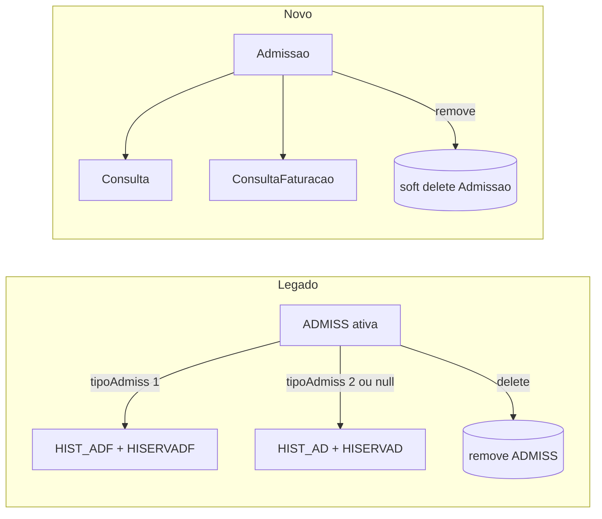

# Auditoria — Área administrativa › Consultas (legado vs novo)

Documento de referência para alinhar o **projeto novo** (`Frontend` + `Backend`) com o **legado** (`CliCloud.ASPcli`, `Dados/CliCloud.Dados.Consultas`), no âmbito do submenu **Consultas** da **Área Administrativa** (`WSMenus.asmx.cs` → `case "Consultas"`).

**Documento global (todas as áreas):** [`auditoria-legado-vs-novo-indice-global.md`](./auditoria-legado-vs-novo-indice-global.md) — incongruências transversais, Comum, Clínica, Financeira, Gestão, Aprovisionamento, inventário G01–M01.

**Data de referência:** maio 2026 (validado contra código: `AdmissaoSearchTable.cs`, rotas em `areaAdministrativa.tsx`, admissões UI).

**Última atualização:** maio 2026 — alinhado ao código (P0 + P1 núcleo receção, incl. P1-11 `hora_fim`).

---

## 0.2 Estado P0 — Consultas diárias

| ID | Item | Estado | Notas |
|----|------|--------|-------|
| **P0-1** | Data de trabalho na lista admissões (≠ `DateTime.Today` servidor) | **✅ Fechado** | `dataReferencia` em `AdmissaoSearchTable` + `getDataTrabalhoIsoDate()` no frontend |
| **P0-2** | `Pago`/`Faturado` não editáveis manualmente na admissão | **✅ Fechado (fase A)** | Mapper/service ignoram flags no create/update; UI só leitura; leitura via `ConsultaFaturacao` no histórico |
| **P0-3** | Histórico administrativo editável (`HistoricoDatasEdt`) | **✅ Fechado (edição)** | `GET/PUT client/consultas/historico-administrativo/{id}`; modal `source='consulta-historico'`; `Consulta` + `ServicoConsulta` |
| **P0-4** | Fisioterapia pós-promoção | **⚠️ Parcial** | Toast após promover quando `TipoAdmissao.CodigoLegado == 1`; falta navegação/marcações automáticas (módulo tratamentos) |
| **P0-5** | Modelo `HIST_*` vs `Consulta` | **✅ Decidido** | `Consulta` é fonte de verdade; views SQL `HIST_*` só se relatórios Crystal exigirem |

**P0-3 — limitações aceites (não bloqueiam fecho do item):**

- **Faturar** no ecrã histórico (como legado): depende da **área financeira** (secção 6.2 / 6.5).
- Na **admissão activa**: `HoraChegada` e `Ordem` gravados em `ConfirmarAsync` (`Admissao`); lista ordenada por `Ordem` + `HoraInicio`.
- No **PUT histórico** (`Consulta`): sem colunas `MotivoConsultaId`, `HoraChegada`, `NumDestacavel`, `Ordem` — não persistidos na edição histórica.
- BD legada: `Consulta.Sinistrado` é `bit` na SQL Server; conversor `int?` ↔ `bool?` em `ConsultaConfiguration`.

---

## 0.3 Estado P1 — Consultas diárias (validado maio 2026)

| ID | Item | Estado | Evidência no código |
|----|------|--------|---------------------|
| **P1-1** | Pendentes: `Data < dataReferencia` (não `Today` servidor) | **✅ Fechado** | `AdmissaoSearchTable.cs` (`ModoListagemAdmissao.Pendentes`) |
| **P1-2** | Grelha: colunas Consulta, Trat., Conf., Situação, ordem legado | **✅ Fechado** | `listagem-admissoes-table.columns.tsx` |
| **P1-3** | Checkboxes inline Presente / Trat. / Conf. | **✅ Fechado** | Grelha + `POST .../confirmar`, `.../confirma-consulta`, `.../em-tratamento` |
| **P1-4** | Passar para histórico em massa (toolbar) | **✅ Fechado** | `POST promover-lote` + toolbar `listagem-admissoes-page.tsx` |
| **P1-5** | Desmarcar (≠ apagar) com motivo | **✅ Fechado** | `POST .../desmarcar` + `admissao-desmarcar-modal.tsx`; lista exclui `Desmarcada` |
| **P1-6** | Observações append (histórico texto) | **✅ Fechado** | `GET/POST .../observacoes` + `admissao-observacoes-modal.tsx` |
| **P1-7** | Fecho diário + data de trabalho alinhada | **✅ Fechado** | `fecho-diario-modal.tsx` → `getDataTrabalhoIsoDate()`; `FechoDiarioAdministrativoService` |
| **P1-8** | `ConfirmaConsulta` / `EmTratamento` na entidade | **✅ Fechado** | Migration + campos em `Admissao`; DTOs e toggles API |
| **P1-9** | `TipoConsultaItem.CodigoLegado` | **✅ Fechado** | Migration backfill + CRUD tipos consulta |
| **P1-10** | Relatórios, SMS, Kiosk na receção | **❌ Aberto** | Stubs / `toast.info` no menu opções |
| **P1-11** | `hora_fim` ramo primeira consulta (`Prim_Conslt`) | **✅ Fechado** | `AdmissaoHoraCalculoHelper` + `AdmissaoTipoConsultaHelper` (`HorarioMedico.PrimeiraConsulta` / `MinMarcacao`; `CodigoLegado == 1`) |
| **P1-12** | Validação disponibilidade médico no save | **❌ Aberto** | — |
| **P1-13** | Histórico por tipos de serviço | **❌ Aberto** | Sem rota `historico/tipos-servico` |
| **P1-14** | Suite marcações admin | **❌ Aberto** | Track dedicado (§6.12) |
| **P1-15** | Mapas admin | **❌ Aberto** | P2 / §6.13 |

**Próximo foco recomendado:** **área financeira** (emitir FR/NC — P0-2b/c), **validação disponibilidade médico** (P1-12), relatórios/SMS mínimos (P1-10), fisio pós-promoção completo (P0-4).

---

## 0. Âmbito e limites (ler primeiro)

> **Nota:** Este ficheiro é **apenas um subconjunto** do produto. Para enumerar **todas** as incongruências e como retificar em **todas** as áreas, usar o [índice global](./auditoria-legado-vs-novo-indice-global.md).

| Incluído neste documento | Fora de âmbito (ver índice global) |
|--------------------------|-------------------------------------|
| Menu **Consultas** da área administrativa legado | **Área Comum** — secção 3.1 do índice global |
| Consultas diárias (admissões, pendentes, fecho) | **Área Clínica** — secção 3.2 (prescrição/MCDT/enfermagem) |
| Histórico administrativo | **Área Financeira** — secção 3.4 |
| Credenciais SNS, sinistrados | **Tratamentos / Modalidades** admin — secção 3.3.2–3.3.4 |
| Marcações **operacionais admin**, mapas admin | **Gestão / Aprovisionamento** — secções 3.5–3.6 |

**O que “equiparável ao legado” significa aqui:** mesmo **resultado operacional** (filtros, colunas, regras, integrações), não cópia de WebForms nem obrigatoriamente tabelas `HIST_*`. O modelo novo (`Admissao` → `Consulta`) é aceitável se o comportamento e os relatórios/integrações estiverem cobertos.

**Percentagens (estimativa maio 2026):**

| Recorte | Equiparação vs legado |
|---------|------------------------|
| Só **consultas diárias** (admissões + pendentes + fecho + histórico editável) | **~88–92%** |
| Menu admin **Consultas** completo (marcações, mapas, credenciais, sinistrados, tabelas) | **~35–45%** |
| Área administrativa inteira (incl. Tratamentos/Modalidades placeholders) | **~25–35%** |

---

## 0.1 Posicionamento no plano de migração (Comum → Clínica → Admin → Financeira)

A estratégia por áreas **compõe**, mas este módulo **cruza** outras:

| Dependência | Legado | Novo hoje | Para paridade admin Consultas |
|-------------|--------|-----------|-------------------------------|
| Tabelas (serviços, subsistemas, salas, motivos…) | `Client/Comum`, `Consultas` | `area-comum` + rotas admin | Reutilizar; validar campo a campo |
| Marcação → admissão | `Marcacoes*` + `Admissoes` | `MarcacaoConsultaController` + `openAdmissaoFromMarcacaoInApp` | OK no núcleo; falta suite **admin** marcações |
| Faturação → `pago` | `TFatura`, `setAdmissaoFaturada` | Só leitura na UI (P0-2 fase A); flags em `ConsultaFaturacao` no histórico | Emitir FR/NC → **área financeira** (secção 6.2) |
| Fisio pós-fecho | `HIST_ADF`, `MarcacoesAutomaticas` | Toast pós-promoção (`CodigoLegado == 1`) | Marcações automáticas / módulo tratamentos — **P0-4 parcial** |
| Relatórios Crystal | `Reports/Consultas/*` | Motor relatórios + stubs | Migrar templates críticos ou views SQL |

---

## 1. Resumo executivo

| Dimensão | Legado | Novo | Avaliação |
|----------|--------|------|-----------|
| **Modelo de dados** | `ADMISS` → `HIST_AD` / `HIST_ADF` | `Admissao` → `Consulta` + `ConsultaFaturacao` | Mudança arquitetural — não é cópia 1:1 |
| **Consultas diárias** | Muito completo | **~88–92%** do operacional balcão | Lacunas: **faturação na receção** (financeira), relatórios/SMS/kiosk, fisio automático, validação disponibilidade médico |
| **Fecho / histórico** | Transferência + edição histórico | Promoção + lote + fecho + **histórico editável** (`Consulta`) | Faturar no histórico → financeira; fisio pós-promoção parcial |
| **Marcações / mapas** | Menu admin dedicado | Atalhos clínica ou ausente | Por recriar |
| **Credenciais SNS** | `LancamentoCredenciais*` + faturação SNS | `LoteDirect` (parcial) | Track dedicado |
| **Sinistrados** | ASMX + listagens | CRUD + histórico (parcial) | Validar regras |
| **Tratamentos / Modalidades** (entrada admin) | Módulos legado | Placeholder | Fora deste doc |

O novo cobre bem o **núcleo de receção** (criar/editar admissão, grelha com toggles, pendentes, desmarcar, promover em lote, fecho, obs, histórico editável). **Não substitui** o submenu Consultas do legado em produção completa (faturação na receção, relatórios/SMS, marcações admin, mapas).

---

## 2. Incongruência estrutural (modelo de dados)

### 2.1 Fluxos comparados

### 2.2 Tabela de diferenças

| Tema | Legado | Novo | Risco |
|------|--------|------|-------|
| Histórico | `HIST_AD` / `HIST_ADF` | `Consulta` promovida | Relatórios/integrações que leem `HIST_*` |
| Fisio (`tipoAdmiss = 1`) | `HIST_ADF`; pode abrir marcações automáticas de tratamento | `TipoAdmissaoId` na `Consulta`; toast pós-promoção | Marcações automáticas ainda em falta |
| Faturação na admissão | `c_recibo`, `destino`, `estado_u`, `CodigoFatura` em `ADMISS` | `Pago`/`Faturado` só leitura na UI; documento em `ConsultaFaturacao` | Emitir FR/NC → área financeira |
| Passar para histórico | Cópia linhas `SERV_AD` → `HISERVAD*` + apagar `ADMISS` | `AdmissaoPromocaoRunner` → `ServicoConsulta` + remove admissão | Semântica similar, implementação diferente |

**Nota:** A decisão de não usar `HIST_AD`/`HIST_ADF` no novo é intencional (hub `Admissao`, histórico em `Consulta`). A mitigação não é “voltar ao legado”, mas **garantir paridade funcional e compatibilidade onde necessário**.

---

## 3. Matriz por módulo

### 3.1 Listagem de admissões

| Funcionalidade | Legado (`AdmissoesLst.js`) | Novo | Gap |
|----------------|---------------------------|------|-----|
| Filtro “dia” | Data de trabalho (`getDataTrabalho`, `SessoesDiariasData`) | `dataReferencia` + `getDataTrabalhoIsoDate()` | **OK** (P0-1) |
| Pendentes | Data &lt; data de trabalho | `Data < dataReferencia` em `AdmissaoSearchTable` | **OK** (P1-1) |
| Colunas | Presente, Consulta, Pago, Em tratamento, Confirmação, Situação, Sala | Data, Hora, Utente, Organismo, Médico, Esp., Consulta, Presente, Pago, Trat., Conf., Situação, Sala, Opções | **OK** (P1-2) |
| Presente / Em trat. / Confirmação | Checkboxes inline na grelha | Checkboxes inline + API dedicada | **OK** (P1-3) |
| Pago | Coluna só leitura (origem: fatura) | Coluna + form **só leitura**; não grava no save | **OK** fase A (P0-2) |
| Menu Opções | Obs, relatórios, histórico, SMS, etiquetas, kiosk | Obs ✅; promover/histórico linha ✅; relatórios/SMS/kiosk **stub** | **P1-10** |
| Toolbar bulk histórico | `TransferirParaHistoricoAll` | `POST promover-lote` + seleção na toolbar | **OK** (P1-4) |
| Apagar / desmarcar | Fluxo desmarcar (`Estado`/`apagado`) | **Desmarcar** com motivo; `DELETE` existe mas UI usa desmarcar | **OK** (P1-5) |
| Presente → hora/ordem | Grava chegada e nº ordem | `ConfirmarAsync` → `HoraChegada` + `AdmissaoOrdemHelper` | **OK** |
| Ordenação grelha | Por ordem de chegada | `OrderBy(Ordem).ThenBy(HoraInicio)` em `AdmissaoSearchTable` | **OK** |
| Efetuado | Inline ou menu | Menu Opções → `POST .../efetuado`; modal Ver/Editar | **OK** (não inline na grelha) |
| Modos lista | `MedicosHora`, `UtentesEsp` (comentados/desativados em parte) | Não | **P2** |
| Chamar utente / voz | Integração chamada | Não na lista admissões | **P2** |

**Evidências:**

- Legado: `CliCloud.ASPcli/Client/Consultas/AdmissoesLst.js`
- Novo lista: `AdmissaoSearchTable.cs` (`dataReferencia`), `listagem-admissoes-queries.ts`, `data-trabalho-selector.tsx`
- Novo fecho: `Frontend/.../fecho-diario-modal.tsx` (`getDataTrabalhoIsoDate()`)
- Grelha: `listagem-admissoes-table.columns.tsx`, toggles em `listagem-admissoes-page.tsx`

---

### 3.2 Edição de admissão

| Área | Legado (`AdmissoesEdt`) | Novo (`admissao-view-edit-modal`) | Gap |
|------|-------------------------|-----------------------------------|-----|
| Tabs utente / consulta / serviços | Sim | Sim | OK |
| Presente / Efetuado / Faltou | Sim | Sim | OK |
| Linhas serviço / subsistemas / artigo | `SERV_AD`, acordos | `AdmissaoServico`, fluxo subsistemas | OK (validar regras) |
| Tipo consulta + `hora_fim` | `consulta==1` → `Prim_Conslt`, senão `min_marc` | `PrimeiraConsulta` ou `MinMarcacao` (`AdmissaoHoraCalculoHelper` + `CodigoLegado`) | **OK** (P1-11) |
| Horário flexível + slots | Validação extensa em `AdmissoesEdtSave` | Respeita `HorarioFlexivel` se `HoraFim` já definida; sem validação de slots | **P1** (P1-12) |
| Emitir fatura / recibo | `EmitirFaturaReciboAdmiss`, Cloud, manual | Não | **P0** |
| Reimpressão / NC | Sim | Não | **P0** |
| Pago no guardar | Parâmetro `pago` comentado no save legado | Ignorados no create/update; só leitura na UI | **OK** fase A (P0-2); emitir FR → **P0** financeira |
| Processo organismo / doc. manual | Modais + WS | Stub / desativado | **P1** |
| Observações, histórico utente, etiquetas | Menu opções | Parcial / stubs relatórios | **P1** |

**Evidências:**

- Legado: `CliCloud.ASPcli/Client/Consultas/Services/Admissoes.cs` (`AdmissoesEdtSave`)
- Novo: `Frontend/.../admissoes/modals/admissao-view-edit-modal.tsx`, `admissao-form-utils.ts`
- Hora fim: `AdmissaoHoraCalculoHelper.cs`, `AdmissaoTipoConsultaHelper.cs`

---

### 3.3 Fecho diário

| Funcionalidade | Legado | Novo | Gap |
|----------------|--------|------|-----|
| Fecho do dia | `FechoDiario` → `ADMISS` da data trabalho | `FechoDiarioAdministrativoService` + `getDataTrabalhoIsoDate()` no modal | **OK** (P1-7) |
| Filtro clínica | `filtro` empresa | `Sala.ClinicaId` | OK |
| Excluir desmarcadas | `Estado` / `apagado` | `StatusConsulta` Desmarcada/Suspensa | OK |
| Contagem prévia | UI | `GET contagem` sem uso na UI | **P2** |
| Fecho mensal | `FechoMensal` (`Client/Comum`) | Não | **P2** |

---

### 3.4 Histórico administrativo

| Vista legado | Novo | Gap |
|--------------|------|-----|
| `HistoricoDatasLst` | `/historico/datas` | OK (leitura) |
| `HistoricoUtentesLst` | `/historico/utentes` | OK |
| `HistoricoMedicosLst` | `/historico/medicos` | OK |
| `HistoricoOrganismosLst` | `/historico/organismos` | OK |
| `HistoricoTiposServicoLst` | Não | **P1** |
| `HistoricoDatasEdt` (editar) | `GET/PUT historico-administrativo/{id}` + `admissao-view-edit-modal` (`consulta-historico`) | **OK** (P0-3) |
| `HistoricoDatasEdt` (faturar) | Pago/Faturado leitura (`ConsultaFaturacao`) | **P0** financeira |

**Fonte novo:** `HistoricoConsultasAdministrativoService`, entidade `Consulta` + `ServicoConsulta` + `ConsultaFaturacao`.

**API:** `HistoricoConsultasAdministrativoController` — `GET/PUT {id}`, `POST paginated`.

---

### 3.5 Faturação — “Pago” e “Faturado”

| Comportamento legado | Novo |
|----------------------|------|
| `pago = 1` via `setAdmissaoFaturada`, `UpdateParaPago*`, `TFatura.GuardarOrUpdate` | UI só leitura; service ignora flags no save; cópia no fecho via `AdmissaoFaturacaoPromocaoHelper` |
| Lista: coluna Pago desativada / só leitura | Coluna + form **só leitura** (P0-2) |
| Histórico: `pago` + `faturado` editáveis no ecrã histórico | Colunas/form **leitura** (P0-3); edição manual → financeira |

**SQL legado:** `Dados/CliCloud.Dados.Consultas/Admissoes.cs` — `setAdmissaoFaturada`, `UpdateParaNaoPago`, `UpdateParaPagoFaturacaoCloud`.

**Conclusão:** paridade real quando a **área financeira** expuser os mesmos eventos (emitir documento ↔ atualizar flags). Até lá: **não gravar** `Pago`/`Faturado` manualmente (secção 6.2 fase A).

---

### 3.6 Marcações (menu admin Consultas)

No legado é **operação administrativa** (não confundir com agenda clínica).

| Ecrã legado | Novo | Estado |
|-------------|------|--------|
| `MarcacoesLst.aspx` / `MarcacoesGestaoSalasLst.aspx` | Atalho → `area-clinica/.../agenda` | **Recriar** suite admin ou documentar equivalência clínica |
| `TrocaMarcacoesEntreMedicos.aspx` | — | **Recriar** |
| `OrdemEntradaMarcacoesLst.aspx` | — | **Recriar** |
| `ListaEsperaLst.aspx` (consultas) | Tabela `EstadoListaEspera` em comum; **sem** lista espera consultas | **Recriar** API + UI (`ListaEsperaConsulta` — ver doc paridade admin) |
| `PedidosConsultaLst.aspx` (Global Booking) | — | **Recriar** ou integração externa |

**Legado:** `Client/Consultas/Marcacoes*.aspx`, `Services/MarcacoesDiarias.cs`, `PedidosConsulta.cs`, etc.

---

### 3.7 Credenciais SNS

| Fluxo legado | Novo | Gap |
|-------------|------|-----|
| `LancamentoCredenciaisLst/Edt` | `LoteDirect` listagem + formulário + corrigir lotes | Modelo e UX diferentes; paridade de **regras SNS/ADSE** por validar |
| `ExamesSemPapelLst` (admin) | Rota admin → página clínica `exames-sem-papel` | OK como atalho; validar permissões `Consul_*` |
| Histórico exames sem papel (`?historico=1`) | Rota `exames-sem-papel-historico` | Verificar paridade filtros |
| Faturação credenciais (`CredenciaisSnsLst`, relatórios) | Parcial | **Recriar** com área financeira / relatórios |
| Entidades `LoteDirect*` (linhas, agregados, 789…) | Domain + `LoteDirectController` | Continuar track; ver `credenciais-corrigir-lotes-implementacao.md` |

**Novo:** `Frontend/.../credenciais/`, `Backend/.../Credenciais/LoteDirectController.cs`.

---

### 3.8 Sinistrados

| Funcionalidade legado | Novo | Gap |
|----------------------|------|-----|
| `SinistradosLst.aspx` | `listagem-sinistrados-page` | OK base |
| Registo / edição | `novo-sinistrado`, `sinistrado-view-edit-modal` | Validar campos vs ASMX |
| Histórico sinistrados | `listagem-historico-sinistrados-page` | OK |
| Listagens / relatórios do menu | Botão sem ação | **P2** — recriar ou ligar motor relatórios |
| Estados sinistro | `EstadoSinistrado` em comum + admin | OK |

**Legado:** `Client/Consultas/Sinistrados*`, `Dados/CliCloud.Dados.Consultas` (sinistrados).

---

### 3.9 Mapas e exportações (menu admin Consultas)

Legado concentra dezenas de variantes em `MapasServicosComValores.aspx?codigo=...`, `MapasLivroCaixa.aspx`, `GerarFicheiroExcel.aspx`.

| Grupo | Exemplos `codigo=` / modo legado | Novo | Ação |
|-------|----------------------------------|------|------|
| Serviços com valores | Data, TaxaModeradora, Organismo*, Medico*, Especialidade, TipoServico, Servico | Mapas **clínicos** (marcadas/efetuadas) apenas | **Recriar** serviço relatórios admin + UI parâmetros |
| Serviços com quantidades | OrganismoQuant, Medico*Quant, etc. | — | Idem |
| Livro de caixa | geral, utilizador, médico, organismo | — | **Recriar** |
| Excel | `GerarFicheiroExcel.aspx` | — | **Recriar** export |
| Mapas derivados | MotivosConsulta, TiposConsulta (via mapas) | Tabelas admin existem; mapas não | Relatórios |

**Nota:** Não é obrigatório 40 ecrãs `.aspx`; pode ser **um** ecrã parametrizado + templates no motor de relatórios (`ReportController`), desde que os mesmos `codigo` produzam o mesmo output.

---

### 3.10 Entidades e tabelas (submenu Consultas legado)

| Item legado (menu Consultas › Entidades / Tabelas) | Novo | Estado |
|----------------------------------------------------|------|--------|
| Utentes | `area-comum` (não no header admin) | Reutilizar rota comum |
| Médicos | `area-comum` + `area-administrativa/entidades/medicos` | Parcial menu |
| Organismos | `area-comum` | Reutilizar |
| Salas | `area-administrativa/tabelas/salas` | OK |
| Serviços | comum + admin | OK |
| Acordo institucional (`Acor_InsLst`) | `subsistemas-servicos` (fluxo equivalente) | OK conceito; validar campos |
| Doenças, margem médicos, tipos carta, tipos consulta, prioridades, motivos consulta | Rotas admin/comum | OK listagem; paridade campo a campo por `.aspx` |

---

### 3.11 Hub e entradas admin sem produto

| Item | Novo |
|------|------|
| Dashboard / atalhos Consultas admin | `/area-administrativa/consultas` — **vazio** |
| Tratamentos / Modalidades (filhos área admin) | **Placeholder** (`area-administrativa-table-placeholder`) |

---

## 4. Falhas e disparidades por prioridade

### P0 — Bloqueadores de paridade operacional

#### Resolvidos (mai 2026)

| # | Disparidade | Resolução |
|---|-------------|-----------|
| 1 | Lista “dia” vs data de trabalho | **P0-1** — `dataReferencia` na spec e no frontend |
| 2a | `pago` editável manualmente na admissão | **P0-2** fase A — só leitura; mapper ignora flags |
| 3 | Histórico não editável | **P0-3** — `GET/PUT` + modal histórico |
| 5 | Modelo `HIST_*` vs `Consulta` | **P0-5** — `Consulta` como verdade; views SQL se necessário |

#### Em aberto

| # | Disparidade | Impacto |
|---|-------------|---------|
| 2b | Faturação na receção (emitir FR, NC, marcar pago via documento) | Paridade com legado e área financeira |
| 2c | Faturar no ecrã histórico | Depende de 2b |
| 4 | Fisio: marcações automáticas / fluxo tratamentos após promoção | **P0-4 parcial** (só toast) |

### P1 — Importante para UX e operação diária

#### Resolvidos (validação maio 2026)

| # | Disparidade | ID doc |
|---|-------------|--------|
| 6 | Colunas Consulta, Em tratamento, Confirmação, Situação na grelha | P1-2 |
| 7 | Checkboxes inline presente / em tratamento / confirmação | P1-3 |
| 8 | “Passar para histórico” em massa na toolbar | P1-4 |
| 13 | Desmarcar com motivo (lista exclui desmarcadas) | P1-5 |
| — | Pendentes com `dataReferencia` | P1-1 |
| — | Observações append | P1-6 |
| — | Fecho diário data trabalho | P1-7 |
| — | `ConfirmaConsulta` / `EmTratamento` + `CodigoLegado` tipo consulta | P1-8, P1-9 |
| 11 | `hora_fim` com ramo `Prim_Conslt` / 1ª consulta | P1-11 |

#### Em aberto

| # | Disparidade | ID doc |
|---|-------------|--------|
| 9 | Vista histórico por tipos de serviço em falta | P1-13 |
| 10 | Relatórios, SMS, Kiosk — stubs | P1-10 |
| 12 | Sem validação de disponibilidade do médico ao gravar | P1-12 |
| 20 | Suite **marcações admin** ausente | P1-14 |
| 21 | **Mapas admin** e Excel ausentes | P1-15 |

### P2 — Pode aguardar ou substituir por outro módulo

| # | Disparidade |
|---|-------------|
| 14 | Contagem prévia no modal de fecho |
| 15 | Fecho mensal |
| 16 | Modos lista MedicosHora / UtentesEsp |
| 17 | Chamar utente / fila de voz na receção |
| 18 | Home admin consultas vazia |
| 19 | Sinistrados — botão “Listagens” sem ação |
| 22 | Credenciais SNS — paridade total faturação/relatórios legado |

---

## 5. O que o novo já faz bem

- CRUD admissão com linhas de serviço e fluxo subsistemas (`subsistemas-servicos-admissao-flow`).
- **Cenário A:** fundir admissão em consulta clínica existente (`ConsultaMarcacao.ConsultaId`).
- Promoção individual (`POST .../promover-consulta`), **promoção em lote** (`POST promover-lote`) e fecho diário transacional.
- Histórico admin em 4 vistas com filtros obrigatórios; **edição** de consulta histórica (Ver/Editar) com serviços.
- Data de trabalho alinhada entre lista admissões, pendentes e fecho diário (`getDataTrabalhoIsoDate()`).
- Grelha admissões com colunas e toggles inline (Presente, Trat., Conf., Situação, Consulta).
- **Desmarcar** com motivo; lista do dia exclui `StatusConsulta.Desmarcada`.
- Observações: leitura + append (`AdmissaoObservacoesHelper` / modal).
- Pago/Faturado só leitura na admissão (fase A); toast fisioterapia pós-promoção.
- Campos `ConfirmaConsulta`, `EmTratamento`, `TipoConsultaItem.CodigoLegado` (migrations aplicadas).
- Estados `Confirmado`, `Efetuado`, `Faltou` na `Consulta`; sincronização no fecho (`AdmissaoPromocaoEstadoHelper`).
- Admitir a partir de marcação (`openAdmissaoFromMarcacaoInApp`).
- Menu Opções alinhado a `AdmissoesLst.js` (estrutura; relatórios/SMS ainda stub).
- `HoraFim` automática: `HorarioMedico.PrimeiraConsulta` ou `MinMarcacao` conforme tipo (`AdmissaoHoraCalculoHelper`, `AdmissaoTipoConsultaHelper`).
- Marcar **presente** grava `HoraChegada` e `Ordem` (`ConfirmarAsync`, `AdmissaoOrdemHelper`).
- Admitir a partir de marcação copia `EmTratamento` da `ConsultaMarcacao` no create.
- Credenciais: CRUD `LoteDirect` + modal corrigir lotes.
- Sinistrados: listagem, novo, histórico, estados.

**Ficheiros-chave novo:**

| Área | Caminho |
|------|---------|
| Admissões API | `Backend/CliCloud.Application/Services/Consultas/AdmissaoAdministrativoService/` |
| Hora fim / ordem / tipo | `.../AdmissaoHoraCalculoHelper.cs`, `AdmissaoTipoConsultaHelper.cs`, `AdmissaoOrdemHelper.cs` |
| Fecho | `Backend/.../FechoDiarioAdministrativoService/` |
| Histórico admin | `Backend/.../HistoricoConsultasAdministrativoService/` |
| Credenciais | `Backend/.../Credenciais/`, `Frontend/.../credenciais/` |
| Sinistrados | `Backend/.../Sinistrados/`, `Frontend/.../sinistrados/` |
| UI admissões | `Frontend/src/pages/area-administrativa/consultas/admissoes/` |
| UI obs / desmarcar | `.../modals/admissao-observacoes-modal.tsx`, `admissao-desmarcar-modal.tsx` |
| Data trabalho | `Frontend/src/lib/utils/data-trabalho.ts`, `data-trabalho-selector.tsx` |
| UI fecho | `Frontend/src/pages/area-administrativa/consultas/fecho-diario/` |
| UI histórico | `Frontend/src/pages/area-administrativa/consultas/historico/` |

---

## 6. Estratégias de mitigação (alinhar novo com legado)

### 6.1 Data de trabalho (P0 — rápido)

**Estado:** ✅ **Implementado** (P0-1).

**Problema (resolvido):** lista “dia” usava `DateTime.Today` do servidor; fecho usava data de trabalho da sessão.

**Implementado:**

1. **Backend:** `dataReferencia` em `AdmissaoTableFilter` / `AdmissaoSearchTable`.
2. **Frontend:** `getDataTrabalhoIsoDate()` em `listagem-admissoes-queries.ts`; invalidação de cache em `data-trabalho-selector.tsx`.

**Pendentes (P1-1):** ✅ `Data < dataReferencia` em `AdmissaoSearchTable` (modo `Pendentes`).

**Fecho (P1-7):** ✅ `fecho-diario-modal.tsx` usa `getDataTrabalhoIsoDate()` (sem `toISOString()` UTC).

**Paridade legado:** `AdmissoesLst.js` + `getDataTrabalho` + `FechoDiario.js` (`window.DataTrabalho`).

---

### 6.2 Pago / Faturado (P0 — depende área financeira)

**Estado:** ✅ **Fase A implementada** (P0-2). Fases B–D em aberto.

**Mitigação (fases):**

| Fase | Ação | Estado |
|------|------|--------|
| **A — Curto prazo** | `Pago`/`Faturado` **só leitura** na admissão e grelha; ignorar no mapper Create/Update | ✅ |
| **B — Integração** | `MarcarAdmissaoPaga`, `MarcarAdmissaoNaoPaga` (espelho `setAdmissaoFaturada`, `UpdateParaNaoPago`) | — |
| **C — UI receção** | Emitir FR, associar documento, NC → API financeira | — |
| **D — Fecho** | `AdmissaoFaturacaoPromocaoHelper` copia flags já definidas pela faturação | parcial no fecho |

**Paridade legado:** `EmitirFaturaReciboAdmiss`, `FaturacaoCloudEmitirFaturaRecibo`, `Dados/.../Admissoes.cs`.

---

### 6.3 Modelo HIST_AD / HIST_ADF vs Consulta (P0 — estratégia)

**Estado:** ✅ **Decidido** (P0-5) — opção **A** em produção; **B** se Crystal exigir.

| Opção | Descrição | Quando usar |
|-------|-----------|-------------|
| **A — Consulta como verdade** | Relatórios novos só leem `Consulta` | Migração limpa |
| **B — Views SQL** | `HIST_AD`/`HIST_ADF` alimentadas por `Consulta` | Crystal/legado |
| **C — Dual-write temporário** | Promoção escreve também tabelas legado | Dois sistemas ativos |

**Recomendação:** **A** + **B** se relatórios antigos forem obrigatórios.

---

### 6.4 Fisioterapia pós-promoção (P0)

**Estado:** ⚠️ **Parcial** (P0-4).

1. ✅ Mapear `TipoAdmissao` fisio (`CodigoLegado == 1`).
2. ✅ Após `PromoverAsync`: toast (`PromoverAdmissaoResultDTO` + UI em `admissoes-lista-acoes-menu.tsx`).
3. ⏳ Navegação / marcações automáticas tratamentos — quando módulo existir.
4. ✅ Equivalência documentada: promoção grava `Consulta` (não `HIST_ADF`).

---

### 6.5 Histórico editável (P0)

**Estado:** ✅ **Implementado** (P0-3), exceto faturar no histórico.

1. ✅ `GET/PUT client/consultas/historico-administrativo/{id}` — `HistoricoConsultasAdministrativoService`.
2. ✅ UI: `listagem-historico-consultas-administrativo-page.tsx` → `admissao-view-edit-modal` com `source='consulta-historico'`.
3. ✅ Serviços: `ServicoConsulta` via spec dedicada; `ProjectTo` na consulta (evita cast legado em joins pesados).
4. ⏳ Faturação no histórico (emitir / editar pago-faturado): **área financeira** (secção 6.2).

---

### 6.6 Grelha da lista — colunas e toggles (P1)

**Estado:** ✅ **Implementado** (P1-2, P1-3).

- Colunas: `listagem-admissoes-table.columns.tsx` (ordem alinhada ao legado).
- Toggles: `POST .../confirmar`, `.../confirma-consulta`, `.../em-tratamento` (`AdmissaoAdministrativoController`).
- UI: `listagem-admissoes-page.tsx` (`gridToggles`).

---

### 6.7 Passar para histórico em massa (P1)

**Estado:** ✅ **Implementado** (P1-4).

- `POST client/consultas/admissoes-administrativo/promover-lote` → `PromoverLoteAsync`.
- Toolbar: “Passar para histórico (N)” em `listagem-admissoes-page.tsx`.
- Fecho diário global: `FechoDiarioAdministrativoService.ExecutarFechoAsync`.

---

### 6.8 Histórico — vista tipos de serviço (P1)

Rota `historico/tipos-servico` + agregação (equivalente `HistoricoTiposServicoLst`).

---

### 6.9 Relatórios, SMS, Kiosk (P1)

Integrar `ReportController` / `admissao-legado-relatorios.ts` com templates reais; SMS via `SmsController`; kiosk conforme legado utente.

---

### 6.10 Hora fim e disponibilidade (P1)

**Estado hora fim:** ✅ **Implementado** (P1-11).

- `AdmissaoHoraCalculoHelper.AplicarHoraFimAsync` — `PrimeiraConsulta` vs `MinMarcacao`.
- `AdmissaoTipoConsultaHelper.EhPrimeiraConsulta` — `TipoConsultaItem.CodigoLegado == 1` ou designação “1ª”.

**Estado disponibilidade:** ❌ **Em aberto** (P1-12).

- Portar `VerificaDisponibilidadeDaConsulta` do legado (`AdmissoesEdtSave`) no create/update admissão.

---

### 6.11 Apagar vs desmarcar (P1)

**Estado:** ✅ **Implementado** (P1-5).

- UI: ícone eliminar abre `admissao-desmarcar-modal.tsx` (motivo obrigatório).
- API: `POST .../desmarcar` → `DesmarcarAsync` (grava em `Obs` com autor).
- Lista: `AdmissaoSearchTable` exclui `StatusConsulta.Desmarcada`.
- `DELETE` mantido na API para outros fluxos; receção usa desmarcar.

---

### 6.12 Marcações admin (P1 — track dedicado)

**Auditoria completa:** [`auditoria-marcacoes-legado-vs-novo.md`](./auditoria-marcacoes-legado-vs-novo.md).

Recriar ou formalizar equivalência com clínica:

- Gestão salas / marcações semanais
- Troca entre médicos
- Ordem de entrada
- Lista de espera consultas
- Pedidos Global Booking

**Backend alvo:** extender `MarcacaoConsultaController` + novos serviços (`ListaEsperaConsulta`, etc.).

---

### 6.13 Mapas admin (P2 — grande esforço)

Um hub `area-administrativa/consultas/mapas` com parametrização `codigo` alinhada ao legado; migrar relatórios de `Reports/Consultas/`.

---

### 6.14 Credenciais SNS — fechar paridade (P1)

Alinhar `LoteDirect` com `LancamentoCredenciais` (validações, estados, ligação faturação); completar doc `credenciais-corrigir-lotes-implementacao.md`.

---

## 7. Roadmap sugerido (sprints)

### Sprint 1 — Correções rápidas (sem área financeira)

- [x] Data de trabalho na lista e pendentes (API + frontend) — P0-1, P1-1.
- [x] `Pago`/`Faturado` só leitura na admissão; não gravar no save — P0-2 fase A.
- [x] Desmarcar em vez de apagar na lista — P1-5.
- [x] `hora_fim` com ramo primeira consulta — P1-11.
- [ ] Contagem no modal de fecho (`GET contagem`) — P2.

### Sprint 2 — Paridade grelha e histórico

- [x] Colunas Consulta, Em tratamento, Confirmação, Situação — P1-2.
- [x] Checkboxes inline presente (e restantes) — P1-3.
- [x] Bulk “Passar para histórico” — P1-4.
- [x] Editar consulta no histórico admin (sem faturação) — P0-3.
- [x] Fecho diário com data de trabalho corrigida — P1-7.
- [x] Observações append — P1-6.

### Sprint 3 — Área financeira (track paralelo)

- [ ] Emitir FR / associar fatura / NC.
- [ ] Eventos → `Admissao.Pago`, `ConsultaFaturacao`.
- [ ] Histórico: faturação editável.

### Sprint 4 — Fisio e compatibilidade

- [ ] Pós-promoção fisio + navegação tratamentos.
- [ ] Views ou decisão “só Consulta” para relatórios.
- [ ] Relatórios admissão prioritários (etiqueta, declaração presença).

### Sprint 5 — Credenciais e sinistrados

- [ ] Paridade `LoteDirect` vs `LancamentoCredenciais`.
- [ ] Sinistrados: listagens e validação campo a campo.

### Sprint 6+ — Menu legado restante

- [ ] `HistoricoTiposServico`.
- [ ] Marcações admin (suite).
- [ ] Mapas admin + Excel + livro caixa.
- [ ] Hub consultas admin + tratamentos/modalidades (módulos separados).

---

## 8. Checklist de aceitação (go-live consultas diárias)

- [x] Ver admissões da **data de trabalho** (não só calendário do servidor).
- [x] Ver **pendentes** com `Data < dataReferencia`.
- [x] Criar admissão manual e a partir de marcação.
- [x] Marcar presente / efetuado / faltou (grelha + modal).
- [x] Toggles em tratamento e confirmação na grelha.
- [x] Registar serviços e subsistemas.
- [x] Passar uma ou várias admissões para histórico (linha, **bulk**, fecho diário).
- [x] Desmarcar admissão com motivo.
- [x] Observações (histórico texto + nova entrada).
- [x] Consultar histórico por data/utente/médico/organismo.
- [x] Editar consulta no histórico administrativo.
- [x] `HoraFim` com duração 1ª consulta vs marcação normal (`AdmissaoHoraCalculoHelper`).
- [ ] **Pago** reflete documento emitido (não checkbox manual) — **bloqueado: área financeira**.
- [ ] Emitir fatura/recibo/NC na receção — **bloqueado: área financeira**.
- [ ] Fisio: após fecho, fluxo sinalizado ou executável — **parcial** (toast; falta marcações automáticas).
- [ ] Imprimir documentos mínimos (etiqueta / declaração) ou fallback documentado — **stubs**.

### Checklist alargado (go-live submenu Consultas admin completo)

- [ ] Todos os itens acima.
- [ ] Marcações admin (ou equivalência formal com clínica assinada por produto).
- [ ] Credenciais SNS e exames sem papel admin.
- [ ] Sinistrados com relatórios/listagens.
- [ ] Mapas críticos da clínica (lista acordada com cliente).
- [ ] Histórico editável + tipos de serviço.
- [ ] Entidades/tabelas do menu Consultas acessíveis com mesmas permissões `Consul_*` / `Comuns_*`.

---

## 9. Referências legado (ficheiros)

| Tema | Caminho |
|------|---------|
| Menu | `CliCloud.ASPcli/Services/WSMenus.asmx.cs` (`case "Consultas"`) |
| Lista admissões | `Client/Consultas/AdmissoesLst.js` |
| Edição admissão | `Client/Consultas/AdmissoesEdt.js` |
| Serviços ASMX | `Client/Consultas/Services/Admissoes.cs` |
| Histórico | `Services/Historico.cs`, `HistoricoDatasEdt.js` |
| Fecho | `Client/Consultas/FechoDiario.js` |
| Marcações | `MarcacoesLst.js`, `MarcacoesGestaoSalasLst.js`, … |
| Credenciais | `LancamentoCredenciaisLst.aspx`, `Services/LancamentoCredenciais.cs` |
| Mapas | `MapasServicosComValores.aspx`, `MapasLivroCaixa.aspx`, `GerarFicheiroExcel.aspx` |
| Sinistrados | `SinistradosLst.aspx`, serviços Consultas |
| Dados ADMISS | `Dados/CliCloud.Dados.Consultas/Admissoes.cs` |
| Relatórios | `CliCloud.ASPcli/Reports/Consultas/` |

---

## 10. Inventário mestre — o que recriar no projeto novo

Legenda: ✅ existe (paridade aceitável) · ⚠️ parcial · ❌ recriar · 🔗 reutilizar noutra área

| # | Bloco WSMenus | Legado (referência) | Novo (alvo) | Estado |
|---|---------------|---------------------|-------------|--------|
| 1 | Admissões dia | `AdmissoesLst.aspx` | `consultas/admissoes` | ✅ grelha + toggles (P1-2/3); emitir FR → financeira |
| 2 | Admissões pendentes | `?tipo=pendentes` | `admissoes/pendentes` | ✅ `Data < dataReferencia` (P1-1) |
| 3 | Nova admissão | `AdmissoesEdt.aspx` | `admissoes/novo` + modal | ⚠️ núcleo OK + `hora_fim` (P1-11); emitir FR → financeira |
| 4 | Fecho diário | `FechoDiario.aspx` | `fecho-diario` | ✅ `getDataTrabalhoIsoDate()` (P1-7) |
| 5 | Fecho mensal | `FechoMensal.aspx` | — | ❌ |
| 6 | Histórico datas/utentes/médicos/organismos | `Historico*Lst.aspx` | `historico/:vista` | ✅ leitura |
| 7 | Histórico tipos serviço | `HistoricoTiposServicoLst` | — | ❌ |
| 8 | Histórico editar | `HistoricoDatasEdt` | `historico/*` + modal | ✅ edição (P0-3); faturar → financeira |
| 9 | Marcações semanais / gestão salas | `Marcacoes*.aspx` | clínica agenda | ❌ admin |
| 10 | Troca médicos | `TrocaMarcacoesEntreMedicos` | — | ❌ |
| 11 | Ordem entrada | `OrdemEntradaMarcacoesLst` | — | ❌ |
| 12 | Lista espera consultas | `ListaEsperaLst` | — | ❌ |
| 13 | Global Booking | `PedidosConsultaLst` | — | ❌ |
| 14 | Lançamento credenciais | `LancamentoCredenciais*` | `credenciais` LoteDirect | ⚠️ |
| 15 | Exames sem papel admin | `ExamesSemPapelLst` | rota admin → clínica | ⚠️ |
| 16 | Sinistrados | `SinistradosLst` | `sinistrados/*` | ⚠️ |
| 17 | Mapas com valores/quantidades | `MapasServicosComValores` | — | ❌ |
| 18 | Livro de caixa | `MapasLivroCaixa` | — | ❌ |
| 19 | Excel | `GerarFicheiroExcel` | — | ❌ |
| 20 | Entidades menu Consultas | `UtentesLst`, etc. | 🔗 area-comum | 🔗 |
| 21 | Tabelas menu Consultas | salas, serviços, … | `area-administrativa/tabelas` | ⚠️ validar |
| 22 | Emitir FR / NC na admissão | `Admissoes.cs` WS | — | ❌ financeira |
| 23 | Relatórios admissão (etiqueta, etc.) | `Reports/Consultas` | stubs | ❌ |
| 24 | SMS / Kiosk na receção | Comum + admissões | stubs | ❌ |
| 25 | Hub consultas | (vários atalhos) | home vazia | ❌ |

---

## 11. Documentos relacionados no repositório

| Documento | Notas |
|-----------|--------|
| [`auditoria-legado-vs-novo-indice-global.md`](./auditoria-legado-vs-novo-indice-global.md) | **Todas as áreas** — usar como ponto de entrada |
| `area-administrativa-paridade-legado-novo.md` | Admin menu amplo; cruzar com índice global e este ficheiro |
| `credenciais-corrigir-lotes-implementacao.md` | Track LoteDirect |
| **Este ficheiro** | Detalhe: Consultas admin (A01–A25 no inventário global) |

---

## 12. Conclusão

Alinhar o novo com o legado **no submenu Consultas (admin)** implica:

1. **Consultas diárias — P0 + P1 núcleo fechados** (mai 2026): data trabalho, grelha com toggles, pendentes, desmarcar, promover em lote, obs, fecho, histórico editável, pago só leitura, `hora_fim` 1ª consulta, fisio (toast). **Seguinte:** **área financeira** (FR/NC, P0-2b/c), relatórios/SMS (P1-10), validação disponibilidade médico (P1-12), fisio completo (P0-4).  
2. **Recriar ou formalizar** marcações admin, mapas e exportações (Sprints 6+).  
3. **Fechar credenciais e sinistrados** com validação contra ASMX legado.  
4. **Não duplicar** entidades/tabelas já em área comum — reutilizar com permissões `Consul_*` corretas.  
5. **Compatibilidade de dados** (`HIST_*` vs `Consulta`) decidida com produto/relatórios.

As mitigações de **Sprint 1** são independentes da área financeira e reduzem riscos imediatos. A paridade **completa** do menu Consultas legado só fecha quando financeira, relatórios e (se aplicável) marcações admin estiverem cobertos.
