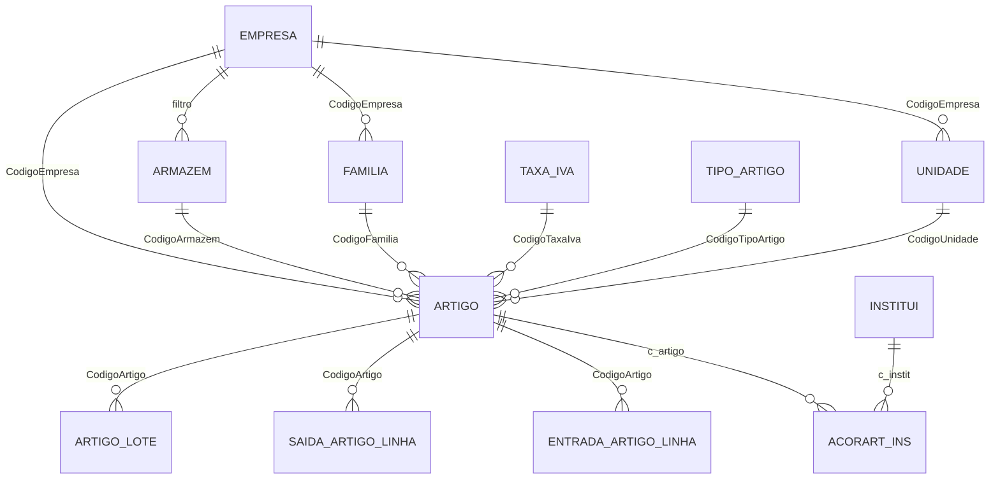

# Auditoria legado vs. novo — Módulo Artigos (Faturação → Tabelas)

Documento de referência para implementação no projeto novo.  
Fontes: `CliCloud.Dados.Faturacao`, `CliCloud.Dados.Comum`, `CliCloud.ASPcli`, scripts `BDUpdate`.

**Estado:** auditoria concluída — implementação pendente.

---

## 1. Resumo executivo

| Item menu legado | Tabela runtime (legado) | CRUD UI | No projeto novo |
|------------------|-------------------------|---------|-----------------|
| **Unidades** | `Faturacao.Unidade` | Sim | ❌ Não existe |
| **Família de Artigos** | `Faturacao.Familia` | Sim (árvore 3 níveis) | ❌ Não existe |
| **Armazéns** | **`dbo.ARMAZENS`** (não `Faturacao.Armazem`) | Sim | ⚠️ Só `ClinicaArmazemDefault` (placeholder) |
| **Artigos** | `Faturacao.Artigo` | Sim (complexo) | ❌ Só `CodigoArtigo` string em `DocumentoLinha` |
| **Subsistemas Artigos** | `dbo.ACORART_INS` | Sim | ❌ Diferente de `SubsistemaServico` |

**Conclusão:** é um **módulo de stocks/faturação por implementar quase na totalidade**. Nada disto pode ser ligado ao menu como foi feito com Serviços ou Zonas Fiscais.

### Confusões a evitar no novo

| Nome parecido | O que é |
|---------------|---------|
| `Artigos/ViaAdministracao` (novo) | Vias de administração de medicamentos — **não** é catálogo de artigos |
| `SubsistemaServico` (novo) | Acordos **serviço × organismo** — **não** é `ACORART_INS` |
| `UnidadesLocaisSaude` (novo) | Unidades SNS — **não** é `Faturacao.Unidade` |
| `ClinicaArmazemDefault` (novo) | Registo auxiliar ao criar clínica — **não** substitui `dbo.ARMAZENS` |

---

## 2. Menu legado e permissões

```
Faturação → Tabelas → Artigos
  ├── Artigos                    → ArtigoLst.aspx
  ├── Família de Artigos         → FamiliaArtigosLst.aspx
  ├── Subsistemas Artigos        → AcorArt_InsLst.aspx (WSComum)
  ├── Armazéns                   → ArmazemLst.aspx
  └── Unidades                   → UnidadeLst.aspx
```

- **Permissão:** `Faturacao_Tabelas`
- **Scope:** empresa da sessão (`SessionManager.Empresa` / `filtro` / `CodigoEmpresa`)
- **Armazéns:** filtro por utilizador via `Base.UtilizadoresEmpresasArmazens` (só armazéns autorizados)

Referência menu novo: `Frontend/src/config/menu-items.ts` — submenu Artigos **ainda não existe**.

---

## 3. Diagrama de dependências



**Ordem de implementação sugerida:** Unidades → Famílias → Armazéns → Artigos → Subsistemas Artigos.

---

## 4. Entidade por entidade (legado)

### 4.1 Unidades (`Faturacao.Unidade`)

**Função:** unidade de medida do artigo (un, kg, caixa, etc.).

| Campo | Tipo | Notas |
|-------|------|-------|
| `Codigo` | int IDENTITY | PK surrogate |
| `CodigoUnidade` | int | Código de negócio por empresa |
| `CodigoEmpresa` | int | FK lógica → empresa |
| `Descricao` | varchar(15) | |

- **UK:** `(CodigoUnidade, CodigoEmpresa)`
- **CRUD:** completo (`UnidadeLst.js` — ver/editar/apagar)
- **Código novo:** `MAX(CodigoUnidade)+1` por empresa
- **API legado:** `WSFaturacao.UnidadeLst`, `UnidadeAutocomplete`
- **Ficheiros legado:** `Dados/CliCloud.Dados.Faturacao/Unidade.cs`, `CliCloud.ASPcli/Client/Faturacao/UnidadeLst.*`
- **Consumidores:** `Faturacao.Artigo.CodigoUnidade`

---

### 4.2 Família de Artigos (`Faturacao.Familia`)

**Função:** classificação hierárquica de artigos (até **3 níveis**).

| Campo | Tipo | Notas |
|-------|------|-------|
| `Codigo` | int IDENTITY | PK surrogate (usado em FKs) |
| `CodigoFamilia` | int | Código de negócio por empresa |
| `CodigoEmpresa` | int | |
| `CodigoClasseFamilia` | int? | Pai na hierarquia |
| `Descricao` | varchar(50) | |
| `Nivel` | int? | 1 = família, 2 = classe, 3 = subclasse |
| `UrlFoto` | varchar(512) | |

- **UK:** `(CodigoFamilia, CodigoEmpresa)`
- **Listagem:** SQL com `UNION` de 3 níveis + coluna `Path` (ex.: `/Família/Classe/Subclasse`)
- **Filtro obrigatório:** `empresa` + `codigoClasseFamilia` (null = raiz nível 1)
- **Delete:** bloqueado se existirem filhos (`CodigoClasseFamilia` referencia o `Codigo`)
- **Ficheiros legado:** `Dados/CliCloud.Dados.Faturacao/FamiliaArtigos.cs`, `FamiliaArtigosLst.*`
- **Consumidores:** `Artigo.CodigoFamilia`, relatórios de inventário

---

### 4.3 Armazéns (`dbo.ARMAZENS`)

**Atenção:** existe `Faturacao.Armazem` nos scripts de migração (`script00507.sql`), mas o **código activo usa `dbo.ARMAZENS`**.

| Campo | Tipo | Notas |
|-------|------|-------|
| `c_armazem` | int | Código por empresa |
| `filtro` | int | = `c_empresa` |
| `nome` | varchar | |
| `morada` | varchar(40) | |
| `localidade` | varchar(20) | |
| `c_cpostal` | int? | FK → `CPOSTAL` |
| `telefone` / `fax` | varchar | |
| `armazem_geral` | bit | Um por empresa; desmarca os outros ao marcar novo |

- **PK lógica:** `(c_armazem, filtro)`
- **CRUD:** completo + permissões por utilizador (`UtilizadoresEmpresasArmazens`)
- **`ObterAutorizados`:** lista armazéns do user na empresa
- **FK Artigo:** `FK_Artigo_Armazem` → `(CodigoEmpresa, CodigoArmazem)` referencia `(filtro, c_armazem)` (`script00817.sql`)
- **Ficheiros legado:** `Dados/CliCloud.Dados.Faturacao/Armazem.cs`, `ArmazemLst.*`
- **Consumidores:** artigos, entradas/saídas de stock, sessão (`SessionManager.Armazem`), empresa (`CodigoArmazemHabitual`)

**No novo:**

- `Backend/CliCloud.Domain/Entities/Core/ClinicaArmazemDefault.cs` — placeholder ao criar clínica
- `Clinica.armazemHabitual` — string, sem FK
- `ClinicaService.EnsureClinicaArmazemGeralDefaultAsync` — **não** persiste em tabela de armazéns

---

### 4.4 Artigos (`Faturacao.Artigo`)

**Função:** catálogo de produtos/material com preços, stock, IVA e ligação a armazém.

#### Chaves

| Chave | Campos |
|-------|--------|
| PK | `Codigo` (IDENTITY) |
| UK negócio | `(NumeroArtigo, CodigoEmpresa, CodigoArmazem)` — mesmo número pode existir em armazéns diferentes |
| `NumeroArtigo` | varchar(20) na app (evolução de int no script inicial `script00507.sql`) |

#### Campos principais (agrupados)

| Grupo | Campos |
|-------|--------|
| Identificação | `NumeroArtigo`, `Descricao`, `CodigoEmpresa`, `CodigoArmazem`, `EAN`, `CodigoBarras` |
| Classificação | `CodigoUnidade`, `CodigoFamilia`, `CodigoTipoArtigo`, `CodigoCorGrelha`, `CodigoTamanhoGrelha` |
| Fiscal | `CodigoTaxaIva`, `CodigoMotivoIsencao`, `Motivo`, `CodigoSAFT` |
| Preços | `PrecoFinal1/2/3`, `PrecoVenPublico1/2/3`, `UltimoPrecoVenda`, `PrecoMedioVenda`, `PrecoCusto`, `Desconto` |
| Stock | `StockMinimo`, `StockMaximo`, `StockReposicao`, `StockReal` (calculado) |
| Estado | `Inativo`, `Descontinuado`, `PermitirDescontos`, `PermitirAlterarPreco` |
| Farmácia | `CodigoPrincipioAtivo`, `CodigoFormasAdmin`, `CodigoDosagem`, `CodigoViasAdmin` |
| Outros | `ActHotel`, `ActPOS`, `UrlFoto`, `NumSerieUCentral`, `PSO`, `TemGarantia`, … |

#### Lógica de negócio relevante

1. **Preços e moeda:** insert/update usa `Faturacao.CambioMoedaOrigem`.
2. **Regra de faturação:** se `RegraFaturacao == 1` usa `PrecoVenPublico*`; senão `PrecoFinal*`.
3. **Stock:** `StockReal` recalculado a partir de `EntradaArtigoLinha` / `SaidaArtigoLinha`.
4. **Descontinuar:** pode gerar movimentos de saída.
5. **Lotes:** `Faturacao.ArtigoLote` (acoplado, fora do menu).
6. **Autocomplete:** `ArtigoAutocomplete` — faturas, entradas/saídas, admissões.

#### Ficheiros legado

- `Dados/CliCloud.Dados.Faturacao/Artigo.cs` (entidade principal, ~2500 linhas)
- `CliCloud.ASPcli/Client/Faturacao/ArtigoLst.*`
- `WSFaturacao.asmx` — `ArtigoLst`, `ArtigoEdtLoad/Save/Del`, `ArtigoAutocomplete`

#### Consumidores no novo

- `Backend/CliCloud.Domain/Entities/Documentos/DocumentoLinha.cs` — `CodigoArtigo` (string placeholder, sem FK)

---

### 4.5 Subsistemas Artigos (`dbo.ACORART_INS`)

**Função:** acordo de preço **artigo × organismo** (paralelo a `ACOR_INS` para serviços).

| Campo | Tipo | Notas |
|-------|------|-------|
| `filtro` | int | Empresa |
| `c_artigo` | varchar(20) | Join frágil: `cast(art.Codigo as varchar) = sub.c_artigo` |
| `c_instit` | int | Organismo (`INSTITUI`) |
| `val_serv` | float | Valor artigo |
| `val_ins` | float | Valor organismo |
| `valut` | float | Valor utente |
| `ins_marg` | float | Margem % |
| `cartinst` | nvarchar(20) | Código cartão organismo |
| `inactivo` | int | |
| `codComplementarADSE` | nvarchar(10) | ADSE |

- **PK composta:** `(filtro, c_artigo, c_instit)`
- **CRUD:** completo
- **Ficheiros legado:** `Dados/CliCloud.Dados.Comum/AcorArt_Ins.cs`, `AcorArt_InsLst.aspx`, `WSComum`

#### Comparação com `SubsistemaServico` (novo)

| Legado `ACORART_INS` | Novo `Servicos.SubsistemaServico` |
|----------------------|-----------------------------------|
| Artigo (string/int legado) | `ServicoId` (Guid) |
| `c_instit` (int) | `OrganismoId` (Guid) |
| `val_serv`, `val_ins`, `valut`, `ins_marg` | `ValorServico`, `ValorOrganismo`, `ValorUtente`, margens % |
| `cartinst` | sem equivalente directo |
| `dbo.ACORART_INS` | `Servicos.SubsistemaServico` |

**Entidades paralelas** — implementar `SubsistemaArtigo` separado; não reutilizar `SubsistemaServico`.

---

## 5. Tabelas satélite (fora do menu, acopladas)

Para fases posteriores do módulo stocks:

| Tabela | Função |
|--------|--------|
| `Faturacao.EntradaArtigo` / `EntradaArtigoLinha` | Entradas de stock |
| `Faturacao.SaidaArtigo` / `SaidaArtigoLinha` | Saídas de stock |
| `Faturacao.ArtigoLote` | Lotes e quantidades |
| `Faturacao.ArtigoFornecedor` | Artigos por fornecedor |
| `Faturacao.ArtigoGrelha` | Variantes cor/tamanho |
| `Faturacao.TipoArtigo` | Tipos de artigo |
| `Faturacao.TipoArtigoBebida` | Extensão bebidas |
| `Base.UtilizadoresEmpresasArmazens` | Permissões armazém por user |

---

## 6. Estado no projeto novo

| Área | Existência | Gap |
|------|------------|-----|
| Entidades BE | `ClinicaArmazemDefault`, `ViaAdministracao`, `SubsistemaServico` | Falta domínio stocks |
| `DocumentoLinha` | `CodigoArtigo` string | Falta `ArtigoId` |
| `Clinica` | `armazemHabitual` string | Falta FK armazém |
| FE páginas | Vias administração (`area-comum/.../stocks/vias-administracao`) | Zero páginas Artigos/Armazém/Unidade/Família |
| Menu área financeira | Serviços, Zonas Fiscais ✅ | Submenu Artigos ❌ |
| Dependências prontas | TaxaIva, MotivoIsencao, Organismos, Moedas | OK para FKs em Artigo |

---

## 7. Proposta de normalização (projeto novo)

Alinhar ao padrão **ModoPagamento / Servico** (`ClinicaId` + `Codigo` int + `Guid Id`).

### Schema sugerido: `Stocks` (ou `Faturacao`)

| Entidade nova | Mapeamento legado |
|---------------|-------------------|
| `Stocks.Unidade` | `Faturacao.Unidade` |
| `Stocks.FamiliaArtigo` | `Faturacao.Familia` |
| `Stocks.Armazem` | `dbo.ARMAZENS` |
| `Stocks.Artigo` | `Faturacao.Artigo` |
| `Stocks.SubsistemaArtigo` | `dbo.ACORART_INS` |

### Decisões de desenho

1. `ClinicaId` em vez de `CodigoEmpresa` / `filtro`.
2. `Codigo` int por clínica + `Id` Guid.
3. **Artigo:** UK `(ClinicaId, ArmazemId, NumeroArtigo)` — preservar regra multi-armazém.
4. **SubsistemaArtigo:** FK `ArtigoId` + `OrganismoId` — não string `c_artigo`.
5. **Armazém:** uma só entidade; não replicar `Faturacao.Armazem` órfã.
6. **Família:** árvore com `ParentId` / `Nivel` em vez de SQL `UNION` de 3 níveis.
7. **`ClinicaArmazemDefault`:** evoluir para criar `Armazem` real com `ArmazemGeral = true`.

### Estrutura FE (quando implementar)

```
area-financeira/faturacao/tabelas/artigos/
  unidades/
  familias-artigo/
  armazens/
  artigos/
  subsistemas-artigos/
```

Blueprint CRUD: `area-financeira/faturacao/tabelas/pagamentos/modo-pagamento/`.

---

## 8. Fases de implementação recomendadas

| Fase | Entregável | Dependências |
|------|------------|--------------|
| **F1** | Unidades + Famílias + Armazéns (BE + FE + menu) | CodigoPostal, TaxaIva |
| **F2** | Artigos (CRUD + autocomplete) | F1 + MotivoIsencao |
| **F3** | Subsistemas Artigos | F2 + Organismos |
| **F4** | Integrações: `DocumentoLinha.ArtigoId`, linhas artigo na faturação | F2 |
| **F5** | Movimentos stock (entradas/saídas/lotes) | F2 + F1 |

---

## 9. Riscos e peculiaridades legado

1. **`c_artigo` em `ACORART_INS` é string** com join por cast — normalizar para FK Guid.
2. **Duas tabelas de armazém** (`Faturacao.Armazem` vs `dbo.ARMAZENS`) — seguir só `dbo.ARMAZENS`.
3. **Artigo por armazém** — UK tripla; não modelar artigo global sem armazém.
4. **Família com 3 níveis fixos** — validar árvore N níveis vs. limite 3.
5. **Campos farmácia** no artigo — ligam a vias/princípio activo (parcial no novo).
6. **Permissões armazém por utilizador** — paridade com `ObterAutorizados`.
7. **Volume de campos em Artigo** — considerar MVP vs. paridade total.

---

## 10. Contexto relacionado (outras conversas)

### Zonas / Zonas Fiscais (já tratado)

| Conceito | Decisão |
|----------|---------|
| **Zonas** (`dbo.Zonas`) | Adiado — etiqueta comercial opcional, não geografia |
| **Zonas Fiscais** | Enum `Clinica.ZonFisc` + página consulta FE implementada |

Ver: `area-financeira/faturacao/tabelas/zonas/zonas-fiscais/`.

### Documentos relacionados

- `auditoria-menu-faturacao-legado-vs-novo.md` — Artigos marcado ❌
- `auditoria-legado-vs-novo-indice-global.md` — secção stocks (T7, C2)
- `normalizacao-estrutura-pages.md` — padrão canónico de páginas

---

## 11. Conclusão

O submenu **Artigos** do legado é um **domínio de stocks completo**. Nada está pronto para ligar ao menu sem implementação prévia das **5 entidades** e respetivos serviços/páginas.

Ponto de contacto actual no novo: `DocumentoLinha.CodigoArtigo` (texto) e `ClinicaArmazemDefault` (placeholder).

**Próximo passo recomendado:** Fase F1 — Unidades, Famílias de Artigos e Armazéns.
