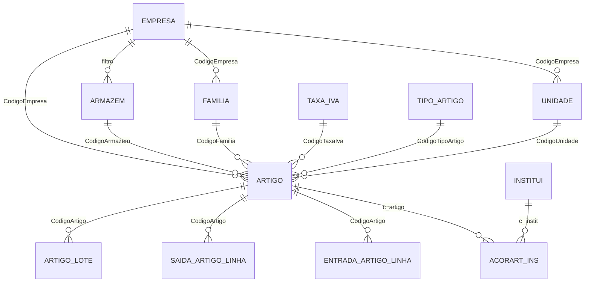

# Auditoria — Artigos / Stocks (Faturação → Tabelas)

> **⚠️ Documento desactualizado (2026-06-17).** Para o estado actual e plano de implementação, ver **[`paridade-artigos-legado-vs-novo.md`](./paridade-artigos-legado-vs-novo.md)**.

**Última atualização:** 2026-06-17  
**Âmbito:** submenu **Área Financeira → Faturação → Tabelas → Artigos** (5 itens do print legado).  
**Fora de âmbito neste documento:** movimentos de stock (entradas/saídas), lotes, mapas de artigo, aprovisionamento.

**Fontes legado:**

- `Dados/CliCloud.Dados.Faturacao/` — `Artigo.cs`, `FamiliaArtigos.cs`, `Armazem.cs`, `Unidade.cs`
- `Dados/CliCloud.Dados.Comum/AcorArt_Ins.cs`
- `CliCloud.ASPcli/Client/Faturacao/` — `ArtigoLst`, `FamiliaArtigosLst`, `ArmazemLst`, `UnidadeLst`
- `CliCloud.ASPcli/Client/Comum/AcorArt_InsLst.aspx`
- `CliCloud.ASPcli/Services/WSMenus.asmx.cs` (menu Faturação → Tabelas → Artigos)
- Scripts `Dados/CliCloud.ASPcli.BDUpdate/Resources/` — `script00507.sql`, `script00520.sql`, `script00531.sql`, `script00817.sql`, etc.

**Fontes novo:**

- `Backend/CliCloud.Domain/Entities/` — `ClinicaArmazemDefault`, `DocumentoLinha`, `SubsistemaServico`, `ViaAdministracao`
- `Frontend/src/docs/auditoria-menu-faturacao-legado-vs-novo.md`

> **Relacionado:** índice global §C2 em [`auditoria-legado-vs-novo-indice-global.md`](./auditoria-legado-vs-novo-indice-global.md).

---

## 1. Resumo executivo

| Item menu legado | Tabela runtime (legado) | CRUD UI | No projeto novo |
|------------------|-------------------------|---------|-----------------|
| **Unidades** | `Faturacao.Unidade` | Sim | ❌ Não existe |
| **Família de Artigos** | `Faturacao.Familia` | Sim (árvore 3 níveis) | ❌ Não existe |
| **Armazéns** | **`dbo.ARMAZENS`** (não `Faturacao.Armazem`) | Sim | ⚠️ Só `ClinicaArmazemDefault` (placeholder) |
| **Artigos** | `Faturacao.Artigo` | Sim (complexo) | ❌ Só `CodigoArtigo` string em `DocumentoLinha` |
| **Subsistemas Artigos** | `dbo.ACORART_INS` | Sim | ❌ Diferente de `SubsistemaServico` |

**Conclusão:** é um **módulo de stocks/faturação por implementar quase na totalidade**. Nenhum destes itens pode ser ligado ao menu do projeto novo da forma como foi feito com Serviços ou Zonas Fiscais (reutilização de páginas/API existentes).

### Confusões a evitar no novo

| Nome parecido no novo | O que é na realidade |
|------------------------|----------------------|
| `area-comum/.../stocks/vias-administracao` | Vias de administração de medicamentos — **não** é catálogo de artigos |
| `SubsistemaServico` (`Servicos.SubsistemaServico`) | Acordos **serviço × organismo** — **não** é `ACORART_INS` |
| `UnidadesLocaisSaude` | Unidades locais de saúde (SNS) — **não** é `Faturacao.Unidade` |
| `ClinicaArmazemDefault` | Registo auxiliar ao criar clínica — **não** substitui `dbo.ARMAZENS` |
| Pasta `Backend/.../Artigos/` (`ViaAdministracao`) | Domínio farmácia/clínico — **não** é `Faturacao.Artigo` |

---

## 2. Menu legado e permissões

```
Faturação → Tabelas → Artigos
  ├── Artigos                    → ArtigoLst.aspx
  ├── Família de Artigos         → FamiliaArtigosLst.aspx
  ├── Subsistemas Artigos        → AcorArt_InsLst.aspx (WSComum)
  ├── Armazéns                   → ArmazemLst.aspx
  └── Unidades                   → UnidadeLst.aspx
```

| Aspeto | Legado |
|--------|--------|
| Permissão | `AppControl.Funcionalidades.Faturacao_Tabelas` |
| Scope | Empresa da sessão (`SessionManager.Empresa` / `filtro` / `CodigoEmpresa`) |
| Armazéns | Filtro por utilizador via `Base.UtilizadoresEmpresasArmazens` (`Armazem.ObterAutorizados`) |
| API listagens | `WSFaturacao.asmx` (Artigo, Família, Armazém, Unidade) + `WSComum.asmx` (AcorArt) |

**Estado menu novo:** ❌ sem submenu Artigos em `menu-items.ts` / `areaFinanceira.tsx` (ver `auditoria-menu-faturacao-legado-vs-novo.md` § Tabelas).

---

## 3. Diagrama de dependências



**Ordem de implementação sugerida:** Unidades → Famílias → Armazéns → Artigos → Subsistemas Artigos.

---

## 4. Entidades — detalhe legado

### 4.1 Unidades (`Faturacao.Unidade`)

**Função:** unidade de medida do artigo (un, kg, caixa, etc.).

| Campo | Tipo | Notas |
|-------|------|-------|
| `Codigo` | int IDENTITY | PK surrogate |
| `CodigoUnidade` | int | Código de negócio por empresa |
| `CodigoEmpresa` | int | FK lógica → `dbo.EMPRESAS.c_empresa` |
| `Descricao` | varchar(15) | |

| Regra | Descrição |
|-------|-----------|
| UK | `(CodigoUnidade, CodigoEmpresa)` |
| Novo código | `MAX(CodigoUnidade)+1` por empresa |
| CRUD | Completo — `UnidadeLst.js` (ver / editar / apagar) |
| Autocomplete | `WSFaturacao.UnidadeAutocomplete` |
| Consumidores | `Faturacao.Artigo.CodigoUnidade` |

**Script criação:** `script00531.sql`

---

### 4.2 Família de Artigos (`Faturacao.Familia`)

**Função:** classificação hierárquica de artigos (até **3 níveis**: família → classe → subclasse).

| Campo | Tipo | Notas |
|-------|------|-------|
| `Codigo` | int IDENTITY | PK surrogate (usado em FKs de artigo) |
| `CodigoFamilia` | int | Código de negócio por empresa |
| `CodigoEmpresa` | int | |
| `CodigoClasseFamilia` | int? | Referência ao pai (`Familia.Codigo`) |
| `Descricao` | varchar(50) | |
| `Nivel` | int? | 1 = família, 2 = classe, 3 = subclasse |
| `UrlFoto` | varchar(512) | |

| Regra | Descrição |
|-------|-----------|
| UK | `(CodigoFamilia, CodigoEmpresa)` |
| Listagem | SQL com `UNION` de 3 níveis + coluna calculada `Path` (ex.: `/Família/Classe/Subclasse`) |
| Filtro listagem | Obrigatório: `empresa` + `codigoClasseFamilia` (`null` = raiz nível 1) |
| Delete | Bloqueado se existirem filhos com `CodigoClasseFamilia` = este `Codigo` |
| Autocomplete | `FamiliaArtigos.Procurar` por `Path` |
| Consumidores | `Artigo.CodigoFamilia`, relatórios inventário |

**Script criação:** `script00520.sql`

---

### 4.3 Armazéns (`dbo.ARMAZENS`)

> **Atenção:** existe tabela `Faturacao.Armazem` em scripts de migração (`script00507.sql`), mas o **código activo** em `Armazem.cs` usa **`dbo.ARMAZENS`**.

**Função:** local físico de stock; um artigo pertence a um armazém; permissões por utilizador.

| Campo | Tipo | Notas |
|-------|------|-------|
| `c_armazem` | int | Código por empresa |
| `filtro` | int | = `c_empresa` |
| `nome` | varchar | |
| `morada` | varchar(40) | |
| `localidade` | varchar(20) | |
| `c_cpostal` | int? | FK → `dbo.CPOSTAL` |
| `telefone` / `fax` | varchar | |
| `armazem_geral` | bit | Um por empresa; ao marcar novo, desmarca os outros |

| Regra | Descrição |
|-------|-----------|
| PK lógica | `(c_armazem, filtro)` |
| CRUD | Completo + `UtilizadoresEmpresasArmazens` |
| `ObterAutorizados` | Armazéns do utilizador na empresa |
| FK Artigo | `FK_Artigo_Armazem`: `(CodigoEmpresa, CodigoArmazem)` → `(filtro, c_armazem)` |
| Sessão | `SessionManager.Armazem`, `SessionManager.ArmazemGeral` |
| Empresa | `EMPRESAS.CodigoArmazemHabitual` |

**No projeto novo:**

- `Core.ClinicaArmazemDefault` — criado em `ClinicaService.EnsureClinicaArmazemGeralDefaultAsync` (nome + flag `ArmazemGeral`)
- `Clinica.armazemHabitual` — string, sem FK
- **Não** persiste em tabela de armazéns nem liga a artigos

---

### 4.4 Artigos (`Faturacao.Artigo`)

**Função:** catálogo de produtos/material com preços, stock, IVA e ligação a armazém.

#### Chaves

| Chave | Campos |
|-------|--------|
| PK | `Codigo` (IDENTITY) |
| UK negócio | `(NumeroArtigo, CodigoEmpresa, CodigoArmazem)` — **o mesmo número pode existir em armazéns diferentes** |
| `NumeroArtigo` | `varchar(20)` na aplicação (evolução de `int` no script inicial `script00507.sql`) |

#### Campos principais (agrupados)

| Grupo | Campos |
|-------|--------|
| Identificação | `NumeroArtigo`, `Descricao`, `CodigoEmpresa`, `CodigoArmazem`, `EAN`, `CodigoBarras` |
| Classificação | `CodigoUnidade`, `CodigoFamilia`, `CodigoTipoArtigo`, `CodigoCorGrelha`, `CodigoTamanhoGrelha` |
| Fiscal | `CodigoTaxaIva`, `CodigoMotivoIsencao`, `Motivo`, `CodigoSAFT` |
| Preços | `PrecoFinal1/2/3`, `PrecoVenPublico1/2/3`, `UltimoPrecoVenda`, `PrecoMedioVenda`, `PrecoCusto`, `Desconto` |
| Stock | `StockMinimo`, `StockMaximo`, `StockReposicao`, `StockReal` (calculado) |
| Estado | `Inativo`, `Descontinuado`, `PermitirDescontos`, `PermitirAlterarPreco` |
| Farmácia | `CodigoPrincipioAtivo`, `CodigoFormasAdmin`, `CodigoDosagem`, `CodigoViasAdmin` |
| Outros | `ActHotel`, `ActPOS`, `UrlFoto`, `NumSerieUCentral`, `PSO`, `TemGarantia`, `MesesGarantia`, … |

#### Lógica de negócio relevante

1. **Preços e moeda:** insert/update usa `Faturacao.CambioMoedaOrigem` para converter preços conforme moeda/data.
2. **Regra de faturação:** se `RegraFaturacao == 1` expõe `PrecoVenPublico*`; senão `PrecoFinal*`.
3. **Stock:** `StockReal` recalculado a partir de `EntradaArtigoLinha` / `SaidaArtigoLinha`.
4. **Descontinuar:** pode gerar movimentos de saída (`DescontinuarArtigo`).
5. **Lotes:** `Faturacao.ArtigoLote` (fora do menu Tabelas, acoplado).
6. **Autocomplete:** `WSFaturacao.ArtigoAutocomplete` — faturas, entradas/saídas, admissões.

#### Consumidores

- Linhas de fatura / `Tfatura` com tipo linha artigo
- `EntradaArtigo` / `SaidaArtigo`
- `dbo.ACORART_INS`
- **Novo:** `Documentos.DocumentoLinha.CodigoArtigo` (string placeholder até existir entidade)

**Scripts:** `script00507.sql` (base), `script00817.sql` (`CodigoArmazem` + FK), migrações farmácia `script00830.sql`, etc.

---

### 4.5 Subsistemas Artigos (`dbo.ACORART_INS`)

**Função:** acordo de preço **artigo × organismo** (análogo a `dbo.ACOR_INS` para serviços).

| Campo | Tipo | Notas |
|-------|------|-------|
| `filtro` | int | Empresa |
| `c_artigo` | varchar(20) | Join frágil: `cast(art.Codigo as varchar) = sub.c_artigo` |
| `c_instit` | int | Organismo (`INSTITUI.c_instit`) |
| `val_serv` | float | Valor artigo |
| `val_ins` | float | Valor organismo |
| `valut` | float | Valor utente |
| `ins_marg` | float | Margem % organismo |
| `cartinst` | nvarchar(20) | Código cartão organismo |
| `inactivo` | int | |
| `codComplementarADSE` | nvarchar(10) | Código ADSE |

| Regra | Descrição |
|-------|-----------|
| PK composta | `(filtro, c_artigo, c_instit)` |
| CRUD | Completo — `AcorArt_InsLst.aspx`, `WSComum` |
| Listagem | Join `Faturacao.Artigo` por `NumeroArtigo` / `Codigo` |

#### Comparação com `SubsistemaServico` (novo)

| Legado `ACORART_INS` | Novo `Servicos.SubsistemaServico` |
|----------------------|-----------------------------------|
| Artigo (string/int legado) | `ServicoId` (Guid) |
| `c_instit` (int) | `OrganismoId` (Guid) |
| `val_serv`, `val_ins`, `valut`, `ins_marg` | `ValorServico`, `ValorOrganismo`, `ValorUtente`, margens % |
| `cartinst`, `codComplementarADSE` | Sem equivalente directo na entidade actual |
| Tabela `dbo.ACORART_INS` | `Servicos.SubsistemaServico` |

**Decisão:** criar entidade **`SubsistemaArtigo`** separada; não reutilizar `SubsistemaServico`.

---

## 5. Tabelas satélite (fora do menu, acopladas)

Implementação em fases posteriores ao CRUD base:

| Tabela legado | Função |
|---------------|--------|
| `Faturacao.EntradaArtigo` / `EntradaArtigoLinha` | Entradas de stock |
| `Faturacao.SaidaArtigo` / `SaidaArtigoLinha` | Saídas de stock |
| `Faturacao.ArtigoLote` | Lotes e quantidades disponíveis |
| `Faturacao.ArtigoFornecedor` | Referências fornecedor |
| `Faturacao.ArtigoGrelha` | Variantes cor/tamanho |
| `Faturacao.TipoArtigo` / `TipoArtigoBebida` | Tipologia |
| `Base.UtilizadoresEmpresasArmazens` | Permissões armazém por utilizador |
| Mapas (`MapasArtigo.aspx`, `MapasExtratoMovimentos.aspx`) | Relatórios |

---

## 6. Estado no projeto novo

| Área | Existência | Gap |
|------|------------|-----|
| Entidades BE stocks | `ClinicaArmazemDefault` apenas | Falta `Unidade`, `FamiliaArtigo`, `Armazem`, `Artigo`, `SubsistemaArtigo` |
| `DocumentoLinha` | `CodigoArtigo` string | Falta `ArtigoId` (Guid FK) |
| `Clinica` | `armazemHabitual` string | Falta FK armazém |
| FE — área financeira | — | Sem páginas Artigos / Armazém / Unidade / Família |
| FE — área comum stocks | Vias / grupo vias administração | Domínio clínico, não faturação |
| Taxa IVA, Motivo Isenção | ✅ Implementados | Prontos para FK em `Artigo` |
| Organismos | ✅ Implementados | Prontos para `SubsistemaArtigo` |
| Menu | ❌ | Ver §2 |

---

## 7. Proposta de normalização (projeto novo)

Alinhar ao padrão **ModoPagamento** / **Servico** (`ClinicaId` + `Codigo` int legado + `Guid Id` + soft delete).

### Schema sugerido: `Stocks` (ou `Faturacao`)

| Entidade nova | Tabela legado | Notas normalização |
|---------------|---------------|-------------------|
| `Stocks.Unidade` | `Faturacao.Unidade` | `ClinicaId`, `Codigo`, `Descricao` |
| `Stocks.FamiliaArtigo` | `Faturacao.Familia` | `ParentId` + `Nivel` (1–3) em vez de SQL UNION |
| `Stocks.Armazem` | `dbo.ARMAZENS` | Unificar; ignorar `Faturacao.Armazem` órfã |
| `Stocks.Artigo` | `Faturacao.Artigo` | UK `(ClinicaId, ArmazemId, NumeroArtigo)` |
| `Stocks.SubsistemaArtigo` | `dbo.ACORART_INS` | FK `ArtigoId` + `OrganismoId` (não string `c_artigo`) |

### Decisões de desenho

1. **`ClinicaId`** substitui `CodigoEmpresa` / `filtro`.
2. **`Codigo` int** por clínica (paridade legado) + **`Id` Guid** (padrão novo).
3. **Artigo multi-armazém:** preservar UK tripla do legado.
4. **`ClinicaArmazemDefault`:** evoluir para criar registo real em `Stocks.Armazem` com `ArmazemGeral = true`.
5. **Permissões armazém:** tabela de junção utilizador–armazém (paridade `UtilizadoresEmpresasArmazens`).

### Estrutura FE (quando implementar)

```
Frontend/src/pages/area-financeira/faturacao/tabelas/artigos/
  unidades/
  familias-artigo/
  armazens/
  artigos/
  subsistemas-artigos/
```

Blueprint CRUD: `area-financeira/faturacao/tabelas/pagamentos/modo-pagamento/` e `area-comum/.../servicos/servicos/`.

### Backend (espelho ModoPagamento)

```
Backend/
  CliCloud.Domain/Entities/Stocks/
  CliCloud.Infrastructure/Persistence/Configurations/
  CliCloud.Application/Services/Stocks/{Entidade}Service/
  CliCloud.WebApi/Controllers/Stocks/
```

---

## 8. Fases de implementação recomendadas

| Fase | Entregável | Dependências |
|------|------------|--------------|
| **F1** | Unidades + Famílias + Armazéns (BE + FE listagem CRUD) | CodigoPostal, TaxaIva (já existem) |
| **F2** | Artigos (CRUD + autocomplete light) | F1; MotivoIsencao; TipoArtigo (opcional v1) |
| **F3** | Subsistemas Artigos | F2 + Organismos |
| **F4** | Integrações: `DocumentoLinha.ArtigoId`, linhas de fatura com artigo | F2 |
| **F5** | Movimentos stock (entradas/saídas/lotes) + mapas | F2 + F1 |

---

## 9. Riscos e peculiaridades legado

| # | Risco | Mitigação no novo |
|---|--------|-------------------|
| 1 | `c_artigo` em `ACORART_INS` é string com cast do `Codigo` | FK `ArtigoId` Guid |
| 2 | Duas tabelas armazém (`Faturacao.Armazem` vs `dbo.ARMAZENS`) | Modelar só `Armazem` alinhado a `dbo.ARMAZENS` |
| 3 | Artigo identificado por armazém (UK tripla) | Não modelar artigo “global” sem armazém |
| 4 | Família com 3 níveis fixos no SQL | Árvore com `Nivel` max 3 ou adjacency list |
| 5 | ~50+ campos em `Artigo` | MVP F2: identificação + preços + IVA + stock básico; resto incremental |
| 6 | Campos farmácia no artigo | Integrar com `ViaAdministracao` / princípio activo quando existirem |
| 7 | Permissões armazém por utilizador | Replicar ou simplificar com roles clínica |

---

## 10. Checklist pré-implementação

- [ ] Confirmar com dados reais se clientes usam multi-armazém e famílias 3 níveis
- [ ] Definir MVP de campos `Artigo` para F2
- [ ] Decidir schema final: `Stocks` vs `Faturacao`
- [ ] Migrar `ClinicaArmazemDefault` → `Armazem` real
- [ ] Atualizar `auditoria-menu-faturacao-legado-vs-novo.md` quando menu existir
- [ ] Atualizar `auditoria-legado-vs-novo-indice-global.md` §C2 quando F1 concluída

---

## 11. Conclusão

O submenu **Artigos** do legado é um **domínio de stocks completo**, independente do que já existe no projeto novo. Nada está pronto para ligar ao menu sem implementação dedicada.

Pontos de contacto actuais com o novo:

- `Documentos.DocumentoLinha.CodigoArtigo` (texto)
- `Core.ClinicaArmazemDefault` (placeholder)
- `Clinica.armazemHabitual` (string)

Próximo passo recomendado: **Fase F1 — Unidades, Famílias de Artigos e Armazéns**.
