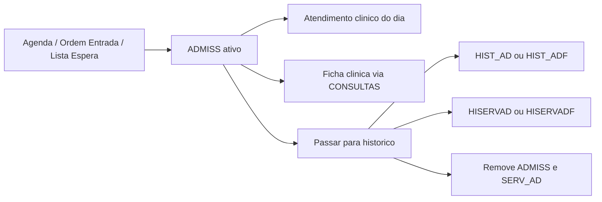
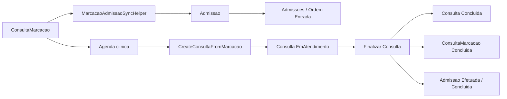
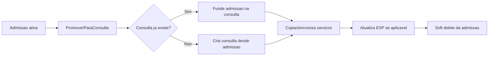
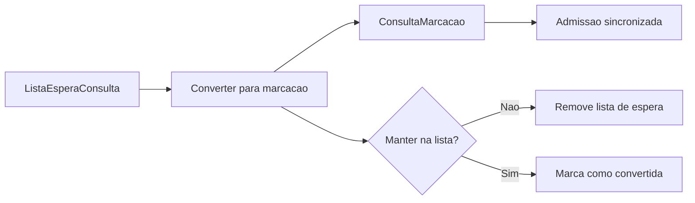

# Auditoria de Fluxos Administrativo e Clinico: Legado vs Novo

Data: 2026-05-25

Escopo: area administrativa e area clinica, com foco nos fluxos que cruzam consultas, marcacoes, admissoes, lista de espera, agenda, atendimento, ficha clinica, historico, fecho diario, credenciais SNS/ESP e visibilidade ativo/historico.

Esta auditoria nao propoe alteracoes de codigo. O objetivo e fixar o comportamento real do legado, mapear o estado atual do projeto novo e separar divergencias aceitaveis pela nova arquitetura de divergencias que quebram expectativa funcional.

## 1. Conclusao executiva

O legado usa um modelo operacional centrado em `ADMISS`: uma marcacao, uma entrada de marcacao, uma admissao visivel no atendimento e uma consulta clinica ativa sao, na pratica, variacoes do mesmo registo ativo. O historico nasce quando esse registo sai de `ADMISS` e e copiado para `HIST_AD` ou `HIST_ADF`, juntamente com os servicos associados (`SERV_AD` para `HISERVAD`/`HISERVADF`).

O projeto novo separa corretamente o modelo em tres entidades principais: `ConsultaMarcacao`, `Admissao` e `Consulta`. Esta separacao e aceitavel e mais limpa, mas so fica funcionalmente equivalente ao legado se a sincronizacao entre entidades for tratada como regra de dominio, nao como detalhe de UI.

Estado atual observado:

- O novo ja cobre os blocos principais de marcacoes administrativas, ordem de entrada, lista de espera, admissoes, fecho diario, agenda clinica, ficha clinica, historico e exames sem papel.
- O fluxo `ConsultaMarcacao -> Admissao -> Consulta -> historico` esta estruturalmente encaminhado no backend.
- As correcoes recentes aproximaram bem o comportamento de ativo/historico: consultas concluidas saem das grelhas ativas, admissoes promovidas deixam de aparecer como ativas e a conclusao clinica sincroniza a admissao associada.
- Ainda ha gaps relevantes, sobretudo no comportamento administrativo de `Marcar efetuado`, na unificacao do Atendimento ao Utente clinico e na garantia de paridade de servicos/faturacao/historico em todos os caminhos.

Classificacao geral:

- Critico: garantir que todo caminho de encerramento/promocao remove o ativo correto e cria/funde a consulta historica com servicos.
- Alto: alinhar o botao administrativo `Marcar efetuado` com o legado e transformar o Atendimento ao Utente clinico numa vista operacional, nao apenas numa listagem.
- Medio: rever permissoes semeadas, GlobalBooking/Pedidos Consulta, mapas e exames sem papel contra o detalhe legado.
- Baixo: labels, pequenas diferencas de layout, filtros e nomes desde que os efeitos laterais estejam corretos.

## 2. Mapa funcional do legado

### 2.1 Area Administrativa > Consultas

Fonte principal: `CliCloud.ASPcli/Services/WSMenus.asmx.cs`, caso `Consultas`.

Menus confirmados no legado:

| Grupo | Ecras | Permissoes legacy |
| --- | --- | --- |
| Marcacoes | `MarcacoesGestaoSalasLst.aspx` ou `MarcacoesLst.aspx`, `TrocaMarcacoesEntreMedicos.aspx`, `OrdemEntradaMarcacoesLst.aspx`, `ListaEsperaLst.aspx`, `PedidosConsultaLst.aspx` | `Consul_MarcacoesSemanais`, `Consul_TrocaMarcacoesEntreMedicos`, `Consul_OrdemEntradaMarcacoes`, `Consul_ListaEspera`, `Consul_GlobalBooking` |
| Consultas Diarias | `AdmissoesLst.aspx`, `AdmissoesLst.aspx?tipo=pendentes`, `FechoDiario.aspx` | `Consul_Admissoes` |
| Credenciais SNS | `LancamentoCredenciaisLst.aspx`, `ExamesSemPapelLst.aspx`, `ExamesSemPapelLst.aspx?historico=1` | `Consul_LancCredenciais`, `Consul_ExamesSemPapel` |
| Sinistrados | `SinistradosLst.aspx` | `Consul_Sinistrados` |
| Historico | `HistoricoDatasLst.aspx`, `HistoricoUtentesLst.aspx`, `HistoricoMedicosLst.aspx`, `HistoricoOrganismosLst.aspx` | `Consul_HistoricoDatas`, `Consul_HistoricoUten`, `Consul_HistoricoMed`, `Consul_HistoricoOrganismos` |
| Mapas | `MapasServicosComValores.aspx`, `MapasLivroCaixa.aspx`, mapas por data, organismo, medico, especialidade, servico e quantidade | `Consul_MapasServicosComValores`, `Consul_MapasServicosComQuant`, `Consul_MapasLivroCaixa`, outros |

Ficheiros legacy principais:

- `CliCloud.ASPcli/Client/Consultas/Services/MarcacoesDiarias.cs`
- `CliCloud.ASPcli/Client/Consultas/Services/Admissoes.cs`
- `CliCloud.ASPcli/Client/Consultas/Services/OrdemEntradaMarcacoes.cs`
- `CliCloud.ASPcli/Client/Consultas/Services/ListaEspera.cs`
- `CliCloud.ASPcli/Client/Consultas/Services/PedidosConsulta.cs`
- `CliCloud.ASPcli/Client/Consultas/Services/Historico.cs`
- `CliCloud.ASPcli/Client/Consultas/Services/ExamesSemPapel.cs`
- `CliCloud.ASPcli/Client/Consultas/AdmissoesLst.js`
- `CliCloud.ASPcli/Client/Consultas/MarcacoesLst.js`
- `CliCloud.ASPcli/Client/Consultas/OrdemEntradaMarcacoesLst.js`

### 2.2 Area Clinica > Processo Clinico

Fonte principal: `CliCloud.ASPcli/Services/WSMenus.asmx.cs`, caso `ProcessosCli`.

Menus confirmados:

| Grupo | Ecras | Permissoes legacy |
| --- | --- | --- |
| Atendimento Utente | `AtendimentoUtenteLst.aspx`, `FichaClinica.aspx?modo=ficha` | `PClinico_AtenUtente`, `PClinico_FichaClini` |
| Agenda | `ConsultasMarcadasLst.aspx`, `ConsultasMarcadasLst.aspx?modo=listagem`, `MapaConsultasAgendadas.aspx` | `PClinico_ConsMarca` |
| Exames Sem Papel | `ExamesSemPapelMedicoLst.aspx` | `PClinico_ExamesSemPapel` |
| Atestados | `AtestadoCartaConducao.aspx?modo=ficha`, `AtestadoCartaConducaoLst.aspx?modo=ficha` | `PClinico_Atestados` |
| Historico | `ConsultasEfetuadasLst.aspx`, `ConsultasEfetuadasLst.aspx?modo=listagem`, `MapaConsultasEfetuadas.aspx` | `PClinico_ConsMarca` |
| Tabelas | medicamentos, medicos, patologias, historia clinica, body chart, alergias, estados dentarios | varias permissoes comuns e clinicas |

Ficheiros legacy principais:

- `CliCloud.ASPcli/Client/ProcessoClinico/Services/AtendimentoUtente.cs`
- `CliCloud.ASPcli/Client/ProcessoClinico/AtendimentoUtenteEdt.js`
- `CliCloud.ASPcli/Client/ProcessoClinico/ConsultasMarcadasLst.js`
- `CliCloud.ASPcli/Client/ProcessoClinico/FichaClinica.js`
- `Dados/CliCloud.Dados.ProcessoClinico/RelatorioClinico.cs`

## 3. Modelo de dados e regras do legado

### 3.1 Tabelas/classes centrais

| Legacy | Papel funcional |
| --- | --- |
| `ADMISS` | Registo ativo. Alimenta marcacoes, ordem de entrada, admissoes, atendimento clinico do dia e parte das consultas visiveis na ficha clinica. |
| `SERV_AD` | Servicos/artigos ligados a uma admissao ativa. |
| `HIST_AD` | Historico de consultas/admissoes de especialidades/consultas. |
| `HIST_ADF` | Historico de fisioterapia/tratamentos. |
| `HISERVAD` / `HISERVADF` | Servicos historicos copiados de `SERV_AD`. |
| `LISTAESPERACONSATEND` | Lista de espera de consultas. Pode ser convertida em `ADMISS`. |
| `MARCATEND` | Configuracao/apoio de agenda/marcacoes. |
| `RequisicoesESP` | Estado de credenciais/exames sem papel, atualizado em agendamento, anulacao e realizacao. |
| `CONSULTAS` | Agregado usado na ficha clinica, construido a partir de ativos e historicos. |

### 3.2 Criacao de marcacao/admissao

No legado, marcar consulta grava diretamente em `ADMISS`.

Evidencia:

- `MarcacoesDiarias.cs` cria `ADMISS` em `MarcacoesSemanaisMarcarConsulta`, calcula duracao por tipo de consulta, valida horario/flexivel/folgas, valida disponibilidade e trata credenciais ESP.
- `OrdemEntradaMarcacoes.cs` tambem grava `ADMISS` em `OrdemEntradaMarcacoesEdtSave`, com validacoes de medico, utente, organismo, data, hora, duracao e disponibilidade.
- Quando a marcacao vem da lista de espera, `MarcacoesDiarias.cs` cria `ADMISS` e executa `LISTAESPERACONSATEND.Delete`.

Regra funcional:

- Nao existe uma entidade separada "marcacao" no sentido do novo.
- Uma marcacao ativa ja e uma admissao ativa em `ADMISS`.
- Por isso a area clinica consegue listar o mesmo registo sem transformacao adicional.

### 3.3 Confirmar presente e marcar efetuado

No legado, `Admissoes.cs` tem `ActualizaSituacao`.

Comportamento observado:

- Recebe `efectuado`, `codAdmissao`, hora opcional, `isAtendimento` e `isPresente`.
- Atualiza `ADMISS.Efectuado`.
- Quando aplicavel, atualiza `ADMISS.Hora_Gdh`.
- Calcula `ADMISS.Ordem` quando marcado como efetuado.
- Atualiza `ADMISS.Confirmado` quando e acao de presenca.

Regra funcional:

- `Confirmado` e presenca/chegada.
- `Efectuado` e estado operacional da consulta/admissao.
- Isto nao remove automaticamente de `ADMISS`; a saida definitiva da lista ativa acontece no historico/fecho.

### 3.4 Passar para historico

No legado, `Admissoes.cs` tem `TransferirParaHistorico`.

Comportamento:

- Obtem `ADMISS` por `c_admiss`.
- Se `TipoAdmiss == 2` ou nulo, copia para `HIST_AD`.
- Caso contrario, copia para `HIST_ADF`.
- Copia `SERV_AD` para `HISERVAD` ou `HISERVADF`.
- Executa `ADMISS.DeleteAdmissao` e `SERV_AD.DeleteServicoArtigo`.
- Se existir credencial, atualiza `RequisicoesESP` para realizado ou atualiza data de realizacao.

Regra funcional:

- Historico nao e apenas um estado; e transferencia fisica/logica do ativo para tabelas historicas.
- Apos passar a historico, o registo nao deve permanecer em listagens ativas de admissoes/marcacoes.

### 3.5 Atendimento e ficha clinica

`AtendimentoUtente.cs` lista o atendimento a partir de `VConsultasTodasLst`, usando filtros de empresa, data de trabalho e utilizador.

O editor/ficha clinica usa a classe `CONSULTAS` em `Dados/CliCloud.Dados.ProcessoClinico/RelatorioClinico.cs`, que agrega dados de `ADMISS`, `HIST_AD` e `HIST_ADF`.

Regra funcional:

- A ficha clinica do legado consegue ver consultas ativas e historicas do utente.
- O medico nao depende de uma entidade "Consulta" separada; depende da projecao sobre `ADMISS`/historicos.
- Consultas efetuadas/historicas sao lidas por consultas especificas de historico/listagem.

### 3.6 Lista de espera

No legado, a lista de espera de consultas usa `LISTAESPERACONSATEND`.

Comportamento:

- `ListaEspera.cs` lista, cria, altera, apaga e atualiza observacoes.
- Quando convertida por marcacao, `MarcacoesDiarias.cs` cria `ADMISS` e apaga a entrada da lista.

Regra funcional:

- A lista de espera nao cria uma admissao so por existir.
- A conversao para marcacao cria o registo ativo em `ADMISS`.
- A entrada convertida sai da lista de espera.

## 4. Mapa funcional do projeto novo

### 4.1 Rotas e permissoes do frontend

Area administrativa:

- `Frontend/src/routes/area-administrativa/areaAdministrativa.tsx`
- `Frontend/src/config/modules/administrativo/area-administrativa-module.ts`

Rotas principais mapeadas:

- `/area-administrativa/consultas`
- `/area-administrativa/consultas/marcacoes`
- `/area-administrativa/consultas/marcacoes/troca-medicos`
- `/area-administrativa/consultas/marcacoes/ordem-entrada`
- `/area-administrativa/consultas/marcacoes/lista-espera`
- `/area-administrativa/consultas/marcacoes/global-booking`
- `/area-administrativa/consultas/admissoes`
- `/area-administrativa/consultas/admissoes/novo`
- `/area-administrativa/consultas/admissoes/:id`
- `/area-administrativa/consultas/admissoes/pendentes`
- `/area-administrativa/consultas/fecho-diario`
- `/area-administrativa/consultas/historico/:vista`
- `/area-administrativa/consultas/sinistrados`

Area clinica:

- `Frontend/src/routes/area-clinica/areaClinica.tsx`
- `Frontend/src/config/modules/clinical/area-clinica-module.ts`

Rotas principais mapeadas:

- `/area-clinica/processo-clinico`
- `/area-clinica/processo-clinico/atendimento`
- `/area-clinica/processo-clinico/atendimento/consultas-do-dia`
- `/area-clinica/processo-clinico/atendimento/ficha-clinica`
- `/area-clinica/processo-clinico/agenda/consultas-marcadas`
- `/area-clinica/processo-clinico/agenda/listagem-consultas-marcadas`
- `/area-clinica/processo-clinico/agenda/mapa-consultas-marcadas`
- `/area-clinica/processo-clinico/exames/exames-sem-papel`
- `/area-clinica/processo-clinico/atestados/*`
- `/area-clinica/processo-clinico/historico/*`
- `/area-clinica/processo-clinico/tabelas/*`

### 4.2 Entidades centrais do backend novo

| Novo | Papel funcional |
| --- | --- |
| `ConsultaMarcacao` | Agenda/marcacao. Tem utente, medico, especialidade, sala, data, hora, tipo consulta/admissao, status e FK opcional para `Consulta`. |
| `Admissao` | Rececao/admissao administrativa. Pode estar ligada a `ConsultaMarcacao`. Guarda organismo, servicos, confirmado, efetuado, pago/faturado, credencial, origem e soft delete. |
| `Consulta` | Ato clinico/historico operacional. Pode nascer de `ConsultaMarcacao` ou de `Admissao`, guarda status, efetuado, diagnostico, servicos e FKs para admissao/marcacao. |
| `ListaEsperaConsulta` | Lista de espera nova. Pode converter para `ConsultaMarcacao` e opcionalmente sair da lista. |
| `RequisicoesESP` | Mantem estados de credenciais/exames sem papel via updater de fecho/agendamento. |

Estados novos:

- `Agendada`
- `Pendente`
- `Desmarcada`
- `Suspensa`
- `EmAtendimento`
- `Concluida`
- `Faltou`
- `FaltouJustificada`

### 4.3 Controllers e services novos

Controllers principais em `Backend/CliCloud.WebApi/Controllers/Consultas`:

- `MarcacoesAdministrativoController`
- `OrdemEntradaAdministrativoController`
- `AdmissaoAdministrativoController`
- `ListaEsperaAdministrativoController`
- `FechoDiarioAdministrativoController`
- `HistoricoConsultasAdministrativoController`
- `MarcacaoConsultaController`
- `ConsultaController`
- `PedidosConsultaAdministrativoController`
- `ExamesSemPapelController`

Services principais em `Backend/CliCloud.Application/Services/Consultas`:

- `MarcacoesAdministrativoService`
- `OrdemEntradaAdministrativoService`
- `AdmissaoAdministrativoService`
- `AdmissaoPromocaoRunner`
- `ListaEsperaAdministrativoService`
- `FechoDiarioAdministrativoService`
- `MarcacaoConsultaService`
- `ConsultaService`
- `HistoricoConsultasAdministrativoService`

### 4.4 Fluxo novo observado

Fluxo administrativo:

1. A area administrativa cria uma `ConsultaMarcacao`.
2. `MarcacaoAdmissaoSyncHelper` cria/sincroniza uma `Admissao` associada.
3. A agenda clinica le `ConsultaMarcacao`.
4. A admissao/ordem de entrada le `Admissao`.
5. O medico pode iniciar atendimento a partir da agenda clinica, criando `Consulta` via `ConsultaService.CreateConsultaFromMarcacaoAsync`.
6. A ficha clinica opera sobre `Consulta`.
7. Ao finalizar consulta, `Consulta`, `ConsultaMarcacao` e `Admissao` associada sao marcadas como concluidas/efetuadas.
8. Ao passar a admissao para historico, `AdmissaoPromocaoRunner` cria ou funde a `Consulta`, copia servicos e remove a admissao ativa por soft delete.

Fluxo da lista de espera:

1. `ListaEsperaConsulta` e criada e listada.
2. `ConverterParaMarcacaoAsync` cria `ConsultaMarcacao`.
3. O helper sincroniza `Admissao`.
4. O registo pode sair da lista se `ManterNaListaEspera` for falso.

## 5. Diagramas dos fluxos principais

### 5.1 Legado: marcacao/admissao/historico

### 5.2 Novo: marcacao para admissao para consulta

### 5.3 Novo: passar admissao para historico

### 5.4 Lista de espera

## 6. Comparacao por fluxo

### 6.1 Marcacoes administrativas

Legado:

- Cria `ADMISS` diretamente.
- Valida medico, organismo, horario fixo, horario variavel, folgas, vagas, duracao e credenciais.
- Agenda e atendimento leem o mesmo registo.

Novo:

- Cria `ConsultaMarcacao` e sincroniza `Admissao`.
- Usa services separados e helper de sincronizacao.
- A agenda le `ConsultaMarcacao`; admissoes/ordem leem `Admissao`.

Conclusao:

- Divergencia arquitetural aceitavel.
- Obrigatorio manter sincronizacao total entre `ConsultaMarcacao` e `Admissao`.
- O helper nao pode ser opcional em caminhos de criacao/edicao/desmarcacao.

Risco: alto se alguma rota criar `ConsultaMarcacao` sem `Admissao`, ou `Admissao` sem atualizar a marcacao associada.

### 6.2 Ordem de entrada de marcacoes

Legado:

- `OrdemEntradaMarcacoesEdtSave` grava em `ADMISS`.
- Usa `cadmiss` como chave.
- Nao interage automaticamente com lista de espera.
- Anular/remove atua sobre a propria admissao.

Novo:

- `OrdemEntradaAdministrativoService` tem service/controller proprios.
- Continua a usar `Admissao` como entidade operacional, mas cria/sincroniza `ConsultaMarcacao`.
- Anular marca `Admissao` e `ConsultaMarcacao` como `Desmarcada` e reverte ESP se possivel.

Conclusao:

- Alinhado em comportamento esperado, com adaptacao correta para arquitetura nova.
- A existencia de `ConsultaMarcacao` adicional e necessaria para a agenda clinica.

Risco: medio, dependente de testes manuais de anular/editar/horario flexivel.

### 6.3 Lista de espera

Legado:

- `LISTAESPERACONSATEND` e independente.
- Conversao para marcacao cria `ADMISS`.
- Depois apaga a entrada da lista.

Novo:

- `ListaEsperaConsulta` e independente.
- Conversao cria `ConsultaMarcacao` e sincroniza `Admissao`.
- Permite manter ou remover da lista.

Conclusao:

- Divergencia aceitavel se o default funcional usado na UI for remover da lista, como no legado.
- Se a UI permitir "manter na lista", isso deve ser tratado como melhoria consciente, nao comportamento legado.

Risco: medio se entradas convertidas continuarem visiveis sem indicacao clara.

### 6.4 Admissoes administrativas

Legado:

- Listagem ativa le `ADMISS`.
- `Confirmar presente`/estado mexe em `Confirmado`, `Hora_Chegada`/ordem conforme caso.
- `Marcar efetuado` mexe em `Efectuado`, `Hora_Gdh` e `Ordem`.
- `Passar para historico` copia para `HIST_AD/HIST_ADF`, copia servicos e remove ativo.

Novo:

- Listagem ativa le `Admissao`.
- `ConfirmarAsync` atualiza `Confirmado`, `HoraChegada` e `Ordem`.
- `SetEfetuadoAsync` atualmente so atualiza `Efetuado`.
- `PromoverParaConsultaAsync` usa `AdmissaoPromocaoRunner` para criar/fundir `Consulta`, sincronizar servicos/ESP e remover admissao ativa.

Conclusao:

- `Passar para historico` esta bem encaminhado e corresponde ao efeito essencial do legado.
- `Confirmar presente` esta parcialmente alinhado.
- `Marcar efetuado` nao esta totalmente alinhado com `ActualizaSituacao` do legado porque nao atualiza hora final/GDH, ordem ou status de forma equivalente.

Risco: alto. Este e um dos pontos que pode gerar confusao operacional: admissao aparece efetuada, mas nao necessariamente percorre o mesmo estado visual/temporal do legado.

### 6.5 Fecho diario

Legado:

- E o caminho em lote para tirar admissoes ativas e passa-las para historico.
- Deve preservar servicos e efeitos laterais de credenciais.

Novo:

- `FechoDiarioAdministrativoService` e `AdmissaoPromocaoRunner` tratam promocao em lote.
- A runner cria/funde `Consulta`, sincroniza servicos e remove admissao.

Conclusao:

- Arquitetura correta.
- Deve ser validado com admissoes com servicos, com credencial ESP, com consulta clinica ja aberta e com consulta ja concluida.

Risco: critico se algum caso duplicar consulta ou deixar admissao ativa.

### 6.6 Agenda clinica e consultas marcadas

Legado:

- `ConsultasMarcadasLst.aspx` lista consultas marcadas por data.
- Usa dados da mesma base operacional `ADMISS`.
- O medico ve as marcacoes do dia/listagem e abre contexto clinico a partir dai.

Novo:

- `ConsultasMarcadasPage` e `ListagemConsultasMarcadasPage` usam `MarcacaoConsultaService.getConsultasDoDia`.
- Permitem abrir/admitir e iniciar atendimento por `ConsultaService.createConsultaFromMarcacao`.
- Filtro de desmarcadas existe; por defeito exclui desmarcadas/suspensas/concluidas.

Conclusao:

- Fluxo principal esta alinhado.
- A acao "Atender" e o elo correto entre agenda e ficha clinica.

Risco: medio se a permissao de ver consulta clinica for insuficiente para iniciar atendimento; nesse caso o medico pode ver a agenda mas nao conseguir abrir a ficha.

### 6.7 Atendimento ao Utente

Legado:

- `AtendimentoUtenteLst` usa `VConsultasTodasLst` com data de trabalho e utilizador.
- Apresenta estados: `Efetuada`, `Faltou`, `Presente`, `N/Efectuada`.
- Permite abrir o atendimento/ficha clinica sobre registos ativos e historicos conforme contexto.

Novo:

- `ConsultasDoDiaPage` usa o mesmo hook de marcacoes (`useConsultasDoDiaMarcacoes`) e apresenta uma listagem simples.
- Nao foi observado no ficheiro lido um conjunto de acoes equivalente ao legado para abrir atendimento diretamente a partir desta pagina.
- A ficha clinica existe e consegue receber `utenteId`/`consultaId`.

Conclusao:

- Existe uma divergencia funcional relevante: a pagina clinica "Consultas do Dia" ainda parece mais uma grelha de agenda do que o "Atendimento ao Utente" operacional do legado.
- A agenda clinica tem a acao "Atender"; o atendimento deveria ter comportamento equivalente ou uma projecao unificada propria.

Risco: alto.

### 6.8 Ficha clinica

Legado:

- `FichaClinica.js` abre por utente.
- `AtendimentoUtente.cs` e `RelatorioClinico.cs` trabalham com consultas ativas e historicas via `CONSULTAS`.
- A ficha clinica consegue relacionar relatorio, consultas, servicos, diagnosticos, documentos, antecedentes e dados clinicos.

Novo:

- `FichaClinicaPage` abre por `utenteId` e opcionalmente `consultaId`.
- Historico usa `ConsultaService` com filtro default `efectuado=true`.
- Consultas do dia desativam esse default para tambem mostrar atendimento em curso.
- Finalizar consulta marca `Consulta`, `ConsultaMarcacao` e `Admissao` como concluidas/efetuadas quando associadas.

Conclusao:

- O fluxo novo esta bem encaminhado.
- A diferenca essencial e que o novo precisa de `Consulta` criada para a ficha clinica operar como atendimento clinico.
- Isso e aceitavel se todos os pontos de entrada clinicos criarem/reutilizarem `Consulta` de forma idempotente.

Risco: medio, sobretudo em registos antigos ou criados por caminhos que ainda nao associam `ConsultaMarcacaoId`/`AdmissaoId`.

### 6.9 Credenciais SNS / Exames Sem Papel

Legado:

- Marcacao com credencial valida duplicacao por tipo de consulta.
- Pode atualizar medico na requisicao.
- Ao passar para historico marca requisicao como realizada ou atualiza data de realizacao.
- Ao anular/desmarcar deve respeitar estado efetivado.

Novo:

- Existe `ExamesSemPapelController`.
- Fluxos de marcacao/admissao/ordem chamam `IRequisicaoEspFechoUpdater` para reverter agendamento quando possivel.
- Promocao chama `MarcarRealizadoSeAplicavelAsync`.

Conclusao:

- A direcao esta correta.
- Falta uma validacao ponta a ponta documentada para credencial agendada, credencial efetivada, anulacao bloqueada e historico.

Risco: alto por impacto externo/financeiro.

### 6.10 Historico administrativo e clinico

Legado:

- Historico administrativo consulta `HIST_AD/HIST_ADF`.
- Historico clinico consulta efetuadas/listagens/mapas.
- Ativo e historico sao fisicamente separados.

Novo:

- Historico e representado por `Consulta` e soft delete de `Admissao`.
- `HistoricoConsultasAdministrativoController` existe.
- Area clinica tem rotas de consultas efetuadas, listagem e mapa.

Conclusao:

- Divergencia arquitetural aceitavel.
- O ponto critico e garantir que toda promocao preserva servicos, faturacao, credencial, diagnostico, organismo, medico, datas/horas e estados.

Risco: critico se historico novo nao for uma projecao completa do que o legado guardava em `HIST_AD/HIST_ADF`.

### 6.11 Sinistrados, mapas, atestados e tabelas

Legado:

- Sinistrados e historico de sinistrados estao na area administrativa.
- Mapas de consultas sao extensos e baseados em historico/servicos/valores.
- Area clinica inclui atestados, exames sem papel, medicamentos, patologias, historia clinica, mapas body chart, alergias e estados dentarios.

Novo:

- Sinistrados e historico de sinistrados existem nas rotas administrativas.
- Area clinica tem atestados, exames, historico e tabelas.
- Area administrativa `tratamentos` e `modalidades` aparecem como placeholders, fora do nucleo de consultas auditado.

Conclusao:

- Presenca de rotas nao garante paridade funcional.
- Para esta fase, os pontos fora de consultas foram inventariados, mas a comparacao detalhada deve ser feita por auditorias especificas se os chefes exigirem paridade tambem nesses subdominios.

Risco: medio para mapas/relatorios; baixo para tabelas simples.

## 7. Divergencias priorizadas

### Critico

1. Garantir que `Passar para historico` e `Fecho diario` nunca deixam `Admissao` ativa quando a promocao teve sucesso.
   - Evidencia legado: `TransferirParaHistorico` executa `ADMISS.DeleteAdmissao` e `SERV_AD.DeleteServicoArtigo`.
   - Novo esperado: `AdmissaoPromocaoRunner` cria/funde `Consulta`, sincroniza servicos e remove a admissao.

2. Validar que os servicos da admissao sao sempre copiados/fundidos para a consulta.
   - Evidencia legado: `SERV_AD` e copiado para `HISERVAD/HISERVADF`.
   - Novo esperado: `AdmissaoPromocaoHelper.MapearServicos` e `MapearServicosNovos`.

3. Validar ESP em todos os caminhos.
   - Agendar com credencial.
   - Desmarcar/anular antes de efetivar.
   - Bloquear quando efetivada.
   - Passar para historico e marcar realizado.

### Alto

4. Alinhar `AdmissaoAdministrativoService.SetEfetuadoAsync` com `Admissoes.cs/ActualizaSituacao`.
   - Hoje o novo so muda `Efetuado`.
   - O legado tambem trata ordem, hora GDH/fim conforme contexto e confirmacao.

5. Tornar `Consultas do Dia`/`Atendimento ao Utente` clinico equivalente ao legado.
   - Hoje parece usar a mesma fonte de marcacoes da agenda e nao expoe a mesma acao operacional de atendimento no ficheiro analisado.
   - Deve abrir/reutilizar `Consulta` e ficha clinica como a agenda faz.

6. Validar permissao cruzada de agenda clinica para iniciar atendimento.
   - O medico pode ter permissao de `PClinico_ConsMarca`/agenda mas nao necessariamente a permissao administrativa de admissoes.
   - A acao "Atender" deve depender da permissao clinica correta.

### Medio

7. Confirmar default da lista de espera convertida.
   - Para paridade, converter deve remover ou ocultar da lista por defeito.

8. Auditar GlobalBooking/PedidosConsulta.
   - O menu existe no legado e ha controller novo.
   - Ainda deve ser validado: aceitar/recusar pedido, criar utente, guardar marcacao, email e SMS.

9. Auditar mapas.
   - Legado tem mapas ricos por valores/quantidades/livro caixa.
   - Novo precisa confirmar equivalentes ou assumir diferenca de escopo.

10. Rever seeds/permissoes.
   - Legacy usa `AppControl.Funcionalidades`.
   - Novo usa GUIDs em `modules`.
   - Paridade depende de seeds/licencas baterem com menus esperados.

### Baixo

11. Labels e pequenas diferencas de UI desde que a acao e os efeitos laterais estejam corretos.

12. Opcao de manter lista de espera apos conversao, se for assumida como melhoria e nao default.

## 8. Plano de correcao recomendado

Ordem sugerida:

1. Criar testes manuais e/ou automatizados para o fluxo `marcacao -> admissao -> atendimento -> finalizar -> historico`.
2. Corrigir/alargar `SetEfetuadoAsync` para reproduzir os efeitos de `ActualizaSituacao` relevantes na arquitetura nova.
3. Dar ao `ConsultasDoDiaPage` a mesma acao "Atender"/"Abrir ficha clinica" que existe em `ConsultasMarcadasPage`, usando `CreateConsultaFromMarcacaoAsync`.
4. Validar `AdmissaoPromocaoRunner` com admissao sem consulta, admissao com consulta em atendimento, admissao com consulta concluida e admissao com servicos.
5. Validar ESP com estados antes/depois da anulacao e historico.
6. Rever `HistoricoConsultasAdministrativoService` e historico clinico contra os campos copiados de `HIST_AD/HIST_ADF`.
7. Auditar GlobalBooking/PedidosConsulta com o mesmo metodo, porque e um subfluxo proprio.
8. Auditar mapas/relatorios numa fase separada, por terem impacto financeiro e muitas variantes.

## 9. Cenarios de teste manuais

### 9.1 Marcacao administrativa simples

1. Criar marcacao administrativa com utente, medico, organismo, tipo consulta e hora.
2. Confirmar que aparece na agenda administrativa.
3. Confirmar que aparece na agenda clinica do medico.
4. Confirmar que existe admissao associada.
5. Abrir `Admitir` pela agenda clinica e validar que abre a admissao existente, nao cria duplicado.

Resultado esperado: uma `ConsultaMarcacao`, uma `Admissao`, nenhuma `Consulta` ate iniciar atendimento.

### 9.2 Ordem de entrada

1. Criar entrada de marcacao em ordem de entrada.
2. Confirmar que aparece na listagem de ordem de entrada.
3. Confirmar que aparece como marcacao na agenda do medico.
4. Editar hora/observacoes.
5. Anular com motivo.

Resultado esperado: admissao e marcacao ficam desmarcadas; nao aparecem nas grelhas ativas; aparecem so no modo desmarcadas quando existir.

### 9.3 Lista de espera para marcacao

1. Criar entrada em lista de espera.
2. Converter para marcacao.
3. Confirmar que cria `ConsultaMarcacao`.
4. Confirmar que cria/sincroniza `Admissao`.
5. Confirmar que a entrada sai da lista se a UI estiver em modo legado.

Resultado esperado: comportamento equivalente a `LISTAESPERACONSATEND -> ADMISS`.

### 9.4 Atender consulta na area clinica

1. Abrir agenda clinica do medico.
2. Clicar `Atender`.
3. Confirmar que e criada uma `Consulta` em atendimento.
4. Confirmar que a ficha clinica abre com `utenteId` e `consultaId`.
5. Repetir o clique e confirmar idempotencia: nao duplica consulta.

Resultado esperado: uma unica consulta ligada a marcacao e, se existir, a admissao.

### 9.5 Finalizar consulta

1. Abrir ficha clinica a partir de uma marcacao.
2. Finalizar consulta.
3. Confirmar que `Consulta.StatusConsulta = Concluida` e `Efetuado = true`.
4. Confirmar que `ConsultaMarcacao.StatusConsulta = Concluida`.
5. Confirmar que `Admissao.StatusConsulta = Concluida`, `Efetuado = true`, `EmTratamento = false`.
6. Confirmar que nao aparece em agendas/listagens ativas.

Resultado esperado: alinhado com o legado, onde historico/efetuadas deixam o fluxo ativo.

### 9.6 Passar para historico apos finalizar

1. Usar admissao associada a consulta ja concluida.
2. Clicar `Passar para historico`.
3. Confirmar que nao cria consulta duplicada.
4. Confirmar que funde/copia dados e servicos.
5. Confirmar que a admissao desaparece da listagem ativa.
6. Confirmar que a consulta aparece no historico/ficha clinica.

Resultado esperado: equivalente a `ADMISS -> HIST_AD/HIST_ADF` + delete do ativo.

### 9.7 Marcar efetuado administrativo

1. Criar admissao ativa.
2. Clicar `Marcar efetuado`.
3. Confirmar campos alterados.
4. Comparar com legado: `Efectuado`, ordem, hora GDH/fim e confirmado quando aplicavel.

Resultado esperado atual: provavelmente incompleto no novo. Deve ser usado para confirmar o gap alto.

### 9.8 Credencial ESP

1. Criar marcacao com credencial nao efetivada.
2. Desmarcar/anular.
3. Confirmar reversao de agendamento.
4. Criar nova marcacao com credencial efetivada.
5. Tentar anular.
6. Confirmar bloqueio.
7. Passar para historico e confirmar marcado como realizado quando aplicavel.

Resultado esperado: alinhado com regras legacy de `RequisicoesESP`.

### 9.9 Atendimento ao Utente

1. Criar marcacao/admissao para o medico logado.
2. Abrir `area-clinica/processo-clinico/atendimento/consultas-do-dia`.
3. Confirmar se aparece.
4. Confirmar se existe acao para abrir atendimento/ficha clinica.
5. Comparar com a agenda clinica.

Resultado esperado legado: atendimento do dia e operacional. Se no novo for apenas grelha sem acao, confirmar gap alto.

## 10. Decisao arquitetural recomendada

Manter a arquitetura nova com entidades separadas:

- `ConsultaMarcacao` para agenda.
- `Admissao` para rececao/administrativo.
- `Consulta` para ato clinico e historico operacional.

Mas tratar os efeitos do legado como invariantes:

- Criar marcacao administrativa deve sincronizar admissao.
- Anular/desmarcar deve refletir em marcacao e admissao.
- Atender deve criar ou reutilizar consulta.
- Finalizar deve concluir consulta, marcacao e admissao associadas.
- Passar para historico deve criar/fundir consulta, copiar servicos e remover admissao ativa.
- Credencial ESP deve ser revertida, bloqueada ou marcada realizada de acordo com o estado.

Esta abordagem respeita a estrutura nova sem perder a expectativa funcional do legado.

## 11. Auditoria detalhada por areas funcionais ate ao historico

Nota de leitura: aqui "area" significa area funcional do produto, nao modulo tecnico. O legado organiza isto em menus de Consultas e Processo Clinico; o novo deve manter a sua arquitetura (`ConsultaMarcacao`, `Admissao`, `Consulta`), mas cada area deve cumprir o contrato funcional observado no legado.

### 11.1 Area Administrativa > Marcacoes

Legacy:

- Menu em `CliCloud.ASPcli/Services/WSMenus.asmx.cs`: `Consul_MarcacoesSemanais`, com `MarcacoesGestaoSalasLst.aspx` quando a empresa tem `GestaoSalas`, ou `MarcacoesLst.aspx` quando nao tem.
- Negocio principal em `CliCloud.ASPcli/Client/Consultas/Services/MarcacoesDiarias.cs`.
- O ato de marcar grava diretamente em `ADMISS`, calculando `Hora_Fim` por tipo de consulta/duracao, validando horario fixo, horario variavel, folgas, vagas e conflitos.
- Quando vem de lista de espera, cria `ADMISS` e remove `LISTAESPERACONSATEND`.
- Quando usa credencial ESP, valida duplicacao, medico/organismo e pode atualizar a requisicao.

Novo:

- Menu/rota em `Frontend/src/config/menu-items.ts` e `Frontend/src/routes/area-administrativa/areaAdministrativa.tsx`: `/area-administrativa/consultas/marcacoes`.
- Frontend principal em `Frontend/src/pages/area-administrativa/consultas/marcacoes`.
- Backend em `MarcacoesAdministrativoController` e `MarcacoesAdministrativoService`.
- Entidade primaria nova: `ConsultaMarcacao`.
- Invariante obrigatorio: sempre que a marcacao representa uma consulta operacional do legado, deve sincronizar `Admissao` via `MarcacaoAdmissaoSyncHelper`.

Estado de alinhamento:

- Alinhado na separacao arquitetural: `ConsultaMarcacao` substitui a funcao de agenda, e `Admissao` substitui a parte ativa de rececao.
- Tem de continuar garantido que criar/editar/desmarcar marcacao propaga para a admissao associada.
- A agenda ativa deve excluir `Desmarcada`, `Suspensa` e `Concluida`, porque no legado estes estados nao permanecem como marcacoes ativas normais.

Regras para implementacoes futuras:

- Nunca criar uma marcacao administrativa "real" sem decidir se precisa de `Admissao`.
- Qualquer validacao de horario deve considerar medico, especialidade, duracao, folgas, variaveis, sala e conflitos.
- Qualquer alteracao de data/hora/medico deve avaliar efeitos na `Admissao` e em ESP.

### 11.2 Area Administrativa > Ordem de Entrada

Legacy:

- Menu em `WSMenus.asmx.cs`: `Consul_OrdemEntradaMarcacoes`, ecran `OrdemEntradaMarcacoesLst.aspx`.
- Frontend legacy em `CliCloud.ASPcli/Client/Consultas/OrdemEntradaMarcacoesLst.js`.
- Backend legacy em `CliCloud.ASPcli/Client/Consultas/Services/OrdemEntradaMarcacoes.cs`.
- Chave operacional e `cadmiss`.
- `OrdemEntradaMarcacoesEdtSave` cria/edita `ADMISS`.
- Anular/delete atua sobre a propria admissao.
- Nao ha interacao automatica com lista de espera.

Novo:

- Rota `/area-administrativa/consultas/marcacoes/ordem-entrada`.
- Frontend em `Frontend/src/pages/area-administrativa/consultas/ordem-entrada`.
- Backend em `OrdemEntradaAdministrativoController` e `OrdemEntradaAdministrativoService`.
- Entidade de listagem/operacao: `Admissao`, com `OrigemAdmissao.Marcacao`.
- Para a agenda clinica, cria/sincroniza `ConsultaMarcacao`.

Estado de alinhamento:

- A decisao arquitetural esta correta: a feature tem service/controller proprios, mas usa `Admissao` como ativo operacional, tal como o legado usa `ADMISS`.
- A adicao de `ConsultaMarcacao` e uma adaptacao necessaria da arquitetura nova, nao uma divergencia funcional.
- Anular deve marcar admissao e marcacao como `Desmarcada` e reverter ESP se possivel.

Regras para implementacoes futuras:

- As acoes da grelha devem continuar orientadas a admissao (`Admissao.Id`), nao a uma entidade nova inventada para ordem de entrada.
- A lista de ordem de entrada nao deve mostrar admissoes ja promovidas/soft-deleted.
- A listagem "desmarcadas" deve ter acoes reduzidas, como no legado.

### 11.3 Area Administrativa > Lista de Espera

Legacy:

- Menu em `WSMenus.asmx.cs`: `Consul_ListaEspera`, ecran `ListaEsperaLst.aspx`.
- Backend em `CliCloud.ASPcli/Client/Consultas/Services/ListaEspera.cs`.
- Dados em `Dados/CliCloud.Dados.Consultas/ListaEspera.cs`, tabela/classe `LISTAESPERACONSATEND`.
- A lista de espera e independente de `ADMISS` ate ser convertida.
- Conversao via marcacao cria `ADMISS` e depois executa `LISTAESPERACONSATEND.Delete`.

Novo:

- Rota `/area-administrativa/consultas/marcacoes/lista-espera`.
- Frontend em `Frontend/src/pages/area-administrativa/consultas/lista-espera`.
- Backend em `ListaEsperaAdministrativoController` e `ListaEsperaAdministrativoService`.
- Entidade nova: `ListaEsperaConsulta`.
- Conversao em `ConverterParaMarcacaoAsync` cria `ConsultaMarcacao`, sincroniza `Admissao` e remove ou mantem a entrada consoante `ManterNaListaEspera`.

Estado de alinhamento:

- Modelo esta adequado.
- Para comportamento estritamente legado, o default deve ser remover da lista apos converter.
- O novo permite "manter na lista", que deve ser tratado como melhoria explicita e nao como comportamento legacy por defeito.

Regras para implementacoes futuras:

- Enquanto esta em lista de espera, nao deve aparecer como admissao/consulta ativa.
- Ao converter, deve gerar marcacao e admissao sincronizadas.
- Se ficar na lista apos converter, a UI deve deixar claro que ja foi convertida.

### 11.4 Area Administrativa > Admissoes

Legacy:

- Menu em `WSMenus.asmx.cs`: `Consul_Admissoes`, ecras `AdmissoesLst.aspx` e `AdmissoesLst.aspx?tipo=pendentes`.
- Backend em `CliCloud.ASPcli/Client/Consultas/Services/Admissoes.cs`.
- Dados ativos em `ADMISS`; servicos em `SERV_AD`.
- `ActualizaSituacao` altera `Efectuado`, `Hora_Gdh`, `Ordem` e `Confirmado` conforme parametros.
- `TransferirParaHistorico` copia `ADMISS` para `HIST_AD`/`HIST_ADF`, copia `SERV_AD` para historico, remove ativo e atualiza ESP.

Novo:

- Rotas `/area-administrativa/consultas/admissoes`, `/admissoes/novo`, `/admissoes/:id`, `/admissoes/pendentes`.
- Frontend em `Frontend/src/pages/area-administrativa/consultas/admissoes`.
- Backend em `AdmissaoAdministrativoController`, `AdmissaoAdministrativoService`, `AdmissaoPromocaoRunner`.
- Entidade ativa: `Admissao`.
- Historico operacional: `Consulta`.

Estado de alinhamento:

- A estrutura nova esta correta.
- `ConfirmarAsync` ja representa a presenca/chegada.
- `SetEfetuadoAsync` foi alinhado para nao ser apenas toggle: passa a sincronizar estado com `ConsultaMarcacao`/`Consulta` quando aplicavel.
- `PromoverParaConsultaAsync` e o equivalente funcional de passar para historico: cria/funde `Consulta`, sincroniza servicos/faturacao/ESP e remove a admissao ativa.

Regras para implementacoes futuras:

- `Admissao` soft-deleted/promovida nunca deve aparecer em listagens ativas.
- Uma admissao com consulta clinica ja criada nao deve bloquear "passar historico"; deve fundir dados.
- Os servicos da admissao sao parte critica do historico; nao podem perder linha, valores, quantidades, artigos ou associacoes relevantes.

### 11.5 Area Administrativa > Fecho Diario

Legacy:

- Menu em `WSMenus.asmx.cs`: `FechoDiario.aspx`, protegido por `Consul_Admissoes`.
- Conceito funcional: processar admissoes ativas do dia e passa-las a historico.
- Deve aplicar as mesmas regras de `ADMISS -> HIST_AD/HIST_ADF` e `SERV_AD -> HISERVAD/HISERVADF`.

Novo:

- Rota `/area-administrativa/consultas/fecho-diario`.
- Backend em `FechoDiarioAdministrativoController` e `FechoDiarioAdministrativoService`.
- `ExecutarFechoAsync` obtem admissoes elegiveis por `AdmissoesParaFechoSpec` e chama `AdmissaoPromocaoRunner.PromoverAsync`.

Estado de alinhamento:

- A arquitetura esta correta porque reutiliza a mesma runner de promocao individual.
- O ponto critico e a elegibilidade: deve incluir so admissoes ativas da clinica/data e excluir desmarcadas/suspensas/soft-deleted.
- O fecho deve ser transacional do ponto de vista funcional: se uma admissao falha por ESP/servicos, o resultado deve ser claro e nao deixar estado parcial invisivel.

Regras para implementacoes futuras:

- Nao duplicar logica de historico dentro do fecho; manter centralizada em `AdmissaoPromocaoRunner`.
- Testar admissao sem consulta, com consulta em atendimento, com consulta concluida, com servicos e com credencial.

### 11.6 Area Clinica > Atendimento ao Utente / Consultas do Dia

Legacy:

- Menu em `WSMenus.asmx.cs`: `PClinico_AtenUtente`, ecran `AtendimentoUtenteLst.aspx`.
- Backend em `CliCloud.ASPcli/Client/ProcessoClinico/Services/AtendimentoUtente.cs`.
- A listagem usa `VConsultasTodasLst` com filtros de empresa, data de trabalho e utilizador.
- Mostra estados derivados de `Efectuado`, `Faltou` e `Confirmado`: `Efetuada`, `Faltou`, `Presente`, `N/Efectuada`.
- A fonte pode vir do mesmo universo operacional que `ADMISS`/historico.

Novo:

- Rotas `/area-clinica/processo-clinico/atendimento` e `/area-clinica/processo-clinico/atendimento/consultas-do-dia`.
- `ConsultasDoDiaPage` usa `useConsultasDoDiaMarcacoes`, que consulta `MarcacaoConsultaService`.
- Foi adicionada acao para iniciar/abrir atendimento, usando `ConsultaService.createConsultaFromMarcacao` e `openFichaClinicaAtendimentoInApp`.

Estado de alinhamento:

- O fluxo clinico ficou mais proximo: a partir de consultas do dia o medico consegue criar/reutilizar a `Consulta` e abrir a ficha.
- A fonte ainda e `ConsultaMarcacao`, enquanto no legado era uma view agregadora (`VConsultasTodasLst`).
- Isto e aceitavel se o novo garantir que tudo que deve ser atendimento do dia tem uma `ConsultaMarcacao` ou uma projecao equivalente.

Regras para implementacoes futuras:

- Atendimento clinico deve ser operacional, nao apenas listagem.
- O botao de atendimento deve ser idempotente e nunca criar consultas duplicadas.
- Consultas concluidas nao devem aparecer no ativo por defeito.

### 11.7 Area Clinica > Ficha Clinica

Legacy:

- Menu em `WSMenus.asmx.cs`: `PClinico_FichaClini`, ecran `FichaClinica.aspx?modo=ficha`.
- Frontend legacy em `CliCloud.ASPcli/Client/ProcessoClinico/FichaClinica.js` e `AtendimentoUtenteEdt.js`.
- Backend em `AtendimentoUtente.cs`.
- Dados de relatorio/consultas em `Dados/CliCloud.Dados.ProcessoClinico/RelatorioClinico.cs`.
- Classe `CONSULTAS` agrega dados de `ADMISS`, `HIST_AD` e `HIST_ADF`.

Novo:

- Rota `/area-clinica/processo-clinico/atendimento/ficha-clinica`.
- Frontend em `Frontend/src/pages/area-clinica/processo-clinico/atendimento/pages/ficha-clinica-page.tsx`.
- Backend principal em `ConsultaService`.
- A ficha abre por `utenteId` e opcionalmente `consultaId`.
- `CreateConsultaFromMarcacaoAsync` cria a consulta clinica quando vem da agenda/atendimento; `FinalizarConsultaAsync` conclui consulta, marcacao e admissao associadas.

Estado de alinhamento:

- A ficha no novo depende de existir ou criar `Consulta`, ao contrario do legado que podia trabalhar diretamente sobre `ADMISS`/historico.
- Esta diferenca e correta na arquitetura nova, desde que todos os pontos clinicos criem/reutilizem `Consulta`.
- O filtro historico por `efectuado=true` e coerente para historico; para consultas do dia foi ajustado para nao esconder atendimento em curso.

Regras para implementacoes futuras:

- Qualquer entrada na ficha a partir de agenda/atendimento deve levar `utenteId` e, quando possivel, `consultaId`.
- Finalizar consulta deve ser o ponto unico para concluir a consulta clinica e sincronizar os estados relacionados.

### 11.8 Area Clinica > Historico

Legacy:

- Menu em `WSMenus.asmx.cs`: `PClinico_ConsMarca`, ecras `ConsultasEfetuadasLst.aspx`, `ConsultasEfetuadasLst.aspx?modo=listagem`, `MapaConsultasEfetuadas.aspx`.
- Historico administrativo vem de `HIST_AD/HIST_ADF`.
- Historico clinico usa agregados/projecoes como `CONSULTAS`.
- A distincao ativo/historico e fisica/logica: ativo em `ADMISS`, historico em `HIST_*`.

Novo:

- Rotas clinicas: `/area-clinica/processo-clinico/historico/consultas-efetuadas`, `/listagem-consultas-efetuadas`, `/mapa-consultas-efetuadas`.
- `ListagemConsultasEfetuadasPage` filtra por `efectuado=true`.
- Historico administrativo em `HistoricoConsultasAdministrativoService` usa `Consulta` e permite editar dados historicos via DTO semelhante a admissao.
- `AdmissaoPromocaoRunner` e o ponto que transforma/remapeia a admissao ativa em `Consulta`.

Estado de alinhamento:

- O novo substitui `HIST_AD/HIST_ADF` por `Consulta`; isto e aceitavel.
- A paridade depende de a `Consulta` historica conter tudo que o legado preservava: dados administrativos, clinicos, servicos, faturacao, organismos, medicos, horas, estados e ESP.
- A listagem clinica de efetuadas esta coerente com `efectuado=true`, mas deve ser validada contra consultas promovidas pelo administrativo e consultas concluidas pelo medico.

Regras para implementacoes futuras:

- Historico nao deve depender de admissoes ativas.
- Uma consulta concluida/promovida deve aparecer nas vistas clinicas e administrativas corretas.
- Mapas historicos devem usar a mesma fonte historica consolidada (`Consulta` + servicos/faturacao), nao `Admissao`.

## 12. Contrato de implementacao por area

Para cada nova implementacao nestas oito areas, a pergunta obrigatoria deve ser:

1. No legado isto lia `ADMISS`, `HIST_AD/HIST_ADF`, `SERV_AD/HISERVAD` ou `LISTAESPERACONSATEND`?
2. No novo a fonte correta e `ConsultaMarcacao`, `Admissao`, `Consulta`, `ListaEsperaConsulta` ou uma projecao entre elas?
3. A acao altera apenas a entidade visivel ou tambem deve propagar para outra entidade?
4. O registo deve continuar ativo ou sair para historico?
5. Ha efeitos laterais de ESP, servicos, faturacao, SMS/email ou sala?
6. A listagem e ativa, historica, ou mista?

Se estas seis perguntas forem respondidas antes de implementar, o novo consegue manter a arquitetura atual sem se afastar funcionalmente do legado.
