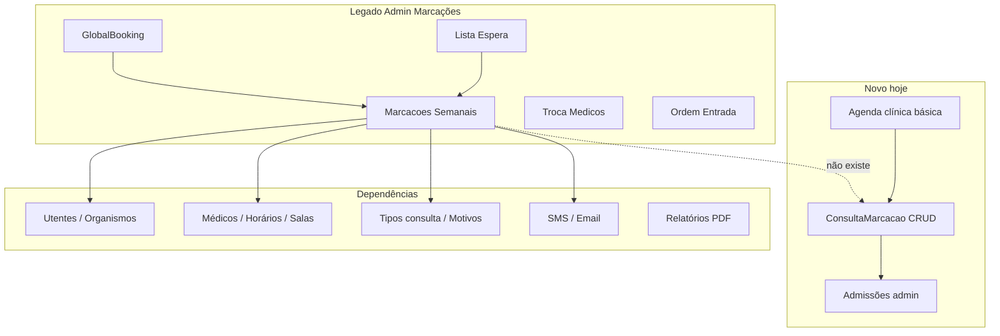

# Auditoria — Área Administrativa › Consultas › Marcações (legado vs novo)

Documento de referência para planear a réplica do **menu Marcações** do legado (`CliCloud.ASPcli` › Área Administrativa › Consultas) no projeto novo — **mesma localização** em `area-administrativa/consultas/marcacoes/*`.

**Relacionado:** [`auditoria-area-administrativa-consultas-legado-vs-novo.md`](./auditoria-area-administrativa-consultas-legado-vs-novo.md) (consultas diárias / admissões).

**Data:** maio 2026 — validado contra `WSMenus.asmx.cs`, `MarcacoesLst.js`, `MarcacoesDiarias.cs`, `MarcacaoConsultaController`, agenda área clínica.

**Paridade:** [`paridade-consultas-marcacoes.md`](./paridade-consultas-marcacoes.md)  
**Plano de fecho + ESP:** [`plano-implementacao-consultas-marcacoes.md`](./plano-implementacao-consultas-marcacoes.md)  
**Checklist:** [`consultas-marcacoes-pendente.md`](./consultas-marcacoes-pendente.md)

Este ficheiro = inventário **legado** e histórico; §8 não usar como tarefas atuais.

---

## 0. Ler primeiro — três “mundos” de marcações no legado

No legado, **“marcações” não é um único módulo**. Há três famílias distintas:

| Família | Menu / contexto | Foco |
|---------|-----------------|------|
| **A — Admin Consultas › Marcações** | `WSMenus` → `case "Consultas"` → submenu **Marcações** | Receção administrativa: agenda semanal, salas, troca médicos, ordem de entrada, lista de espera, GlobalBooking |
| **B — Processo clínico › Agenda** | `PClinico_ConsMarca` | Médico: consultas marcadas do dia, listagem, mapa PDF |
| **C — Tratamentos** | Menu Tratamentos | Fisioterapia: marcações automáticas/manuais, lista de espera prescrições, estatísticas |

Este documento centra-se em **A + B** (consultas). **C** só é referida no fim (fora de âmbito imediato).

**No projeto novo hoje (2026-05-21):**

- **A** existe na área administrativa: agenda, troca médicos, ordem entrada, lista espera, GlobalBooking (`/area-administrativa/consultas/marcacoes/*`).
- **B** existe parcialmente em `area-clinica/processo-clinico/agenda/*` (CRUD básico + admitir).
- Ligação **marcação → admissão** funciona (`MarcacaoAdmissaoSyncHelper` + `openAdmissaoFromMarcacaoInApp`).

---

## 1. Menu legado — Área Administrativa › Consultas › Marcações

Fonte: `CliCloud.ASPcli/Services/WSMenus.asmx.cs` (região `//Menu Marcacoes`, ~651–670).

| # | Item menu | Página | Permissão (`AppControl`) | Condição |
|---|-----------|--------|--------------------------|----------|
| 1 | **Marcações semanais** | `MarcacoesGestaoSalasLst.aspx` | `Consul_MarcacoesSemanais` | Empresa com `GestaoSalas = true` |
| 1b | **Marcações semanais** (alternativa) | `MarcacoesLst.aspx` | `Consul_MarcacoesSemanais` | Sem gestão de salas |
| 2 | **Troca marcações entre médicos** | `TrocaMarcacoesEntreMedicos.aspx` | `Consul_TrocaMarcacoesEntreMedicos` | — |
| 3 | **Ordem de entrada** | `OrdemEntradaMarcacoesLst.aspx` | `Consul_OrdemEntradaMarcacoes` | — |
| 4 | **Lista de espera** | `ListaEsperaLst.aspx` | `Consul_ListaEspera` | — |
| 5 | **GlobalBooking** | `PedidosConsultaLst.aspx` | `Consul_GlobalBooking` | — |

**Comentado / desativado no menu:** `TransferenciaMarcacoesLst` (Comum).

**Nota:** Existe ainda permissão `Consul_MarcacoesDiarias` e serviço `MarcacoesDiarias.cs` (~6600 linhas) usado em fluxos de calendário/listagem diária — **não** aparece como entrada separada neste submenu admin, mas partilha a mesma base de negócio (`WSConsultas.asmx`).

---

## 2. Menu legado — Processo clínico › Agenda (paralelo)

Fonte: `WSMenus.asmx.cs` (~1014–1026), permissão `PClinico_ConsMarca`.

| Item | Página legado |
|------|----------------|
| Consultas marcadas | `ProcessoClinico/ConsultasMarcadasLst.aspx` |
| Listagem consultas marcadas | `?modo=listagem` |
| Mapa consultas marcadas | `MapaConsultasAgendadas.aspx` |

---

## 3. Inventário detalhado por ecrã (legado)

### 3.1 Marcações semanais — `MarcacoesLst.aspx` + `MarcacoesLst.js`

**Tipo:** Agenda **FullCalendar** (vista semana/agenda), ~4500+ linhas JS.

**Funcionalidades principais (amostra validada no código):**

| Área | Comportamento legado |
|------|----------------------|
| **Vista calendário** | Semana por médico; folgas clínica; hidden days; zoom +/- info médico |
| **Seleção médico / especialidade** | Botões médicos por especialidade; autocomplete; `GetMedicosMarcacoesSemana` |
| **Marcar consulta** | Clique slot → modal; `MarcacoesSemanaisMarcarConsulta`; tipo consulta (1ª vs seguinte) |
| **Editar / mover** | Duplo clique `AlterarConsultaDuploClique`; drag `MudarHorarioConsulta`; validação horário |
| **Disponibilidade** | `VerificaDisponibilidadeMedicos`, `checkHoraConsulta`, `checkNextDateAvailable`, `obterHorariosPossiveisMedicoPorDia` |
| **Vagas / capacidade** | `CheckVagas`, `MaximoValorVaga`, `nrVagasExtra` |
| **Horário flexível** | Flag por médico (`isHorarioFlexivel`); duração consulta vs primeira consulta |
| **Lista de espera** | Integração: marcar a partir da LE; `showListaEspera`, checkbox no modal |
| **Observações** | Histórico obs utente; append `MarcacoesLstSaveObs` |
| **SMS** | Envio ao marcar/alterar/apagar (`sendConsultaSmsUtente`, mensagens alteração/remoção) |
| **Desmarcar** | `ConfirmaDesmarcarSelecionada`, `DeleteConsultaCalendario` |
| **Transferir** | `TransferirMarcacao` entre contextos |
| **Entrada externa** | Querystring: utente, médico, especialidade, organismo, credencial, tratamento (`numReq`, etc.) |
| **Exames sem papel** | Ligação modal `modFldExamesSemPapel` |
| **Tabela semanal alternativa** | `tableMarcacoesSemanais` + intervalos horários (`PreencheTabela`, `ChangeTabelaMarcacoes`) |

**WebMethods (`MarcacoesDiarias.cs` — parcial):**

- `calendarioMarcacoesMedicoLst` — eventos calendário por médico  
- `MarcacoesSemanaisMarcarConsulta`, `AlterarConsultaDuploClique`, `DeleteConsultaCalendario`  
- `GetMedicosMarcacoesSemana`, `GetUtentesOrganismos`, `MarcacoesSemanaisTipoConsulta`  
- `VerificaDisponibilidadeMedicos`, `CheckVagas`, `checkHoraConsulta`, `MaximoValorVaga`  
- `GetDiasFolgaClinica`, `ObterDisponibilidadeMedicosMesAtualPorEspecialidade`  
- CRUD diário: `MarcacoesDiariasLst`, `MarcacoesDiariasEdtLoad/Save`, `MarcacoesDiariasDel`  

**Complexidade:** **Muito alta** — núcleo operacional da receção para marcação de consultas.

---

### 3.2 Marcações semanais com gestão de salas — `MarcacoesGestaoSalasLst.aspx`

**Tipo:** Variante do calendário quando `empresa.GestaoSalas = true`.

**Diferença chave:** `calendarioMarcacoesSalaLst` (eventos por **sala** em vez de só médico).

**Ficheiros:** `MarcacoesGestaoSalasLst.js` (estrutura paralela a `MarcacoesLst.js`).

**Complexidade:** **Muito alta** (duplicação + regras de sala).

---

### 3.3 Troca entre médicos — `TrocaMarcacoesEntreMedicos.aspx`

**Tipo:** Modal/página única.

**Fluxo:** Médico origem + médico destino + data origem + data destino → `WSConsultas.asmx/TrocaMarcacoesEntreMedicos2`.

**Uso:** Reagendar em massa consultas de um médico para outro (ex.: substituição, férias).

**Complexidade:** **Média** (ecrã simples, lógica servidor relevante).

---

### 3.4 Ordem de entrada — `OrdemEntradaMarcacoesLst.aspx`

**Tipo:** Listagem + modal registo (~1300+ linhas JS).

**Fluxo:** Filtros (utente, médico, especialidade, datas); definir **ordem de entrada** das marcações do dia; histórico observações; horário flexível por médico.

**WebMethods:** `OrdemEntradaMarcacoes.cs` (vários ativos; alguns comentados).

**Complexidade:** **Média-alta** (receção balcão — fila física).

---

### 3.5 Lista de espera — `ListaEsperaLst.aspx` + `ListaEsperaEdt.aspx`

**Tipo:** CRUD lista de espera para consultas.

**WebMethods (`ListaEspera.cs`):**

- `ListaEsperaLst`, `ListaEsperaEdtLoad`, `ListaEsperaEdtSave`, `ListaEsperaDel`  
- Observações: `ListaEsperaGetObservacoes`, `ListaEsperaAddSaveObs`  
- `ListaEsperaUtentesAutocomplete`  

**Integração:** `MarcacoesLst` consome LE para preencher marcação (`event.data.field === 'modFldListaEspera'`).

**Complexidade:** **Média** (CRUD + ligação agenda).

---

### 3.6 GlobalBooking — `PedidosConsultaLst.aspx`

**Tipo:** Pedidos externos (portal/booking) para converter em consulta/utente.

**WebMethods (`PedidosConsulta.cs`):**

- Listagem, edição, delete, download ficheiro  
- `PedidosConsultaAddUtente`, `PedidosConsultaGuardarConsulta`  
- `PedidosConsultaEnvioEmail`, `PedidosConsultaEnvioSms`  

**Complexidade:** **Média-alta** (integração externa + workflow aprovação).

---

### 3.7 Marcações diárias (serviço transversal)

**Ficheiro:** `Services/MarcacoesDiarias.cs` (~6600 linhas, **33+ WebMethods**).

Usado por calendários e listagens; permissão `Consul_MarcacoesDiarias`.

Trata: blocos indisponibilidade, limites horário clínica, marcação rápida, validações cruzadas médico/especialidade.

**Nota:** No novo, parte disto está **espalhada** em `MarcacaoConsultaService` sem regras de agenda.

---

## 4. Dados e modelo (legado vs novo)

| Legado (típico) | Novo |
|-----------------|------|
| Tabelas `ADMISS` / marcações em `CliCloud.Dados.Consultas` | Entidade `ConsultaMarcacao` (`Consultas.ConsultaMarcacao`) |
| Ligação posterior a admissão/consulta | `ConsultaMarcacao.ConsultaId` opcional; promoção via admissão |
| Campos sala, médico, especialidade, tipo consulta, estado | ✅ na entidade |
| Horário fim calculado, vagas, folgas | ❌ não no serviço novo |
| Lista espera (tabela própria legado) | `Consultas.ListaEsperaConsulta` ✅ (migração dados opcional) |
| Pedidos GlobalBooking | `Consultas.PedidoConsulta` ✅ (migração dados opcional) |

**Entidade novo** (`ConsultaMarcacao.cs`): Utente, Médico, Especialidade, Sala, Data, HoraMarcacao, TipoConsulta, TipoAdmissao, MotivoConsulta, StatusConsulta, EmTratamento, Obs, soft delete.

---

## 5. Projeto novo — o que já existe

### 5.1 Backend

| Componente | Estado |
|------------|--------|
| `MarcacaoConsultaController` | CRUD + paginated + `all` + bulk delete |
| `GET consultas-do-dia` | Filtro data + médico do utilizador logado |
| `MarcacaoConsultaService` | Create/Update/Delete; **SMS** (fluxos 6.1/6.2) e **email** opcional no create/update |
| `ConsultaController.CreateConsultaFromMarcacao` | Criar consulta clínica a partir de marcação |
| Specs / filtros tabela | `MarcacaoConsultaSearchTable`, filtros por data, médico, etc. |

**Ainda em falta ou parcial no backend novo:**

- Paridade total `MarcacoesDiarias` (vagas, horário flexível, transferências)  
- Agenda por **sala** (`GestaoSalas` / `calendarioMarcacoesSalaLst`)  
- Transferência marcações  
- Resolver nomes GlobalBooking sem tabelas `dbo.MEDICOS` / `dbo.ESPECIAL`  

**Já existe (MVP):** `MarcacoesAdministrativo` (CRUD, calendário simplificado, salas associar, troca médicos), `ListaEsperaAdministrativo`, `PedidosConsultaAdministrativo`, extensão ordem entrada em `AdmissaoAdministrativo`.

### 5.2 Frontend

| Rota | Área | Estado |
|------|------|--------|
| `area-administrativa/.../marcacoes` | Admin | Agenda lista + calendário; CRUD; SMS; CSV; deep links |
| `.../marcacoes/troca-medicos` | Admin | ✅ |
| `.../marcacoes/ordem-entrada` | Admin | ✅ |
| `.../marcacoes/lista-espera` | Admin | ✅ |
| `.../marcacoes/global-booking` | Admin | ✅ MVP (dados + filtros UI pendentes) |
| `area-clinica/.../agenda/consultas-marcadas` | Clínica | Listagem do dia; criar marcação; **Admitir** |
| `.../mapa-consultas-marcadas` | Clínica | **Stub** — PDF em desenvolvimento |

**Cliente API:** `marcacao-consulta-client.ts`, DTOs em `marcacao-consulta.dtos.ts`.

**Integração admissões:** `openAdmissaoFromMarcacaoInApp`, pré-preenchimento em `admissao-form-utils.ts` / modal admissão.

### 5.3 Tabelas auxiliares (área comum)

- **Motivos de desmarcação** — CRUD completo (tratamentos), usado indiretamente em desmarcar admissões, não na agenda.

---

## 6. Matriz de equiparação (resumo)

Legenda: ✅ paridade aceitável · ⚠️ parcial · ❌ em falta

| Bloco legado (admin) | Novo | Estado | Notas |
|----------------------|------|--------|-------|
| Marcações semanais (calendário médico) | `marcacoes-administrativo` | ⚠️ **~50%** | Calendário MVP; falta vagas, tabela semanal, paridade `MarcacoesDiarias` |
| Marcações gestão salas (agenda por sala) | associar sala apenas | ⚠️ **~25%** | Falta `MarcacoesGestaoSalasLst` |
| Troca entre médicos | `troca-medicos` | ✅ MVP | |
| Ordem de entrada | `ordem-entrada` | ✅ MVP | Fase 3.1: ESP, validação horário, relatórios |
| Lista de espera | `lista-espera` | ✅ MVP | Migração dados + filtros de/até |
| GlobalBooking / pedidos | `global-booking` | ✅ **~90%** | UAT fechado 2026-05-20 — ver `uat-global-booking-fecho.md` |
| Consultas marcadas (dia) | Agenda clínica | ⚠️ ~40% | |
| Listagem consultas marcadas | Listagem clínica | ⚠️ ~50% | |
| Mapa PDF | Stub | ❌ | |
| Marcar → Admitir | Sync admissão | ✅ | |
| SMS/email na marcação | Parcial | ⚠️ | Templates legado incompletos |
| Validação disponibilidade / vagas | Simplificado | ⚠️ | |

**Percentagem global (admin Marcações itens menu 1–5):** **~65–75%** uso básico; **~40–50%** paridade calendário legado.

**Percentagem agenda clínica (B) vs legado:** **~40–50%**.

**Backlog:** [`consultas-marcacoes-pendente.md`](./consultas-marcacoes-pendente.md).

---

## 7. Dependências com outras áreas

| Dependência | Necessária para |
|-------------|-----------------|
| Horários médico, `MinMarcacao`, folgas | Calendário semanal |
| Gestão salas (`GestaoSalas`) | Variante `MarcacoesGestaoSalasLst` |
| Tipos consulta + código legado | Duração 1ª consulta vs seguinte |
| Utentes / organismos / credencial | Modal marcação |
| Admissões | Fluxo pós-marcação (já ligado) |
| Motor relatórios | Mapa consultas marcadas |
| API GlobalBooking | Pedidos externos |

---

## 8. Plano inicial (histórico — maio 2026, **já ultrapassado**)

> **Não usar esta secção como estado atual.** Foi escrita **antes** da implementação do menu Marcações na área administrativa. Hoje o ponto 1–12 abaixo está em grande parte **feito** (MVP). Pendências reais: [`consultas-marcacoes-pendente.md`](./consultas-marcacoes-pendente.md).

| Item do plano antigo | Situação hoje |
|----------------------|---------------|
| Rota `/area-administrativa/consultas/marcacoes` (não atalho clínica) | ✅ **Feito** — menu Consultas › Marcações › Agenda |
| Listagem + filtros | ✅ MVP |
| Modal marcação (organismo, credencial, tipo, sala…) | ✅ MVP (+ sync admissão) |
| Calendário semana (FullCalendar) | ✅ MVP (`POST .../calendario`) |
| Marcar / mover / desmarcar | ✅ |
| Lista de espera, ordem entrada, troca médicos | ✅ MVP |
| GlobalBooking | ✅ MVP |
| Associar sala | ✅ (falta agenda **por sala** se `GestaoSalas`) |
| Paridade total `MarcacoesDiarias` | ❌ ver doc pendente |

---

## 9. Marcações (Tratamentos) — fora de âmbito imediato

Menu **Tratamentos** no legado inclui (não confundir com Consultas):

| Item | Página |
|------|--------|
| Marcações automáticas | `Tratamentos/MarcacoesAutomaticas.aspx` |
| Marcações manuais | `Tratamentos/MarcacoesManuais.aspx` |
| Lista espera prescrições | `Tratamentos/ListEsperaLst.aspx` |
| Estatísticas marcações | `EstatisticasMarcacoes.aspx` |

Ligação com consultas diárias: após promover admissão fisio (`TipoAdmissao.CodigoLegado == 1`), legado abre **marcações automáticas** — no novo só há toast (ver auditoria consultas diárias P0-4).

---

## 10. Comparação estratégica (histórico — atualizar mentalidade)

Texto de **maio 2026** quando a agenda admin **ainda não existia**. Hoje:

| Critério | Consultas diárias (Admissões) | Menu Consultas › **Marcações** |
|----------|------------------------------|--------------------------------|
| Estado | ~85–90% balcão | **MVP dos 5 submenus** ✅; paridade calendário legado ~40–50% |
| Próximo passo | Faturação / relatórios receção | Polimento agenda + dados GlobalBooking — ver [`consultas-marcacoes-pendente.md`](./consultas-marcacoes-pendente.md) |

A receção **já pode** usar `/area-administrativa/consultas/marcacoes` para marcar (não é só atalho para a área clínica).

---

## 11. Inventário ficheiros legado (referência)

| Tema | Caminho |
|------|---------|
| Menu | `CliCloud.ASPcli/Services/WSMenus.asmx.cs` |
| Agenda semanal | `Client/Consultas/MarcacoesLst.js`, `.aspx` |
| Agenda salas | `Client/Consultas/MarcacoesGestaoSalasLst.*` |
| Serviços WS | `Client/Consultas/Services/MarcacoesDiarias.cs` |
| Troca médicos | `Client/Consultas/TrocaMarcacoesEntreMedicos.*` |
| Ordem entrada | `Client/Consultas/OrdemEntradaMarcacoesLst.*`, `Services/OrdemEntradaMarcacoes.cs` |
| Lista espera | `Client/Consultas/ListaEspera*`, `Services/ListaEspera.cs` |
| GlobalBooking | `Client/Consultas/PedidosConsulta*`, `Services/PedidosConsulta.cs` |
| Agenda clínica legado | `Client/ProcessoClinico/ConsultasMarcadasLst.*` |

## 12. Inventário ficheiros novo (referência)

| Tema | Caminho |
|------|---------|
| API | `Backend/.../MarcacaoConsultaController.cs`, `MarcacaoConsultaService/` |
| Entidade | `Backend/CliCloud.Domain/Entities/Consultas/ConsultaMarcacao.cs` |
| Cliente | `Frontend/src/lib/services/consultas/marcacao-consulta-service/` |
| UI clínica | `Frontend/src/pages/area-clinica/processo-clinico/agenda/` |
| Admitir | `Frontend/src/utils/window-utils.ts` (`openAdmissaoFromMarcacaoInApp`) |
| Menu admin | `menu-items.ts`, `area-administrativa-module.ts`, `areaAdministrativa.tsx` |
| O que falta | `consultas-marcacoes-pendente.md` |
| GlobalBooking | `pedidos-consulta-administrativo-service`, `global-booking/*` |

---

## 13. Checklist de aceitação (go-live Marcações admin — visão completa)

- [x] Agenda semanal por médico — **MVP** (calendário + CRUD; vagas/paridade fina em falta).
- [ ] Agenda por sala se `GestaoSalas`.
- [ ] Marcar / alterar / desmarcar com validações de horário e **vagas** completas.
- [x] Integração lista de espera — **MVP**.
- [x] Troca entre médicos e ordem de entrada — **MVP**.
- [x] GlobalBooking — **Sprint 3 fechado** ([`uat-global-booking-fecho.md`](./uat-global-booking-fecho.md)).
- [ ] SMS/email alinhados aos fluxos legado (templates 6.1/6.2).
- [x] Admitir / sync admissão a partir da marcação.
- [x] Permissões mapeadas (`marcacoes`, `marcacoesAgenda`, `globalBooking`, etc.) — validar UAT por perfil.

---

## 14. Paridade UI — Ordem de entrada e Lista de espera (maio 2026)

Referência legado: `OrdemEntradaMarcacoesLst.aspx` / `.js`, `ListaEsperaLst.aspx`.

### 14.1 Entrada de marcações (`OrdemEntradaMarcacoesLst`)

| Aspeto | Legado | Novo (após alinhamento) | Notas |
|--------|--------|-------------------------|-------|
| Toolbar | Consultas desmarcadas, **Adicionar**, Atualizar, Listagens (relatórios) | Consultas desmarcadas, **Adicionar**, Atualizar | Listagens/relatórios **fora de âmbito** (pedido utilizador) |
| Filtros | Painel GSLst (utente/médico/data/especial **de/até**) + caixa pesquisa | Painel expansível DataTable + pesquisa global | `ordem-entrada-filter-controls.tsx` |
| Modo desmarcadas | `historico=1`; ver/editar/imprimir/apagar + obs | `incluirHistorico=1`; mesmas ações de linha (sem fila Presente/Ordem) | Imprimir relatório — pendente |
| Linha | Ver, Editar, Desmarcar, Obs | Ver, Editar, Desmarcar, Obs | — |
| Grelha | Data, Hora, Cód. utente, Utente, Médico, Consulta, Data/hora marcação | Colunas legado + **Presente/Ordem/Chegada** (fila, modo normal) | Fila = extensão receção |
| Adicionar | `addRegisto()` → `modalRegisto` | `AdmissaoViewEditModal` modo `create` | — |

### 14.1a Deep links agenda (sem c_medico / c_utente no modelo)

| Legado (query) | Novo (resolução) |
|----------------|------------------|
| `c_utente` | `numeroUtente` → `UtentesService.getUtenteByNumeroUtente` → `utenteId` (Guid) |
| `c_medico` | Só se valor for **Guid** → `medicoId`; código legado int/string → aviso + seleção manual |
| `c_especial` / `especialidade` | `especialidadeId` (Guid) ou match por nome |
| `t_consulta` | `tipoConsulta` → `TipoConsulta.codigoLegado` |
| `c_instit` | Reservado; preferir `organismoId` (Guid) |
| `numReq` | Credencial no modal create |

Ficheiros: `marcacoes-agenda-url-prefill.ts`, `resolve-marcacoes-agenda-url-prefill.ts`, `listagem-marcacoes-administrativo-page.tsx`.

### 14.1b Modelo de dados — Marcação ↔ Admissão (P0)

| Legado | Novo |
|--------|------|
| Marcar consulta cria **ADMISS** + marcação | `MarcacaoAdmissaoSyncHelper`: create/update/desmarcar/mudar horário sincronizam `Admissao` com `ConsultaMarcacaoId` |
| Lista espera → marcação com admissão | `ConverterParaMarcacaoAsync` chama o mesmo helper |
| Organismo obrigatório na marcação | `CreateMarcacaoAdministrativoRequest`: validação `OrganismoId` obrigatório |

### 14.2 Lista de espera (`ListaEsperaLst`)

| Aspeto | Legado | Novo (após alinhamento) |
|--------|--------|-------------------------|
| Toolbar | Adicionar, Atualizar, Listagens | Adicionar, Atualizar |
| Filtros | Código, utente, prioridade **de/até** | Painel expansível (utente, médico, esp., prioridade, datas) + pesquisa global |
| Colunas | Utente, médico, esp., data, organismo, prioridade, hora | Alinhadas; sem coluna «Convertido» na grelha |
| Converter | → marcação + admissão | Marcação + **Admissao** via `MarcacaoAdmissaoSyncHelper` |

---

## 15. Documentos relacionados

- [`auditoria-area-administrativa-consultas-legado-vs-novo.md`](./auditoria-area-administrativa-consultas-legado-vs-novo.md)
- [`area-administrativa-paridade-legado-novo.md`](./area-administrativa-paridade-legado-novo.md)
- [`auditoria-legado-vs-novo-indice-global.md`](./auditoria-legado-vs-novo-indice-global.md)
