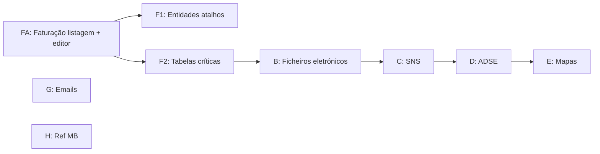

# Auditoria — Menu Faturação (Área Financeira)

**Última atualização:** 2026-06-03  
**Âmbito:** apenas o ramo **Área Financeira → menu Faturação** (`WSMenus.asmx.cs` → `case "Faturacao"`).  
**Fora de âmbito:** Contas Correntes, Tesouraria, Configurações (módulo separado no novo).

**Fontes:** `CliCloud.ASPcli/Services/WSMenus.asmx.cs`, `Frontend/src/config/menu-items.ts`, `Frontend/src/routes/area-financeira/areaFinanceira.tsx`, `Backend/CliCloud.WebApi/Controllers/Documentos/*`.

> **Subgrupo Faturação → Faturação (listagem + editor):** estado e disparidades em **[`disparidades-faturacao-legado-vs-novo.md`](./disparidades-faturacao-legado-vs-novo.md)** — MVP ✅ fechado. Este ficheiro cobre o **menu completo** (~55 ecrãs legado).

---

## 1. Resumo executivo

| Indicador | Legado | Novo | Gap |
|-----------|--------|------|-----|
| Grupos de 1.º nível no menu Faturação | **9** | **9** (estrutura espelhada) | Navegação ✅ |
| Itens folha (ecrãs distintos) | **~55+** | **4 rotas** Faturação/Faturação (listagem, novo, ver, liquidação) + 7 placeholders | **~95% menu por fazer** |
| Backend API dedicado (fora Documento) | WSFaturacao + dezenas de `.asmx` | `Documento*` / `TipoDocumento*` / `Recibo*` + emissão | Fases B–H sem BE dedicado |
| Permissões granulares | `AppControl.Funcionalidades.Faturacao_*` | 1 GUID por grupo no `area-financeira-module` | Mapeamento licença a validar |

**Conclusão:** O **menu novo está desenhado** (URLs + permissões). O subgrupo **Faturação → Novo Documento / Faturação** está **operacional (MVP)** — ver disparidades.md. O resto do menu (B–H) continua ⏳.

---

## 2. Árvore do menu — confronto

Legenda: ✅ implementado · 🟡 parcial · ⏳ placeholder · 🔗 reutilizar noutro módulo novo · ❌ sem BE/FE

### 2.1 Grupo **Faturação** (documentos)

| Item menu | Legado | Novo (rota) | FE | BE | Avançar |
|-----------|--------|-------------|----|----|---------|
| **Novo Documento** | `TfaturaEdt.aspx` | `/faturacao/novo-documento` | ✅ editor + modal tipo | Emissão ✅ | Pós-MVP: `FaturaGlobalObter`, sinistro no doc |
| **Faturação** (listagem) | `TfaturaLst.aspx` | `/faturacao/faturacao` | ✅ grelha + ações | Listagem ✅ | Pós-MVP: filtro nome de/até, tesouraria |
| **Ver documento** | `TfaturaEdt.aspx?oper=ver` | `/faturacao/documento/:id` | ✅ read-only | GET documento ✅ | Reabrir emitido ⏳ |
| **Liquidação** | fluxos legado | `/liquidacao-utente`, `/liquidacao-organismo` | 🟡 mínimo | `liquidar` ✅ | Épico tesouraria |

**Hub** `/area-financeira/faturacao` → `AreaFinanceiraHomePage` vazio (legado não tinha hub; abria submenus).

**Nota Recibos:** No novo, `/area-financeira/recibos` redireciona para `/faturacao`. No legado os recibos não estão neste submenu; existem `ReciboService` no BE e `recibos/` no FE — **fora do menu Faturação**, mas relacionados.

---

### 2.2 Grupo **Ficheiros Eletrónicos**

| Item | Legado | Novo | FE | BE |
|------|--------|------|----|-----|
| SAD/GNR | `FicheiroEletronicoLst.aspx?sigla=SAD/GNR` | `/ficheiros-eletronicos` (única rota) | ⏳ | ❌ |
| ADM | `?sigla=ADM` | (idem placeholder) | ⏳ | ❌ |
| SAD/PSP | `?sigla=SAD/PSP` | (idem) | ⏳ | ❌ |
| Ficheiro SAFT | `FicheirosaftLst.aspx` | (idem) | ⏳ | ❌ |
| Exportar contabilidade | `ExportarFicheiroContabilidade.aspx` | (idem) | ⏳ | ❌ |

**Permissão legado:** `Faturacao_FicheirosEletronicos`, `Faturacao_Ficheirosaft`, `Faturacao_FicheiroExportarCont`  
**Permissão novo:** `ficheirosEletronicos`

**Avançar:** Fase **B** — 5 ecrãs ou 1 ecrã com tabs/sigla; migrar `WSFaturacao` / `FicheiroEletronico.cs` (Dados) para API nova.

---

### 2.3 Grupo **Credenciais S.N.S.**

| Item | Legado | Novo | FE | BE |
|------|--------|------|----|-----|
| Fisioterapia | `CredenciaisSnsLst.aspx?modulo=fisioterapia` | `/credenciais-sns` placeholder | ⏳ | ❌ |
| Especialidades | `?modulo=especialidades` | (idem) | ⏳ | ❌ |
| Exames | `?modulo=exames` | (idem) | ⏳ | ❌ |
| Ficheiro eletrónico SNS | `CredenciaisSnsFicheiroEletronicoLst.aspx` | (idem) | ⏳ | ❌ |

**Permissões legado:** `Faturacao_CredSNS_Fisio`, `_Especi`, `_Exames`  
**Permissão novo:** `credenciaisSns` (única)

**Avançar:** Fase **C** — 4 variantes do mesmo ecrã; legado `CredenciaisSnsLst.js` + reports Crystal.

---

### 2.4 Grupo **ADSE**

| Item | Legado | Novo | FE | BE |
|------|--------|------|----|-----|
| Comunicação faturas → Tratamentos | `FaturacaoAdseLst.aspx?tipoPreFatura=TA` | `/adse` placeholder | ⏳ | ❌ |
| → Consultas | `?tipoPreFatura=CA` | (idem) | ⏳ | ❌ |
| → Exames | `?tipoPreFatura=EX` | (idem) | ⏳ | ❌ |
| Configurações ADSE | `ConfigADSE.aspx` | (idem) | ⏳ | ❌ |

**Permissão legado:** `Faturacao_ADSE`  
**Permissão novo:** `adse`

**Avançar:** Fase **D** — `FaturacaoAdse.cs` / `FaturacaoAdseLst.*`.

---

### 2.5 Grupo **Mapas**

| Item | Legado | Novo | FE | BE |
|------|--------|------|----|-----|
| Mapa IVA | `MapasIVA.aspx` | `/mapas` placeholder | ⏳ | ❌ |
| Recapitulativos | `MapaRecapitulativo.aspx` | (idem) | ⏳ | ❌ |
| Caixa | `MapasCaixa.aspx` | (idem) | ⏳ | ❌ |
| Faturas por área | `MapasFaturacaoDetalhadoDatas.aspx` | (idem) | ⏳ | ❌ |
| Faturas por número | `MapasFaturacaoNumero.aspx` | (idem) | ⏳ | ❌ |
| Faturas por serviço | `MapasFaturacaoServico.aspx` | (idem) | ⏳ | ❌ |
| Por instituição (Excel) | `MapasFaturacao.aspx?modo=instituicao` | (idem) | ⏳ | ❌ |
| Serviços/organismo (Excel) | `?modo=especialidade` | (idem) | ⏳ | ❌ |
| Resumo listagem | `TfaturaListagemReport.aspx` | (idem) | ⏳ | 🟡 ligado a docs |

**Permissões legado:** `Faturacao_Mapas`, `Comuns_MapasExcelMoveClinics`, `Faturacao_FaturacaoListagem` (resumo)  
**Permissão novo:** `mapas`

**Avançar:** Fase **E** — stack de relatórios (Crystal legado → definir substituto no novo); 9 ecrãs.

---

### 2.6 Grupo **Entidades**

| Item | Legado (atalho) | Novo | FE noutro módulo | BE |
|------|-----------------|------|------------------|-----|
| Fornecedores | `~/Client/Comum/FornecedoresLst.aspx` | `/entidades` placeholder | 🔗 `area-comum/.../fornecedores` | ✅ área comum |
| Médicos | `MedicosLst.aspx` | (idem) | 🔗 médicos | ✅ |
| Organismos | `OrganismosLst.aspx` | (idem) | 🔗 `area-comum/.../organismos` | ✅ |
| Utentes | `UtentesLst.aspx` | (idem) | 🔗 `area-comum/.../utentes` | ✅ |

**Avançar:** Fase **F1** — não reimplementar; **menu Entidades** = links para rotas já existentes na Área Comum / Administrativa (só FE routing).

---

### 2.7 Grupo **Tabelas** (maior grupo legado)

Subgrupos legado → estado novo:

| Subgrupo legado | Exemplos `.aspx` | Novo | Estratégia |
|-----------------|------------------|------|------------|
| Documentos | `NaturezaLst`, `TipoDocumentoLst` | placeholder `/tabelas` | TipoDocumento: 🔗 BE `TipoDocumentoController` ✅; falta FE listagem em faturação |
| Entidades bancárias | `ContaBancariaLst`, `BancosLst` | (idem) | 🔗 área comum se existir |
| Geográficas | CPostais, Concelhos, Distritos, Países | (idem) | 🔗 `area-comum/tabelas/geograficas` ✅ |
| Imposto | `MotivoIsencaoLst`, `TaxaIvaLst`, `MotivoRetencaoFonteLst` | (idem) | Parcial 🔗 `motivo-isencao` área comum |
| Moedas | `MoedaLst.aspx` | (idem) | 🔗 área comum |
| Pagamentos | `CondicaoPagamentoLst`, `ModoPagamentoLst` | (idem) | ❌ BE dedicado |
| Serviços | `ServicosLst`, `Acor_InsLst`, `TipoServicoLst` | (idem) | 🔗 área comum / administrativa |
| Zonas | `ZonaLst`, `ZonaFiscalLst` | (idem) | ❌ |
| Artigos / stocks | `ArtigoLst`, `FamiliaArtigosLst`, `ArmazemLst`, `UnidadeLst` | (idem) | ❌ módulo stocks legado — ver [`auditoria-artigos-stocks-legado-vs-novo.md`](./auditoria-artigos-stocks-legado-vs-novo.md) |

**~25+ ecrãs folha** no legado sob Tabelas.

**Avançar:** Fase **F2** — inventário item a item vs `area-comum`; só criar o que não existir noutro sítio; prioridade **Tipo documento / séries** para faturação.

---

### 2.8 Grupo **Emails**

| Item | Legado | Novo | FE | BE |
|------|--------|------|----|-----|
| Mensagens | `MensagensEmailLst.aspx` | `/emails` placeholder | ⏳ | ❌ |
| Enviados | `MensagensEmailHistoricoConsultaLst.aspx` | (idem) | ⏳ | ❌ |

**Avançar:** Fase **G**.

---

### 2.9 Grupo **Referências Multibanco**

| Item | Legado | Novo | FE | BE |
|------|--------|------|----|-----|
| Referências MB | `ReferenciasMBLst.aspx` | `/referencias-multibanco` placeholder | ⏳ | ❌ |

**Avançar:** Fase **H** — `ReferenciasMB.cs` legado.

---

## 3. Profundidade — subgrupo **Faturação / Faturação** (prioridade negócio)

Este é o único bloco com trabalho BE+FE já iniciado.

### 3.1 Legado `TfaturaLst` — capacidades

| Área | Legado | Novo | Estado |
|------|--------|------|--------|
| Colunas grelha | 10 + implícitos | Colunas legado em `listagem-faturacao-table.columns.tsx` | ✅ |
| Filtros | 5 pares de/até | nº/data de/até ✅; nome 🟡 | 🟡 |
| Toolbar | Novo, Crystal, refresh | Novo + modal tipo ✅; Crystal fora âmbito | ✅ / — |
| Ações linha | dropdown ~15 itens | ícones (email, print, liquidar, …) | ✅ (sem SMS/ARS/Crystal) |
| API | `WSFaturacao.asmx/TfaturaLst` | `POST Documento/paginated` | ✅ |

### 3.2 Legado `TfaturaEdt` — capacidades

| Área | Legado | Novo | Estado |
|------|--------|------|--------|
| Tabs | Cliente, Linhas, Admissões, Retenção, MB, … | `documento-editor` + tabs | ✅ núcleo |
| Sinistrados / fatura global | `SinistradosInfoFaturacao`, `FaturaGlobalObter` | sinistrados ✅; global só datas ⏳ | 🟡 |
| Emitir | WSFaturacao | `DocumentoEmissao/emitir` | ✅ |
| Reabrir emitido | `oper=chg` | só `view` | ⏳ |

### 3.3 Backend — **Faturação / Faturação** (2026-06-03)

| ID | Tarefa | Estado |
|----|--------|--------|
| BE-1 | Core documento + emissão + tipos + clínica | ✅ |
| BE-2a | `DocumentoTableDTO` completo (anulado, exibição, origem, admissões, totais) | ✅ |
| BE-2b | Excluir recibos na listagem | ✅ `DocumentoSearchTable` |
| BE-2c | Filtros `anulado`, `liquidado`, de/até | ✅ |
| Pós-MVP | `FaturaGlobalObter`, `Documento.SinistradoId`, reabrir | ⏳ — ver disparidades §4 |

### 3.4 Frontend — **Faturação / Faturação** (2026-06-03)

| ID | Tarefa | Estado |
|----|--------|--------|
| FE-1 | Rotas + menu (listagem, novo, documento, liquidação) | ✅ |
| FE-2 | Listagem + API + ações | ✅ |
| FE-3 | Grelha/filtros legado (exc. nome de/até, Crystal) | ✅ 🟡 nome |
| FE-4 | Editor tabs + sinistrados + totais | ✅ |
| FE-5 | Modal tipo antes de criar | ✅ |
| Pós-MVP | `FaturaGlobalObter` FE, dropdown tarefas (opcional) | ⏳ |

**Checklist único de lacunas:** [`disparidades-faturacao-legado-vs-novo.md`](./disparidades-faturacao-legado-vs-novo.md) §4.

---

## 4. Inventário Backend (novo) — menu Faturação

| Domínio | Controller / serviço | Suporta menu |
|---------|----------------------|--------------|
| Documentos fatura | `DocumentoController`, `DocumentoEmissaoService` | Faturação / Faturação ✅ |
| Tipos documento | `TipoDocumentoController` | Tabelas → séries (parcial) ✅ |
| Recibos | `ReciboController` | Fora menu; redirect antigo |
| Ficheiros eletrónicos | — | ❌ |
| Credenciais SNS | — | ❌ |
| ADSE | — | ❌ |
| Mapas / relatórios | — | ❌ |
| Emails faturação | — | ❌ |
| Referências MB | — | ❌ |
| Artigos / armazém / zonas | — | ❌ |

---

## 5. Permissões — legado vs novo

| Grupo menu | Funcionalidades legado (`AppControl`) | GUID novo |
|------------|----------------------------------------|-----------|
| Faturação (2 itens) | `Faturacao_NovoDoc`, `Faturacao_FaturacaoListagem` | `faturacao` (único) |
| Ficheiros eletrónicos | `Faturacao_FicheirosEletronicos`, `_Ficheirosaft`, `_FicheiroExportarCont` | `ficheirosEletronicos` |
| Credenciais SNS | `_CredSNS_Fisio`, `_Especi`, `_Exames` | `credenciaisSns` |
| ADSE | `Faturacao_ADSE` | `adse` |
| Mapas | `Faturacao_Mapas` (+ excel) | `mapas` |
| Entidades | `Faturacao_Entidades` | `entidades` |
| Tabelas | `Faturacao_Tabelas` | `tabelas` |
| Emails | `Faturacao_Emails` | `emails` |
| Referências MB | `Faturacao_ReferenciasMB` | `referenciasMultibanco` |

**Risco:** No legado, utilizador pode ter só “listagem” sem “novo doc”. No novo, ambos usam o mesmo `faturacao.id` — validar com licenciamento Globalsoft.

---

## 6. Roadmap recomendado (só menu Faturação)

| Prioridade | Código | Escopo | BE | FE | Estimativa relativa |
|------------|--------|--------|----|----|---------------------|
| **P0** | **FA** | Faturação → Novo Doc + Faturação | ✅ MVP | Pós-MVP disparidades §7 | **MVP fechado** — não reimplementar |
| P1 | F1 | Entidades → links área comum | — | Rotas/menu | Baixa |
| P2 | F2 | Tabelas (tipo doc, IVA, pagamentos…) | Parcial | Listagens | Média-alta |
| P3 | B | Ficheiros eletrónicos (5) | Novo | Novo | Alta |
| P4 | C | Credenciais SNS (4) | Novo | Novo | Alta |
| P5 | D | ADSE (4) | Novo | Novo | Alta |
| P6 | E | Mapas (9) | Novo + reports | Novo | Muito alta |
| P7 | G | Emails (2) | Novo | Novo | Média |
| P8 | H | Ref MB (1) | Novo | Novo | Média |

---

## 7. Onde avançar agora (decisão)

Se o objectivo é **Faturação / Faturação**:

1. **Não** repetir listagem/editor — MVP fechado.  
2. Seguir **pós-MVP** em [`disparidades-faturacao-legado-vs-novo.md`](./disparidades-faturacao-legado-vs-novo.md) §7 (`FaturaGlobalObter`, `SinistradoId`, filtro nome, tesouraria).  
3. **Não** abrir Ficheiros SNS/ADSE/Mapas em paralelo sem decisão de produto.

Se o objectivo é **paridade do menu Faturação inteiro**:

- Tratar **FA** como única entrega curta; depois **F1** (atalhos) + **F2** (tabelas); só então fases B–H.

---

## 8. Contagens

| Métrica | Valor |
|---------|-------|
| Grupos 1.º nível menu Faturação (legado) | 9 |
| Itens folha legado (aprox., activos) | ~55 |
| Rotas FE operacionais Faturação/Faturação | 4 (listagem, novo, documento, liquidação×2) |
| Controllers BE específicos faturação (fora Documento/Tipo/Recibo) | 0 |
| Rotas FE placeholder em `areaFinanceira.tsx` | 7 |

---

## Histórico

| Data | Nota |
|------|------|
| 2026-05-29 | Auditoria inicial menu Faturação completo |
| 2026-06-03 | Subgrupo FA: MVP fechado; secções 3.x alinhadas ao código; referência a disparidades.md |
