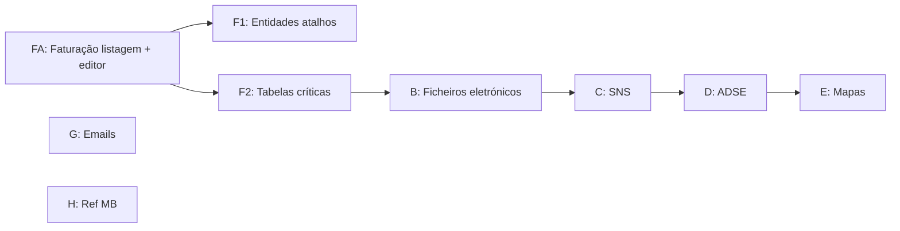

# Auditoria — Menu Faturação (Área Financeira)

**Data:** 2026-05-29  
**Âmbito:** apenas o ramo **Área Financeira → menu Faturação** (`WSMenus.asmx.cs` → `case "Faturacao"`).  
**Fora de âmbito:** Contas Correntes, Tesouraria, Configurações (módulo separado no novo).

**Fontes:** `CliCloud.ASPcli/Services/WSMenus.asmx.cs`, `Frontend/src/config/menu-items.ts`, `Frontend/src/routes/area-financeira/areaFinanceira.tsx`, `Backend/CliCloud.WebApi/Controllers/Documentos/*`.

---

## 1. Resumo executivo

| Indicador | Legado | Novo | Gap |
|-----------|--------|------|-----|
| Grupos de 1.º nível no menu Faturação | **9** | **9** (estrutura espelhada) | Navegação ✅ |
| Itens folha (ecrãs distintos) | **~55+** | **2** implementados + 7 placeholders | **~95% por fazer** |
| Backend API dedicado (fora Documento) | WSFaturacao + dezenas de `.asmx` | Quase só `Documento*` / `TipoDocumento*` / `Recibo*` | Fases B–F sem BE |
| Permissões granulares | `AppControl.Funcionalidades.Faturacao_*` | 1 GUID por grupo no `area-financeira-module` | Mapeamento licença a validar |

**Conclusão:** O **menu novo está desenhado** (URLs + permissões por grupo), mas só o subgrupo **Faturação → Novo Documento / Faturação** tem implementação real — e mesmo esse está **parcial** (BE-1 ✅, BE-2 ⏳, FE 🟡).

---

## 2. Árvore do menu — confronto

Legenda: ✅ implementado · 🟡 parcial · ⏳ placeholder · 🔗 reutilizar noutro módulo novo · ❌ sem BE/FE

### 2.1 Grupo **Faturação** (documentos)

| Item menu | Legado | Novo (rota) | FE | BE | Avançar |
|-----------|--------|-------------|----|----|---------|
| **Novo Documento** | `TfaturaEdt.aspx` | `/faturacao/novo-documento` | 🟡 form mínimo | BE-1 emitir ✅ | BE-2 + editor `TfaturaEdt` |
| **Faturação** (listagem) | `TfaturaLst.aspx` | `/faturacao/faturacao` | 🟡 listagem mínima | BE-1 listar ✅, BE-2 ⏳ | BE-2 + listagem legado |

**Hub** `/area-financeira/faturacao` → `AreaFinanceiraHomePage` vazio (legado não tinha hub; abria submenus).

**Nota Recibos:** No novo, `/area-financeira/recibos` redireciona para `/faturacao`. No legado os recibos não estão neste submenu; existem `ReciboService` no BE e `recibos/` no FE — **fora do menu Faturação**, mas relacionados.

---

### 2.2 Grupo **Ficheiros Eletrónicos**

| Item | Legado | Novo | FE | BE |
|------|--------|------|----|-----|
| SAD/GNR | `FicheiroEletronicoLst.aspx?sigla=SAD/GNR` | `/ficheiros-eletronicos` (única rota) | ⏳ | ❌ |
| ADM | `?sigla=ADM` | (idem placeholder) | ⏳ | ❌ |
| SAD/PSP | `?sigla=SAD/PSP` | (idem) | ⏳ | ❌ |
| Ficheiro SAFT | `FicheirosaftLst.aspx` | (idem) | ⏳ | ❌ |
| Exportar contabilidade | `ExportarFicheiroContabilidade.aspx` | (idem) | ⏳ | ❌ |

**Permissão legado:** `Faturacao_FicheirosEletronicos`, `Faturacao_Ficheirosaft`, `Faturacao_FicheiroExportarCont`  
**Permissão novo:** `ficheirosEletronicos`

**Avançar:** Fase **B** — 5 ecrãs ou 1 ecrã com tabs/sigla; migrar `WSFaturacao` / `FicheiroEletronico.cs` (Dados) para API nova.

---

### 2.3 Grupo **Credenciais S.N.S.**

| Item | Legado | Novo | FE | BE |
|------|--------|------|----|-----|
| Fisioterapia | `CredenciaisSnsLst.aspx?modulo=fisioterapia` | `/credenciais-sns` placeholder | ⏳ | ❌ |
| Especialidades | `?modulo=especialidades` | (idem) | ⏳ | ❌ |
| Exames | `?modulo=exames` | (idem) | ⏳ | ❌ |
| Ficheiro eletrónico SNS | `CredenciaisSnsFicheiroEletronicoLst.aspx` | (idem) | ⏳ | ❌ |

**Permissões legado:** `Faturacao_CredSNS_Fisio`, `_Especi`, `_Exames`  
**Permissão novo:** `credenciaisSns` (única)

**Avançar:** Fase **C** — 4 variantes do mesmo ecrã; legado `CredenciaisSnsLst.js` + reports Crystal.

---

### 2.4 Grupo **ADSE**

| Item | Legado | Novo | FE | BE |
|------|--------|------|----|-----|
| Comunicação faturas → Tratamentos | `FaturacaoAdseLst.aspx?tipoPreFatura=TA` | `/adse` placeholder | ⏳ | ❌ |
| → Consultas | `?tipoPreFatura=CA` | (idem) | ⏳ | ❌ |
| → Exames | `?tipoPreFatura=EX` | (idem) | ⏳ | ❌ |
| Configurações ADSE | `ConfigADSE.aspx` | (idem) | ⏳ | ❌ |

**Permissão legado:** `Faturacao_ADSE`  
**Permissão novo:** `adse`

**Avançar:** Fase **D** — `FaturacaoAdse.cs` / `FaturacaoAdseLst.*`.

---

### 2.5 Grupo **Mapas**

| Item | Legado | Novo | FE | BE |
|------|--------|------|----|-----|
| Mapa IVA | `MapasIVA.aspx` | `/mapas` placeholder | ⏳ | ❌ |
| Recapitulativos | `MapaRecapitulativo.aspx` | (idem) | ⏳ | ❌ |
| Caixa | `MapasCaixa.aspx` | (idem) | ⏳ | ❌ |
| Faturas por área | `MapasFaturacaoDetalhadoDatas.aspx` | (idem) | ⏳ | ❌ |
| Faturas por número | `MapasFaturacaoNumero.aspx` | (idem) | ⏳ | ❌ |
| Faturas por serviço | `MapasFaturacaoServico.aspx` | (idem) | ⏳ | ❌ |
| Por instituição (Excel) | `MapasFaturacao.aspx?modo=instituicao` | (idem) | ⏳ | ❌ |
| Serviços/organismo (Excel) | `?modo=especialidade` | (idem) | ⏳ | ❌ |
| Resumo listagem | `TfaturaListagemReport.aspx` | (idem) | ⏳ | 🟡 ligado a docs |

**Permissões legado:** `Faturacao_Mapas`, `Comuns_MapasExcelMoveClinics`, `Faturacao_FaturacaoListagem` (resumo)  
**Permissão novo:** `mapas`

**Avançar:** Fase **E** — stack de relatórios (Crystal legado → definir substituto no novo); 9 ecrãs.

---

### 2.6 Grupo **Entidades**

| Item | Legado (atalho) | Novo | FE noutro módulo | BE |
|------|-----------------|------|------------------|-----|
| Fornecedores | `~/Client/Comum/FornecedoresLst.aspx` | `/entidades` placeholder | 🔗 `area-comum/.../fornecedores` | ✅ área comum |
| Médicos | `MedicosLst.aspx` | (idem) | 🔗 médicos | ✅ |
| Organismos | `OrganismosLst.aspx` | (idem) | 🔗 `area-comum/.../organismos` | ✅ |
| Utentes | `UtentesLst.aspx` | (idem) | 🔗 `area-comum/.../utentes` | ✅ |

**Avançar:** Fase **F1** — não reimplementar; **menu Entidades** = links para rotas já existentes na Área Comum / Administrativa (só FE routing).

---

### 2.7 Grupo **Tabelas** (maior grupo legado)

Subgrupos legado → estado novo:

| Subgrupo legado | Exemplos `.aspx` | Novo | Estratégia |
|-----------------|------------------|------|------------|
| Documentos | `NaturezaLst`, `TipoDocumentoLst` | placeholder `/tabelas` | TipoDocumento: 🔗 BE `TipoDocumentoController` ✅; falta FE listagem em faturação |
| Entidades bancárias | `ContaBancariaLst`, `BancosLst` | (idem) | 🔗 área comum se existir |
| Geográficas | CPostais, Concelhos, Distritos, Países | (idem) | 🔗 `area-comum/tabelas/geograficas` ✅ |
| Imposto | `MotivoIsencaoLst`, `TaxaIvaLst`, `MotivoRetencaoFonteLst` | (idem) | Parcial 🔗 `motivo-isencao` área comum |
| Moedas | `MoedaLst.aspx` | (idem) | 🔗 área comum |
| Pagamentos | `CondicaoPagamentoLst`, `ModoPagamentoLst` | (idem) | ❌ BE dedicado |
| Serviços | `ServicosLst`, `Acor_InsLst`, `TipoServicoLst` | (idem) | 🔗 área comum / administrativa |
| Zonas | `ZonaLst`, `ZonaFiscalLst` | (idem) | ❌ |
| Artigos / stocks | `ArtigoLst`, `FamiliaArtigosLst`, `ArmazemLst`, `UnidadeLst` | (idem) | ❌ módulo stocks legado |

**~25+ ecrãs folha** no legado sob Tabelas.

**Avançar:** Fase **F2** — inventário item a item vs `area-comum`; só criar o que não existir noutro sítio; prioridade **Tipo documento / séries** para faturação.

---

### 2.8 Grupo **Emails**

| Item | Legado | Novo | FE | BE |
|------|--------|------|----|-----|
| Mensagens | `MensagensEmailLst.aspx` | `/emails` placeholder | ⏳ | ❌ |
| Enviados | `MensagensEmailHistoricoConsultaLst.aspx` | (idem) | ⏳ | ❌ |

**Avançar:** Fase **G**.

---

### 2.9 Grupo **Referências Multibanco**

| Item | Legado | Novo | FE | BE |
|------|--------|------|----|-----|
| Referências MB | `ReferenciasMBLst.aspx` | `/referencias-multibanco` placeholder | ⏳ | ❌ |

**Avançar:** Fase **H** — `ReferenciasMB.cs` legado.

---

## 3. Profundidade — subgrupo **Faturação / Faturação** (prioridade negócio)

Este é o único bloco com trabalho BE+FE já iniciado.

### 3.1 Legado `TfaturaLst` — capacidades

| Área | Legado | Novo | Estado |
|------|--------|------|--------|
| Colunas grelha | 10 + tipo implícito | 6 visíveis | ❌ |
| Filtros | 5 pares de/até + pesquisa | 5 campos simples | ❌ |
| Toolbar | Novo (modal tipo+série), listagens Crystal, refresh, e-mails série | Novo directo, listagens vazio, refresh | 🟡 |
| Ações linha | ~15+ (dropdown tarefas) | Ver, anular, NC | 🟡 |
| API | `WSFaturacao.asmx/TfaturaLst` | `POST Documento/paginated` | ✅ diferente modelo |

### 3.2 Legado `TfaturaEdt` — capacidades

| Área | Legado | Novo | Estado |
|------|--------|------|--------|
| Tabs | Cliente, Linhas, Condições, Admissões, Retenção, MB | Form único simples | ❌ |
| Linhas | Artigo, IVA, descontos, armazém, NC | desc/qtd/preço | ❌ |
| Cálculos | Totais, resumo IVA | — | ❌ |
| Emitir | WSFaturacao grava TFatura | `DocumentoEmissao/emitir` | ✅ BE |

### 3.3 Backend — checklist **Faturação / Faturação**

| ID | Tarefa | Estado |
|----|--------|--------|
| BE-1a | `Documento` paginated / get | ✅ |
| BE-1b | `DocumentoEmissao` emitir / anular / NC | ✅ |
| BE-1c | `TipoDocumento` light | ✅ |
| BE-1d | Scope clínica, transacções | ✅ |
| BE-2a | `DocumentoTableDTO`: `Anulado`, `NumeroExibicao`, `TotalDesconto`, `Origem`… | ⏳ |
| BE-2b | Excluir `Recibo` da listagem Documento | ⏳ |
| BE-2c | Filtro `anulado` + intervalos de/até | ⏳ |
| BE-2d | `DocumentoDTO` detalhe + `Linhas[]` | ⏳ |
| BE-2e | AutoMapper | ⏳ |

### 3.4 Frontend — checklist **Faturação / Faturação**

| ID | Tarefa | Estado |
|----|--------|--------|
| FE-1 | Rotas + menu | ✅ |
| FE-2 | Listagem ligada à API | 🟡 |
| FE-3 | Paridade grelha/filtros legado | ⏳ |
| FE-4 | Dropdown tarefas + regras por tipo doc | ⏳ |
| FE-5 | Editor (substituir `novo-documento-form`) | ⏳ |
| FE-6 | Modal tipo (+ série) antes de criar | ⏳ |
| FE-7 | `form-styles` + padrão admissões | ⏳ |

Ver detalhe: [`alinhamento-fe-faturacao-legado-vs-novo.md`](./alinhamento-fe-faturacao-legado-vs-novo.md).

---

## 4. Inventário Backend (novo) — menu Faturação

| Domínio | Controller / serviço | Suporta menu |
|---------|----------------------|--------------|
| Documentos fatura | `DocumentoController`, `DocumentoEmissaoService` | Faturação / Faturação ✅ |
| Tipos documento | `TipoDocumentoController` | Tabelas → séries (parcial) ✅ |
| Recibos | `ReciboController` | Fora menu; redirect antigo |
| Ficheiros eletrónicos | — | ❌ |
| Credenciais SNS | — | ❌ |
| ADSE | — | ❌ |
| Mapas / relatórios | — | ❌ |
| Emails faturação | — | ❌ |
| Referências MB | — | ❌ |
| Artigos / armazém / zonas | — | ❌ |

---

## 5. Permissões — legado vs novo

| Grupo menu | Funcionalidades legado (`AppControl`) | GUID novo |
|------------|----------------------------------------|-----------|
| Faturação (2 itens) | `Faturacao_NovoDoc`, `Faturacao_FaturacaoListagem` | `faturacao` (único) |
| Ficheiros eletrónicos | `Faturacao_FicheirosEletronicos`, `_Ficheirosaft`, `_FicheiroExportarCont` | `ficheirosEletronicos` |
| Credenciais SNS | `_CredSNS_Fisio`, `_Especi`, `_Exames` | `credenciaisSns` |
| ADSE | `Faturacao_ADSE` | `adse` |
| Mapas | `Faturacao_Mapas` (+ excel) | `mapas` |
| Entidades | `Faturacao_Entidades` | `entidades` |
| Tabelas | `Faturacao_Tabelas` | `tabelas` |
| Emails | `Faturacao_Emails` | `emails` |
| Referências MB | `Faturacao_ReferenciasMB` | `referenciasMultibanco` |

**Risco:** No legado, utilizador pode ter só “listagem” sem “novo doc”. No novo, ambos usam o mesmo `faturacao.id` — validar com licenciamento Globalsoft.

---

## 6. Roadmap recomendado (só menu Faturação)

| Prioridade | Código | Escopo | BE | FE | Estimativa relativa |
|------------|--------|--------|----|----|---------------------|
| **P0** | **FA** | Faturação → Novo Doc + Faturação | BE-2 | FE paridade | Alta — **fechar primeiro** |
| P1 | F1 | Entidades → links área comum | — | Rotas/menu | Baixa |
| P2 | F2 | Tabelas (tipo doc, IVA, pagamentos…) | Parcial | Listagens | Média-alta |
| P3 | B | Ficheiros eletrónicos (5) | Novo | Novo | Alta |
| P4 | C | Credenciais SNS (4) | Novo | Novo | Alta |
| P5 | D | ADSE (4) | Novo | Novo | Alta |
| P6 | E | Mapas (9) | Novo + reports | Novo | Muito alta |
| P7 | G | Emails (2) | Novo | Novo | Média |
| P8 | H | Ref MB (1) | Novo | Novo | Média |

---

## 7. Onde avançar agora (decisão)

Se o objectivo é **fechar o que recomendaste** (Faturação / Faturação):

1. **BE-2** (secção 3.3) — sem isto a listagem nunca fica certa.  
2. **FE FA** — grelha + filtros + editor mínimo credível.  
3. **Não** abrir Ficheiros SNS/ADSE/Mapas em paralelo — menu já tem placeholder; zero BE.

Se o objectivo é **paridade do menu Faturação inteiro**:

- Tratar **FA** como única entrega curta; depois **F1** (atalhos) + **F2** (tabelas); só então fases B–H.

---

## 8. Contagens

| Métrica | Valor |
|---------|-------|
| Grupos 1.º nível menu Faturação (legado) | 9 |
| Itens folha legado (aprox., activos) | ~55 |
| Itens folha novo implementados | 2 |
| Controllers BE específicos faturação (fora Documento/Tipo/Recibo) | 0 |
| Rotas FE placeholder em `areaFinanceira.tsx` | 7 |

---

## Histórico

| Data | Nota |
|------|------|
| 2026-05-29 | Auditoria inicial menu Faturação completo |
