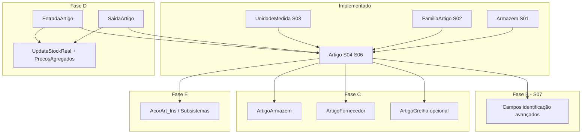

# Paridade Artigos — Legado vs Novo

**Última atualização:** 2026-06-22  
**Âmbito:** Área Financeira → Faturação → Tabelas → **Artigos** (catálogo + ecossistema stocks)  
**Estado geral:** MVP do artigo **operacional**; paridade completa com legado **parcial (~40% funcional, ~85% no núcleo CRUD)**

**Documentos relacionados:**

- [`implementacao-familias-artigo.md`](./implementacao-familias-artigo.md) — Famílias (concluído)
- [`auditoria-artigos-stocks-legado-vs-novo.md`](./auditoria-artigos-stocks-legado-vs-novo.md) — auditoria inicial (desactualizada; ver este documento)
- Legado: `CliCloud.ASPcli/Client/Faturacao/ArtigoLst.aspx`, `ArtigoEdt.aspx`, `ArtigoEdt.js`
- Legado DAL: `Dados/CliCloud.Dados.Faturacao/Artigo.cs`
- Novo BE: `Backend/CliCloud.Application/Services/Stocks/ArtigoService/`
- Novo FE: `Frontend/src/pages/area-financeira/faturacao/tabelas/artigos/artigos/`

---

## 1. Resumo executivo

### 1.1 Submenu Stocks (5 itens legado)

| Item | Legado | Novo | Estado |
|------|--------|------|--------|
| Artigos | `ArtigoLst.aspx` / `ArtigoEdt.aspx` | `listagem-artigos-page` / `artigo-edit-page` | ✅ MVP |
| Armazéns | `ArmazemLst.aspx` | `listagem-armazens-page` | ✅ |
| Unidades | `UnidadeLst.aspx` | `listagem-unidades-page` | ✅ |
| Famílias de Artigos | `FamiliaArtigosLst.aspx` | `listagem-familias-artigo-page` | ✅ |
| Subsistemas Artigos | `AcorArt_InsLst.aspx` | — | ❌ Por implementar |

### 1.2 Paridade estimada

| Área | Legado | Novo hoje | Gap |
|------|--------|-----------|-----|
| CRUD cabeçalho + preços editáveis | Completo | ~85% | Campos fase B, tipo PSO |
| Tabs secundárias (armazéns, fornec., mov.) | Funcional | ~10% (só UI) | APIs + entidades filhas |
| Motor stock / preços agregados | Movimentos actualizam BD | Colunas existem, valor estático | Motor movimentos |
| Listagem + filtros | Avançado | Básico | Intervalos, stock, export |
| Ecossistema entradas/saídas | Sim | Não | Módulos à parte |

### 1.3 Migrations Stocks (novo)

| ID | Conteúdo | Estado |
|----|----------|--------|
| S01 | `Stocks.Armazem` | ✅ |
| S02 | `Stocks.FamiliaArtigo` | ✅ |
| S03 | `Stocks.UnidadeMedida` | ✅ |
| S04 | `Stocks.Artigo` + `DocumentoLinha.ArtigoId` | ✅ |
| S05 | Preços agregados (`UltimoPreco*`, `PrecoMedio*`) | ✅ |
| S06 | `EAN` nvarchar(13) | ✅ |
| S07 | Campos fase B (ver §8) | ❌ Planeado |
| S08+ | Tabelas filhas (armazém, fornecedor, lote…) | ❌ Planeado |

---

## 2. Como funciona no legado

### 2.1 Listagem (`ArtigoLst.aspx`)

1. Utilizador abre janela GS com grelha paginada.
2. Filtros: descrição, nº artigo, nº série U.Central, nº série fornecedor, intervalos, tipo (PSO), inactivos, etc.
3. SQL em `ArtigoLst.GetListaSQL`:
   - PU/PVP com **`Faturacao.Cambio`** (moeda da sessão + data trabalho).
   - `StockReal`, `NumVendas` (contagem em `TfaturaLinha`).
4. Acções: Adicionar → `ArtigoEdt.aspx?oper=add`; Editar/Ver → `oper=chg` / view.
5. Permissão: `Faturacao_Tabelas`; scope por **empresa** (`CodigoEmpresa`).

### 2.2 Edição (`ArtigoEdt.aspx` + `ArtigoEdt.js`)

1. **Janela GS** (não modal) com botões Guardar, Ver movimentos, Help, Fechar.
2. **Cabeçalho:** Nº artigo, EAN, armazém (autocomplete + `+`), tipo **PSO** (Produto/Medicamento/Hospitalar), descrição, foto (`GSFormUpload` — explorador de ficheiros).
3. **Painéis de preços:**
   - PU sem IVA (`PrecoVenPublico1–3`) — editável.
   - PVP com IVA (`PrecoFinal1–3`) — editável.
   - Último/médio **compra** (`UltimoPrecoFinal`, `PrecoMedioFinal`) — **readonly**; actualizados por movimentos.
   - Último/médio **venda** (`UltimoPrecoVenda`, `PrecoMedioVenda`) — **readonly**.
4. **Tabs:**
   - *Identificação* — série U.Central, IVA, motivo isenção, unidade, desconto %, capacidade, família (códigos fam/classe/sub + autocomplete).
   - *Dados1* — princípio activo, grupo formas/dosagem/vias (prescrição).
   - *Outros* — garantia, stocks min/max/repos/real, visualizar na net, hotel, POS, tipo medida, permitir descontos/alterar preço.
   - *Cores/Tamanhos* — grelha `ArtigoGrelha` (muitas instalações com tab oculta).
   - *Armazéns* — stock por armazém (`ArtigoArmazem`).
   - *Fornecedores* — `ArtigoFornecedor` (código artigo fornecedor, preço).
   - *Movimentos* — histórico de movimentos do artigo.
5. **Guardar** (`WSFaturacao.asmx/ArtigoEdtSave`):
   - Persiste artigo + grelha + fornecedores.
   - Validações: descrição, taxa IVA, motivo se IVA zero, nº artigo.
   - `StockReal` não é editável no save — calculado via `Artigo.DaStockReal` / movimentos.

### 2.3 Motor de negócio legado (pós-save)

| Função | Ficheiro / método | Efeito |
|--------|-------------------|--------|
| Stock real | `Artigo.DaStockReal`, `UpdateStockReal` | Soma movimentos por armazém |
| Preços agregados | Entradas/saídas, `GuardarOrUpdateUltimoPrecoVenda` | Actualiza último/médio compra e venda |
| Descontinuar | `DescontinuarArtigo` | Flag + opcional movimentos de saída |
| Multi-armazém | `Artigo.Armazens[]` | Quantidade por armazém |
| Lotes | `ArtigoLote` | Stock por lote |
| Faturação | `ObterArtigoTFatura` | Preço efectivo conforme regra/moeda/cliente |

### 2.4 Modelo de dados legado (`Faturacao.Artigo`)

- PK `int Codigo`, scope `CodigoEmpresa`.
- FKs inteiras: unidade, família, armazém principal, taxa IVA.
- `PSO` (`int?`): 1 Produto, 4 Medicamento, 5 Hospitalar (UI actual).
- `Descontinuado` como **`int?`** (não bool).
- `PermitirDescontos` / `PermitirAlterarPreco` como **`int?`** (0/1).
- Tabelas filhas: `ArtigoFornecedor`, `ArtigoLote`, grelha cores/tamanhos, stock por armazém.

---

## 3. Como funciona no projeto novo

### 3.1 Listagem (`listagem-artigos-page.tsx`)

1. Página em janela (tab inferior) em `/area-financeira/faturacao/tabelas/artigos/artigos`.
2. Permissão: `modules.areaFinanceira.permissions.tabelas`.
3. Scope: **clínica** (`ClinicaId` via `ICurrentClinicaService`).
4. Filtros activos: descrição, tipo artigo (enum stocks), apenas inactivos, apenas descontinuados.
5. Colunas: código, nº artigo, descrição, armazém, PU, PVP, tipo, inactivo.
6. **Adicionar / Ver / Editar** → `openArtigoCreationInApp` / `openArtigoEditInApp` (janela em tab inferior, não modal).
7. Eliminar: diálogo por linha; API `DeleteMultiple` existe mas UI multi-select não.

### 3.2 Edição (`artigo-edit-page.tsx` + `ArtigoEditForm`)

1. Rotas:
   - `/artigos/artigos/novo`
   - `/artigos/artigos/:id/editar`
   - `/artigos/artigos/:id/ver`
2. Cabeçalho com Voltar, Guardar, Cancelar.
3. **Persistência de contexto:** ao trocar de tab da aplicação, rascunho em `artigoFormDraft` (pages store) + tab activa via `useTabManager`.
4. **Foto:** `ImageUploader` → `POST /client/utility/ImageUpload/upload-image` → `Subfolder: Artigos` → `UrlFoto` parcial na BD.
5. **Preços agregados:** lidos da API, readonly no UI; **não actualizados** por movimentos.
6. **StockReal:** exibido readonly; ignorado no create/update (`MappingProfiles`).
7. Campos fase B: presentes no UI mas **`CAMPOS_AGUARDAM_FASE_B = true`** (desactivados).

### 3.3 Backend (`ArtigoService`)

| Operação | Comportamento |
|----------|---------------|
| `CreateAsync` | Código sequencial; `NumeroArtigo` auto se vazio; `StockReal = 0`; valida FKs + motivo isenção se taxa 0 |
| `UpdateAsync` | Não altera `StockReal` nem preços agregados |
| `DeleteAsync` | Soft delete |
| `GetPaginatedAsync` | Spec `ArtigoSearchTable` com filtros básicos |

### 3.4 Modelo novo (`Stocks.Artigo`)

- PK `Guid`, scope `ClinicaId`.
- `TipoArtigoStocks`: 1 Artigo, 2 Serviço, 3 Outros — **diferente do PSO legado**.
- `Descontinuado` / `Inativo` / flags desconto: **bool**.
- `CodigoBarras` max 50 (legado 20); `UrlFoto` max 512 (legado 254).
- `CodigoInternoLegado` para migração futura.

---

## 4. Disparidades detalhadas

### 4.1 Campos — mapeamento legado → novo

| Campo legado | Novo | Persistido | Notas |
|--------------|------|------------|-------|
| `Codigo` | `Codigo` | ✅ | int auto por clínica |
| `NumeroArtigo` | `NumeroArtigo` | ✅ | max 20 |
| `Descricao` | `Descricao` | ✅ | max 100 |
| `EAN` | `EAN` | ✅ | max 13 (S06) |
| `CodigoBarras` | `CodigoBarras` | ✅ | tamanho diferente |
| `UrlFoto` | `UrlFoto` | ✅ | upload ficheiro (novo) |
| `CodigoUnidade` | `UnidadeMedidaId` | ✅ | Guid |
| `CodigoFamilia` | `FamiliaArtigoId` | ✅ | Guid |
| `CodigoTaxaIva` | `TaxaIvaId` | ✅ | + `MotivoIsencaoId` |
| `CodigoArmazem` | `ArmazemId` | ✅ | 1 armazém principal |
| `PSO` | `TipoArtigo` | ⚠️ | **Semântica diferente** (ver §4.2) |
| `Inativo` | `Inativo` | ✅ | |
| `Descontinuado` | `Descontinuado` | ✅ | tipo bool vs int legado |
| `PrecoVenPublico1–3` | `PrecoUnitarioSemIva1–3` | ✅ | |
| `PrecoFinal1–3` | `PrecoVendaComIva1–3` | ✅ | |
| `PrecoCusto` | `PrecoCusto` | ✅ | |
| `UltimoPrecoFinal` etc. | colunas S05 | ⚠️ | BD sim; motor não |
| `StockMin/Max/Reposicao` | idem | ✅ | |
| `StockReal` | `StockReal` | ⚠️ | readonly; sem motor |
| `PermitirDescontos/AlterarPreco` | bool | ✅ | legado int? |
| `ActHotel` / `ActPOS` | idem | ✅ | |
| `NumSerieUCentral` | — | ❌ | UI fase B |
| `Desconto` | — | ❌ | UI fase B |
| `Capacidade` | — | ❌ | UI fase B |
| `TemGarantia`, `MesesGarantia`, `AmpliacaoGarantia` | — | ❌ | UI fase B |
| `VisualizarNaNet` | — | ❌ | UI fase B |
| `TipoMedida` | — | ❌ | UI fase B |
| `PrecoRevenda` | — | ❌ | |
| Datas última entrada/saída/actualização | — | ❌ | |
| `CodigoPrincipioAtivo` etc. | — | ❌ | Tab Dados1 placeholder |
| `ArtigosGrelhas` | — | ❌ | Tab ausente |
| `ArtigoFornecedor[]` | — | ❌ | Tab mock |
| Stock multi-armazém | — | ❌ | Tab mock |
| `CodigoSaidaArtigo` | — | ❌ | |
| `NumSerieFornecedor` | — | ❌ | |

### 4.2 Tipo de artigo — decisão obrigatória

**Legado (`ArtigoEdt.aspx.cs`):**

| Valor PSO | Label UI |
|-----------|----------|
| 1 | Produto |
| 4 | Medicamento |
| 5 | Hospitalar |

**Novo (`TipoArtigoStocks`):**

| Valor | Label |
|-------|-------|
| 1 | Artigo |
| 2 | Serviço |
| 3 | Outros |

**Opções de implementação:**

1. **Renomear enum + UI** para Produto/Medicamento/Hospitalar e mapear PSO na migração (`1→1`, `4→4`, `5→5`).
2. **Manter enum actual** e documentar que PSO legado 4/5 ficam em `CodigoInternoLegado` ou coluna `PsoLegado`.
3. **Dois campos:** `TipoArtigoStocks` (negócio novo) + `Pso` (paridade legado).

**Recomendação:** opção 1 se a clínica usa medicamentos/hospitalar; alinhar com `ArtigoEdt.js` (tab Dados1 só para medicamento).

### 4.3 UI — tabs

| Tab legado | Novo | Acção |
|------------|------|-------|
| Identificação | `identificacao` | Activar campos fase B (S07) |
| Dados1 | `dados1` | Integrar entidades prescrição ou ocultar tab |
| Outros dados | `outros-dados` | Activar garantia + flags (S07) |
| Cores/Tamanhos | — | Fase C opcional (legado muitas vezes oculto) |
| Armazéns | `armazens` | API `ArtigoArmazem` (fase C) |
| Fornecedores | `fornecedores` | API `ArtigoFornecedor` (fase C) |
| Movimentos | `movimentos` | API movimentos + botão header (fase D) |

### 4.4 Listagem

| Funcionalidade legado | Novo | Implementação sugerida |
|----------------------|------|------------------------|
| Filtro nº artigo (de/até) | ❌ | Extender `ArtigoTableFilter` + UI |
| Filtro nº série U.Central | ❌ | Após S07 |
| PU/PVP com câmbio moeda | ❌ | Serviço câmbio ou calcular no Spec |
| Coluna `StockReal` | ❌ | Adicionar a `ArtigoTableDTO` |
| Coluna `NumVendas` | ❌ | Subquery ou campo calculado |
| Listagens / Excel | Botão vazio | Reutilizar padrão export de outras listagens |
| Selecção múltipla + delete | ❌ | UI + `DeleteMultiple` já existe |

### 4.5 UX / shell

| Aspeto | Legado | Novo | Notas |
|--------|--------|------|-------|
| Formulário | Janela GS | Janela tab inferior | ✅ Alinhado |
| Rascunho ao mudar tab | Implícito na página | `artigoFormDraft` | ✅ |
| Autocomplete + botão `+` | Abre lista noutra janela | Select; `+` desactivado | Implementar `openPathInApp` como em Famílias/Médicos |
| Help | Sim | ❌ | Baixa prioridade |
| Ver movimentos | Funcional | Botão sem acção | Fase D |

---

## 5. Ecossistema stocks (fora do CRUD artigo)

Presente no menu legado, **ainda sem equivalente** no novo:

| Módulo legado | Ficheiro | Dependência |
|---------------|----------|-------------|
| Entradas artigo | `EntradaArtigoLst.aspx` | Actualiza stock e preços compra |
| Saídas artigo | `SaidaArtigoLst.aspx` | Actualiza stock |
| Movimentos | `MovimentosArtigoLst.aspx` | Consulta + motor |
| Subsistemas artigos | `AcorArt_InsLst.aspx` | `dbo.ACORART_INS` |
| Mapas artigo | `MapasArtigo.aspx` | Relatórios |

Sem estes módulos, **stock real** e **preços agregados** no novo permanecem estáticos após o create.

---

## 6. Diagrama de dependências (alvo)



---

## 7. Plano de implementação por fases

### Fase A — Coerência rápida ✅ CONCLUÍDA

| Item | Estado |
|------|--------|
| `urlFoto` no save + `ImageUploader` | ✅ |
| EAN 13 + migration S06 | ✅ |
| Preços agregados colunas S05 + readonly UI | ✅ |
| Janela em tab inferior + rascunho `artigoFormDraft` | ✅ |
| Campos fase B desactivados no UI | ✅ |

### Fase B — Campos adicionais no artigo (migration **S07**)

**Objectivo:** Persistir campos já visíveis no formulário (actualmente desactivados).

#### 7.1 Backend

1. **Entidade** `Artigo.cs` — adicionar:

```csharp
[StringLength(100)]
public string? NumSerieUCentral { get; set; }

[Column(TypeName = "decimal(18, 4)")]
public decimal? Desconto { get; set; }

[Column(TypeName = "decimal(18, 4)")]
public decimal? Capacidade { get; set; }

public bool TemGarantia { get; set; }
public int? MesesGarantia { get; set; }
public int? AmpliacaoGarantia { get; set; }
public bool VisualizarNaNet { get; set; }
public TipoMedidaArtigo? TipoMedida { get; set; } // enum Peso=0, Quantidade=1
```

2. **Migration** `S07_Stocks_Artigo_CamposIdentificacao`.
3. **DTOs** `CreateArtigoRequest`, `UpdateArtigoRequest`, `ArtigoDTO` — incluir campos.
4. **Validators** — `NumSerieUCentral` max 100; `Desconto`/`Capacidade` ranges.
5. **MappingProfiles** — mapear; continuar a ignorar `StockReal` e preços agregados no update.

#### 7.2 Frontend

1. `artigo-form-draft.ts` — incluir novos campos no rascunho.
2. `artigo-view-create-modal.tsx` — `CAMPOS_AGUARDAM_FASE_B = false`.
3. Testar create/edit/view + persistência de rascunho.

#### 7.3 Tipo PSO (decisão em paralelo)

- Alterar `TIPO_ARTIGO_OPTIONS` e enum BE para Produto/Medicamento/Hospitalar **ou**
- Adicionar coluna `Pso` int nullable + manter `TipoArtigoStocks` para classificação fiscal.

**Critério de aceitação:** Guardar e reabrir artigo com todos os campos da tab Identificação e Outros (excepto Dados1).

---

### Fase C — Entidades filhas do artigo

**Objectivo:** Tabs Armazéns, Fornecedores (e opcionalmente Cores/Tamanhos) funcionais.

#### 7.4 `Stocks.ArtigoArmazem`

| Campo | Tipo |
|-------|------|
| `Id` | Guid |
| `ArtigoId` | FK |
| `ArmazemId` | FK |
| `Quantidade` | decimal(18,4) |
| UK | `(ArtigoId, ArmazemId)` |

- **API:** `GET/PUT /client/stocks/artigos/{id}/armazens`
- **UI:** Tab Armazéns — grelha editable; soma pode alimentar `StockReal` (decisão: manter coluna agregada ou só calcular).

**Legado:** `Artigo.Armazens[]` na save; `Artigo.DaStockReal`.

#### 7.5 `Stocks.ArtigoFornecedor`

| Campo | Tipo |
|-------|------|
| `ArtigoId` | FK |
| `FornecedorId` | FK entidade fornecedor |
| `CodigoArtigoFornecedor` | string |
| `DescricaoArtigo` | string |
| `Preco` | decimal |

- **API:** CRUD linhas na tab Fornecedores.
- **Legado:** grid `lstFornecedores` no save `ArtigoEdt.js`.

#### 7.6 Cores/Tamanhos (opcional)

- Só se clientes usam `grelhaTamanhosCores` (legado `Visible = false` por defeito em muitas empresas).
- Tabelas `CorGrelha`, `TamanhoGrelha`, `ArtigoGrelha` — avaliar necessidade com negócio.

**Critério de aceitação:** Guardar artigo com linhas de armazém e fornecedor; reabrir com dados correctos.

---

### Fase D — Motor de stock e movimentos

**Objectivo:** `StockReal` e preços agregados reflectem movimentos; tab Movimentos e botão Ver movimentos activos.

#### 7.7 Serviço de domínio

Criar `ArtigoStockService` (ou métodos em serviço existente):

```text
RecalcularStockReal(artigoId, clinicaId)
ActualizarPrecosAgregadosCompra(artigoId, precoEntrada)
ActualizarPrecosAgregadosVenda(artigoId, precoVenda)
```

Espelhar lógica de:

- `Artigo.DaStockReal`
- `Artigo.UpdateStockReal`
- `UltimosValoresCompra` / `UltimosValoresVenda`

#### 7.8 Módulos de movimento (grandes)

| Módulo | Prioridade | Notas |
|--------|------------|-------|
| Consulta movimentos por artigo | Alta | Tab + botão header |
| Entradas artigo | Média | Actualiza compra |
| Saídas artigo | Média | Actualiza stock |
| Descontinuar com saída automática | Baixa | `DescontinuarArtigo` legado |

#### 7.9 Integração faturação

- `DocumentoLinha.ArtigoId` (S04) já existe — ao gravar linha de documento com artigo, chamar actualização preços venda (como `GuardarOrUpdateUltimoPrecoVenda`).

**Critério de aceitação:** Após entrada de stock, `StockReal` e `UltimoPrecoFinal` actualizados; tab Movimentos lista registos.

---

### Fase E — Listagem avançada

1. **Filtros** em `ArtigoTableFilter` + `listagem-artigos-filter-controls.tsx`:
   - Intervalos: `NumeroArtigo`, `Codigo`, `Descricao`
   - `NumSerieUCentral` (após S07)
   - Armazém, família (opcional)
2. **Colunas:** `StockReal`, `Descontinuado` explícito, `NumVendas` (se necessário).
3. **Export Excel** — padrão `DataTable` + endpoint ou export client-side.
4. **Delete múltiplo** — selecção na grelha + `DeleteMultipleArtigoRequest`.

---

### Fase F — Subsistemas Artigos (`ACORART_INS`)

**Legado:** `CliCloud.Dados.Comum/AcorArt_Ins.cs`, `AcorArt_InsLst.aspx`.

- Tabela: acordos **artigo × instituição** (não confundir com `SubsistemaServico`).
- **Implementação:**
  1. Entidade `Stocks.AcorArtIns` ou schema adequado após análise do script SQL legado.
  2. CRUD listagem + modal.
  3. Rota: `/area-financeira/faturacao/tabelas/subsistemas-artigos` (nome a confirmar com menu).
  4. Ligação ao artigo via autocomplete na listagem.

---

### Fase G — Dados farmacêuticos (tab Dados1)

**Legado:** `CodigoPrincipioAtivo`, `CodigoFormasAdmin`, `CodigoDosagem`, `CodigoViasAdmin`.

- Depende de módulos prescrição já parcialmente no novo (`GrupoViasAdministracao`, etc.).
- Adicionar FKs opcionais em `Artigo` **ou** tabela extensão `ArtigoDadosFarmaceuticos`.
- Activar tab `dados1` com autocompletes reais.

---

## 8. Checklist por camada (referência rápida)

### Backend — ficheiros a tocar por fase

```
Fase B:
  CliCloud.Domain/Entities/Stocks/Artigo.cs
  CliCloud.Infrastructure/Persistence/Migrations/S07_*.cs
  CliCloud.Application/.../ArtigoService/DTOs/*
  CliCloud.Infrastructure/Mapper/MappingProfiles.cs

Fase C:
  CliCloud.Domain/Entities/Stocks/ArtigoArmazem.cs
  CliCloud.Domain/Entities/Stocks/ArtigoFornecedor.cs
  CliCloud.Application/.../ArtigoArmazemService/
  CliCloud.WebApi/Controllers/Stocks/ArtigoArmazemController.cs

Fase D:
  CliCloud.Application/.../ArtigoStockService/
  (futuro) EntradaArtigoService, SaidaArtigoService
```

### Frontend — ficheiros a tocar por fase

```
Fase B:
  artigos/types/artigo-form-draft.ts
  artigos/modals/artigo-view-create-modal.tsx  (ArtigoEditForm)
  types/dtos/stocks/artigo.dtos.ts

Fase C:
  artigos/modals/artigo-view-create-modal.tsx  (tabs armazens/fornecedores)
  lib/services/stocks/artigo-armazem-service/
  lib/services/stocks/artigo-fornecedor-service/

Fase D:
  artigos/modals/artigo-view-create-modal.tsx  (tab movimentos)
  artigo-edit-page.tsx  (botão Ver movimentos)
  pages/.../movimentos-artigo/  (novo)

Fase E:
  listagem-artigos-page.tsx
  listagem-artigos-filter-controls.tsx
  listagem-artigos-table.columns.tsx
  ArtigoSearchTable.cs / ArtigoTableFilter.cs
```

---

## 9. Ordem de execução recomendada

```text
1. Decisão PSO vs TipoArtigo          (bloqueante para migração de dados)
2. Fase B — S07                       (1–2 dias)
3. Fase E — listagem                  (paralelo possível)
4. Botões + nas tabelas auxiliares    (unidade, família, armazém, IVA)
5. Fase C — ArtigoArmazem/Fornecedor  (3–5 dias)
6. Fase D — motor stock               (depende entradas/saídas; maior esforço)
7. Fase F — Subsistemas artigos
8. Fase G — Dados farmacêuticos       (se clínica usa medicamentos)
```

---

## 10. Riscos e notas de migração

| Risco | Mitigação |
|-------|-----------|
| PSO 4/5 vs enum 1/2/3 | Mapeamento explícito na migração ETL |
| `Descontinuado` int vs bool | Script: `0 → false`, `≠0 → true` |
| `PermitirDescontos` int vs bool | `>0 → true` |
| Stock real incorrecto sem motor | Não mostrar como editável; recalcular na Fase D |
| Multi-armazém legado | Não assumir que `ArmazemId` único basta para stock |
| `SubsistemaServico` ≠ `ACORART_INS` | Nomes diferentes no código; documentar para equipa |

---

## 11. Estado actual dos ficheiros chave (novo)

| Ficheiro | Função |
|----------|--------|
| `artigo-edit-page.tsx` | Shell janela (Guardar/Voltar) |
| `modals/artigo-view-create-modal.tsx` | `ArtigoEditForm` — formulário completo |
| `constants/artigo-paths.ts` | Rotas canónicas |
| `types/artigo-form-draft.ts` | Rascunho por janela |
| `listagem-artigos-page.tsx` | Lista + navegação janelas |
| `ArtigoService.cs` | CRUD + validações |
| `Artigo.cs` (Domain) | Entidade S04–S06 |
| `window-utils.ts` | `openArtigoCreationInApp`, `openArtigoEditInApp` |

---

## 12. Critérios de “paridade completa” com legado

Considerar o módulo Artigos **em paridade** quando:

- [ ] Todos os campos do `ArtigoEdt` persistidos (excepto os explicitamente descontinuados no negócio)
- [ ] Tipo artigo alinhado com PSO ou documentado e migrado
- [ ] Tabs Armazéns, Fornecedores e Movimentos com dados reais
- [ ] `StockReal` e preços agregados actualizados por movimentos
- [ ] Listagem com filtros principais do `ArtigoLst`
- [ ] Subsistemas Artigos implementado
- [ ] Integração com linhas de documento actualiza preços de venda
- [ ] (Opcional) Entradas/saídas de artigo no menu stocks

Até lá, o **MVP actual** é adequado para **cadastro e manutenção de catálogo** (descrição, preços de tabela, família, IVA, foto), não para **gestão operacional de stock**.

---

*Documento vivo — actualizar após cada migration (S07+) e conclusão de fase.*
