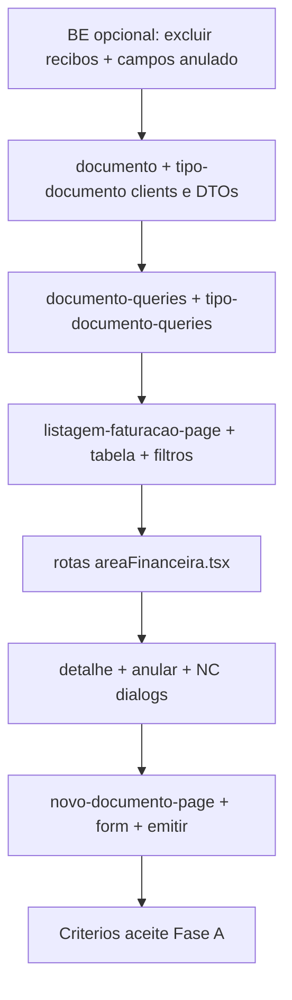

# Plano de Implementacao - Area Financeira (Legado -> Novo)

**Ultima atualizacao:** 2026-05-28

## Objetivo

Migrar a Area Financeira do legado (`CliCloud.ASPcli` + `Dados`) para o projeto novo (`Frontend` + `Backend`), mantendo o padrao de navegacao e os fluxos funcionais do legado, por fases pequenas e com validacao continua.

## Legenda de estado

| Simbolo | Significado |
|---------|-------------|
| ✅ | Concluido |
| 🟡 | Parcial (base feita, falta integrar ou validar) |
| ⏳ | Por fazer |
| 🔧 | Operacional (nao e codigo de feature) |
| ⚠️ | Alteracao recomendada (gap identificado) |

## Regra de execucao

- Implementar por partes, sem "big bang".
- Cada subfase so avanca com:
  - validacao visual (sidebar + header + navegacao),
  - validacao tecnica (lint/build),
  - validacao funcional minima.

---

## Resumo executivo

| Fase | Backend | Frontend | Notas |
|------|---------|----------|-------|
| **Infra / geral** | 🟡 | 🟡 | Migration `F02` e smoke test API pendentes |
| **Fase A** — Faturacao > Faturacao | ✅ + ⚠️ ajustes UI | ⏳ | BE core fechado; ver blueprint abaixo |
| **Fases B–F** | ⏳ | ⏳ | Fora do escopo imediato |

---

# Blueprint Fase A — O que implementar / alterar

Referencia de padrao FE: listagem de recibos em `pages/area-financeira/recibos/` (copiar estrutura, **nao** reutilizar como ecrã de Faturacao).

`idFuncionalidade` sugerido nas chamadas API: `'documentos'` (igual aos recibos).

---

## 1. Backend — ja feito (nao reimplementar)

| Componente | Caminho | Endpoints |
|------------|---------|-----------|
| Documento CRUD + listagem | `Backend/.../DocumentoService/` | `GET/POST /client/documentos/Documento`, `.../paginated`, `.../all`, `/{id}` |
| Emissao / anulacao / NC | `Backend/.../DocumentoEmissaoService/` | `POST .../emitir`, `.../anular/{id}`, `.../nota-credito` |
| Recibos (outro ecrã) | `Backend/.../ReciboService/` | `GET/POST /client/documentos/Recibo/...` |
| Tipos documento | `Backend/.../TipoDocumentoService/` | `GET /client/documentos/TipoDocumento/light`, etc. |
| Transacoes | `ITransactionalExecutor` + `TransactionalExecutor` | |
| Scope clinica | Specs `*Clinica*`, `ICurrentClinicaService` | |

### Operacional backend

| Item | Estado | Comando / acao |
|------|--------|----------------|
| Migration `F02_TipoDocumento_ClinicaScope` | 🔧 | `dotnet ef database update --project Backend/CliCloud.Infrastructure --startup-project Backend/CliCloud.WebApi` |
| Smoke test API | 🔧 | Emitir → listar → anular → NC numa clinica com tipos doc |

---

## 2. Backend — alteracoes recomendadas para a Fase A (UI)

Nao bloqueiam o arranque do FE, mas evitam bugs na listagem e no detalhe.

### 2.1 Excluir recibos da listagem de documentos ⚠️

**Problema:** Com TPT (`Documento` + `Recibo`), linhas de recibo existem na tabela `Documento`. `DocumentoSearchTable` devolve **tambem recibos**, o que mistura Faturacao com Recibos.

| Acao | Ficheiro | Alteracao |
|------|----------|-----------|
| Filtrar recibos nas specs de listagem | `DocumentoService/Specifications/DocumentoSearchTable.cs` | `Where(d => !EF.Set<Recibo>().Select(r => r.Id).Contains(d.Id))` ou spec dedicada `DocumentoFaturacaoSearchTable` |
| Idem lista simples | `DocumentoService/Specifications/DocumentoSearchList.cs` | Mesmo filtro |

### 2.2 Campos para tabela e detalhe ⚠️

| Acao | Ficheiro | Alteracao |
|------|----------|-----------|
| Coluna estado anulado na grelha | `DocumentoService/DTOs/DocumentoTableDTO.cs` | Adicionar `bool Anulado` (e opcional `EstadoDocumento?`) |
| Detalhe / regras UI (desativar NC se anulado) | `DocumentoService/DTOs/DocumentoDTO.cs` | Adicionar `Anulado`, `MotivoAnulacao`, `DataAnulacao`, `AnoFiscal`, `NumeroExibicao` |
| Linhas no detalhe (opcional Fase A) | Novo `DocumentoLinhaDTO` + include em get | `DocumentoByIdClinicaSpec` com `.Include(x => x.Linhas)` ou endpoint `GET .../detalhe` |
| Filtro grelha "anulado" | `DocumentoSearchTable.cs` | `case "anulado":` → `Query.Where(x => x.Anulado == ...)` |
| AutoMapper | Perfil de mapping Documento (Application) | Mapear novos campos |

### 2.3 Tipos documento no FE (combo)

| Acao | Ficheiro | Notas |
|------|----------|-------|
| Nada obrigatorio | `TipoDocumentoController` | Ja expõe `GET .../light` scoped por clinica |
| Opcional | Filtrar tipos "recibo" no light para Novo Documento | Evitar emitir fatura como tipo RC na UI de faturacao |

---

## 3. Frontend — ficheiros a CRIAR

### 3.1 Camada API / tipos

| Ficheiro | Descricao |
|----------|-----------|
| `Frontend/src/types/dtos/faturacao/documento.dtos.ts` | `DocumentoDTO`, `DocumentoTableDTO`, `DocumentoLightDTO`, `DocumentoTableFilter`, `DocumentoAllFilter` — espelhar BE |
| `Frontend/src/types/dtos/faturacao/tipo-documento.dtos.ts` | `TipoDocumentoLightDTO`, etc. — espelhar BE |
| `Frontend/src/lib/services/faturacao/documento-service/documento-client.ts` | `BASE = '/client/documentos/Documento'` — `getPaginated`, `getById`, `getLight` |
| `Frontend/src/lib/services/faturacao/documento-service/index.ts` | `export const DocumentoService = (idFuncionalidade) => new DocumentoClient(...)` |
| `Frontend/src/lib/services/faturacao/tipo-documento-service/tipo-documento-client.ts` | `BASE = '/client/documentos/TipoDocumento'` — `getLight` para combos |
| `Frontend/src/lib/services/faturacao/tipo-documento-service/index.ts` | Factory do client |

**Ja existem (nao recriar):**

- `types/dtos/faturacao/documento-emissao.dtos.ts`
- `lib/services/faturacao/documento-emissao-service/`
- `pages/area-financeira/documentos/queries/documento-emissao-queries.ts`

### 3.2 Queries React Query

| Ficheiro | Descricao |
|----------|-----------|
| `Frontend/src/pages/area-financeira/faturacao/queries/documento-queries.ts` | `documentoQueryKeys`, `useGetDocumentosPaginated`, `useGetDocumentoById`, `usePrefetchAdjacentDocumentos`, `useInvalidateDocumentosMutation` — copiar padrao de `recibo-queries.ts` |
| `Frontend/src/pages/area-financeira/faturacao/queries/tipo-documento-queries.ts` | `useGetTiposDocumentoLight` para filtros e formulario |

**Alterar / estender:**

| Ficheiro | Descricao |
|----------|-----------|
| `pages/area-financeira/documentos/queries/documento-emissao-queries.ts` | Adicionar `onSuccess` invalidate `documentoQueryKeys` apos emitir/anular/NC |

### 3.3 Listagem Faturacao (`faturacao/faturacao`)

| Ficheiro | Descricao |
|----------|-----------|
| `pages/area-financeira/faturacao/pages/listagem-faturacao-page.tsx` | Shell `AreaComumListagemPageShell` + `usePageData` |
| `pages/area-financeira/faturacao/components/listagem-faturacao-table.tsx` | DataTable (padrao `listagem-recibos-table.tsx`) |
| `pages/area-financeira/faturacao/components/listagem-faturacao-table.columns.tsx` | Colunas: tipo, n. doc, data, cliente, total, liquidado, **anulado** |
| `pages/area-financeira/faturacao/components/listagem-faturacao-filter-controls.tsx` | Filtros: `numeroDocumento`, `data`, `nomeCliente`, `tipodocumentoid`, `estado`, `anulado` (ids = BE `DocumentoSearchTable`) |

### 3.4 Dialogs / acoes na listagem

| Ficheiro | Descricao |
|----------|-----------|
| `pages/area-financeira/faturacao/components/documento-detalhe-dialog.tsx` | `useGetDocumentoById` — campos principais + linhas se BE expuser |
| `pages/area-financeira/faturacao/components/anular-documento-dialog.tsx` | Form: motivo, data; `useAnularDocumentoMutation` |
| `pages/area-financeira/faturacao/components/nota-credito-dialog.tsx` | Form: tipo NC, ano fiscal, motivo, credito total/parcial; `useCriarNotaCreditoMutation` |
| `pages/area-financeira/faturacao/components/faturacao-row-actions.tsx` | (opcional) Ver / Anular / NC com permissoes `useAreaComumEntityListPermissions` |

### 3.5 Novo Documento (`faturacao/novo-documento`)

| Ficheiro | Descricao |
|----------|-----------|
| `pages/area-financeira/faturacao/pages/novo-documento-page.tsx` | Pagina com formulario |
| `pages/area-financeira/faturacao/components/novo-documento-form.tsx` | Campos minimos Fase A (ver secao 5) |
| `pages/area-financeira/faturacao/components/documento-linhas-editor.tsx` | Grid editavel de linhas (`EmitirDocumentoLinhaRequest[]`) |
| `pages/area-financeira/faturacao/hooks/use-novo-documento-form.ts` | (opcional) estado + validacao zod |

**Fora de Fase A (manter para depois):**

- Emissao desde admissao/consulta na UI (BE ja existe; ligar quando houver fluxo clinico na area financeira).

---

## 4. Frontend — ficheiros a ALTERAR

| Ficheiro | Alteracao |
|----------|-----------|
| `Frontend/src/routes/area-financeira/areaFinanceira.tsx` | Substituir `AreaFinanceiraPlaceholderPage` por lazy de `ListagemFaturacaoPage` e `NovoDocumentoPage` nas rotas `faturacao/faturacao` e `faturacao/novo-documento` |
| `Frontend/src/config/menu-items.ts` | ✅ Ja aponta para URLs corretas — sem alteracao obrigatoria |
| `Frontend/src/config/modules/financeiro/area-financeira-module.ts` | ✅ Sem alteracao na Fase A |

**Nao alterar na Fase A:**

- `pages/area-financeira/recibos/*` — manter para uso futuro; nao ligar ao menu Faturacao.
- Rotas placeholder das Fases B–F.

---

## 5. Contratos API (referencia FE ↔ BE)

### Listagem paginada

```
POST /client/documentos/Documento/paginated
Body: { pageNumber, pageSize, filters: [{ id, value }], sorting?: [...] }
```

**Filter `id` suportados hoje no BE** (`DocumentoSearchTable`):

| id | Exemplo value |
|----|----------------|
| `numerodocumento` | `123` |
| `data` | ISO date |
| `nomecliente` | texto |
| `numerocontribuintecliente` | NIF |
| `tipodocumentoid` | guid |
| `utenteid` | guid |
| `organismoid` | guid |
| `estado` | int |
| `liquidado` | `true` / `false` |
| `condicaopagamento` | enum string |
| `anulado` | ⏳ apos alteracao BE 2.2 |

### Detalhe

```
GET /client/documentos/Documento/{id}
```

### Emissao / anulacao / NC

```
POST /client/documentos/DocumentoEmissao/emitir
POST /client/documentos/DocumentoEmissao/anular/{documentoId}
POST /client/documentos/DocumentoEmissao/nota-credito
```

### Tipos documento (combos)

```
GET /client/documentos/TipoDocumento/light?keyword=
```

### Campos minimos — Novo Documento (FE Fase A)

Payload `EmitirDocumentoRequest`:

- Cabecalho: `tipoDocumentoId`, `anoFiscal`, `dataDocumento`, `nomeCliente`, `moradaCliente`, `numeroContribuinteCliente` (opcional)
- Linhas (>=1): `descricao`, `quantidade`, `precoUnitario`, `taxaIvaPercentagem`
- Opcionais: `utenteId`, `organismoId`, `condicaoPagamento`, `tipoModoPagamento`, `dataVencimentoPagamento`

---

## 6. Arvore de pastas sugerida (Fase A FE)

```
Frontend/src/
├── types/dtos/faturacao/
│   ├── documento.dtos.ts                    ⏳ CRIAR
│   ├── tipo-documento.dtos.ts               ⏳ CRIAR
│   ├── documento-emissao.dtos.ts            ✅
│   └── recibo.dtos.ts                       ✅ (outro fluxo)
├── lib/services/faturacao/
│   ├── documento-service/                   ⏳ CRIAR
│   ├── tipo-documento-service/              ⏳ CRIAR
│   ├── documento-emissao-service/           ✅
│   └── recibo-service/                      ✅
└── pages/area-financeira/
    ├── documentos/queries/
    │   └── documento-emissao-queries.ts     🟡 ESTENDER invalidate
    ├── faturacao/                           ⏳ CRIAR pasta
    │   ├── pages/
    │   │   ├── listagem-faturacao-page.tsx
    │   │   └── novo-documento-page.tsx
    │   ├── components/
    │   │   ├── listagem-faturacao-*.tsx
    │   │   ├── documento-detalhe-dialog.tsx
    │   │   ├── anular-documento-dialog.tsx
    │   │   ├── nota-credito-dialog.tsx
    │   │   └── novo-documento-form.tsx (+ linhas)
    │   └── queries/
    │       ├── documento-queries.ts
    │       └── tipo-documento-queries.ts
    └── recibos/                             🟡 manter, nao usar no menu Faturacao
```

---

## 7. Ordem de implementacao (dependencias)



| Passo | BE | FE |
|-------|----|----|
| 1 | ⚠️ Excluir recibos + `Anulado` no DTO/filtro (recomendado) | — |
| 2 | — | DTOs + `documento-service` + `tipo-documento-service` |
| 3 | — | `documento-queries` + ligar rota listagem |
| 4 | — | Tabela + filtros + testar paginated |
| 5 | — | Dialogs detalhe / anular / NC |
| 6 | — | `novo-documento-page` + invalidate apos emitir |
| 7 | 🔧 smoke test | Validar criterios aceite |

---

## Estado atual — Infraestrutura e navegacao (FE)

| Item | Estado | Notas |
|------|--------|-------|
| Modulo `areaFinanceira` | ✅ | `area-financeira-module.ts` |
| Sidebar + header `area-financeira` | ✅ | `menu-items.ts` |
| Rotas Faturacao + placeholders B–F | ✅ | `areaFinanceira.tsx` |
| Header Faturacao sem Recibos | ✅ | |
| Redirect `/recibos` → `/faturacao` | ✅ | |
| Rotas Fase A → paginas reais | ⏳ | Ver secao 4 |

---

## Estado atual — Backend Fase A

**Core:** ✅ fechado | **Ajustes UI (secao 2):** ⚠️ recomendados

Ver tabelas em **secao 1** e **secao 2**.

---

## Estado atual — Frontend Fase A

| Item | Estado |
|------|--------|
| `documento-emissao-service` + queries | ✅ |
| `documento-service` + listagem UI | ⏳ |
| `tipo-documento-service` | ⏳ |
| Paginas `faturacao/faturacao` e `novo-documento` | ⏳ |
| Dialogs anular / NC / detalhe | ⏳ |

---

## Plano por fases (visao geral)

### Fase A — Faturacao > Faturacao

**Backend:** ✅ core + ⚠️ ajustes secao 2  
**Frontend:** ⏳ — blueprint completo nas secoes 3–7

#### Criterios de aceite

- [ ] `Faturacao > Faturacao` → listagem de documentos (sem recibos misturados).
- [ ] `Novo Documento` → emissao com pelo menos uma linha.
- [ ] Detalhe, anular e NC funcionam sem erro de contrato.
- [x] Backend core: listagem, emissao, anulacao, NC, scope clinica.

### Fases B–F

| Fase | Backend | Frontend |
|------|---------|----------|
| B — Ficheiros Eletronicos | ⏳ | ⏳ placeholders |
| C — Credenciais S.N.S. | ⏳ | ⏳ placeholders |
| D — ADSE | ⏳ | ⏳ placeholders |
| E — Mapas | ⏳ | ⏳ placeholders |
| F — Entidades / Tabelas / Emails / MB | ⏳ | ⏳ placeholders |

Detalhe de B–F mantido no legado (`WSMenus.asmx.cs`); abrir apos aceite da Fase A.

---

## Mapeamento legado (fonte de verdade)

- Menu: `CliCloud.ASPcli/Services/WSMenus.asmx.cs` → `case "Faturacao"`
- Dados: `Dados/CliCloud.Dados.Faturacao/TFatura.cs`, `TFaturaLinha.cs`, `TipoDocumento.cs`

---

## Notas de risco

- **TPT:** listagem `Documento` pode incluir recibos até aplicar filtro BE (secao 2.1).
- Nao expor listagem `recibos/` no menu Faturacao.
- `idFuncionalidade: 'documentos'` nas chamadas HTTP.
- Aplicar migration `F02` antes de testar tipos de documento.
- Sem `framer-motion` / `motion.*` (regra do projeto).

---

## Historico de marcos

| Data | Marco |
|------|-------|
| 2026-05-28 | Backend Fase A core fechado |
| 2026-05-28 | Plano atualizado com blueprint BE/FE Fase A (ficheiros + contratos + ordem) |
