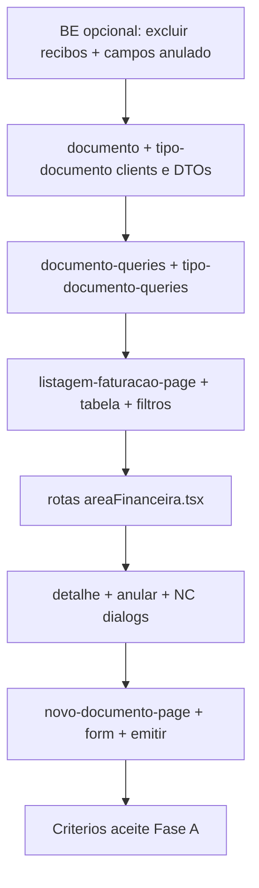

# Plano de Implementacao - Area Financeira (Legado -> Novo)

**Ultima atualizacao:** 2026-06-03

> **Fonte de verdade — Faturação/Faturação:** [`disparidades-faturacao-legado-vs-novo.md`](./disparidades-faturacao-legado-vs-novo.md) (MVP fechado + checklist pós-MVP).  
> **Alinhamento FE (padrões UX):** [`alinhamento-fe-faturacao-legado-vs-novo.md`](./alinhamento-fe-faturacao-legado-vs-novo.md)  
> **Menu completo (~55 ecrãs):** [`auditoria-menu-faturacao-legado-vs-novo.md`](./auditoria-menu-faturacao-legado-vs-novo.md)

## Objetivo

Migrar a Area Financeira do legado (`CliCloud.ASPcli` + `Dados`) para o projeto novo (`Frontend` + `Backend`), mantendo o padrao de navegacao e os fluxos funcionais do legado, por fases pequenas e com validacao continua.

## Legenda de estado

| Simbolo | Significado |
|---------|-------------|
| ✅ | Concluido |
| 🟡 | Parcial (base feita, falta integrar ou validar) |
| ⏳ | Por fazer |
| 🔧 | Operacional (nao e codigo de feature) |
| ⚠️ | Alteracao recomendada (gap identificado) |

## Regra de execucao

- Implementar por partes, sem "big bang".
- Cada subfase so avanca com:
  - validacao visual (sidebar + header + navegacao),
  - validacao tecnica (lint/build),
  - validacao funcional minima.

---

## Resumo executivo

| Fase | Backend | Frontend | Notas |
|------|---------|----------|-------|
| **Infra / geral** | 🟡 | 🟡 | Migrations F01–F09; smoke test contínuo |
| **Fase A** — Faturacao > Faturacao | ✅ MVP | ✅ MVP | Pós-MVP: ver disparidades §4 e §7 |
| **Fases B–H** (menu) | ⏳ | ⏳ placeholders | Auditoria menu |

---

# Blueprint Fase A — O que implementar / alterar

Referencia de padrao FE: listagem de recibos em `pages/area-financeira/recibos/` (copiar estrutura, **nao** reutilizar como ecrã de Faturacao).

`idFuncionalidade` sugerido nas chamadas API: `'documentos'` (igual aos recibos).

---

## 1. Backend — ja feito (nao reimplementar)

| Componente | Caminho | Endpoints |
|------------|---------|-----------|
| Documento CRUD + listagem | `Backend/.../DocumentoService/` | `GET/POST /client/documentos/Documento`, `.../paginated`, `.../all`, `/{id}` |
| Emissao / anulacao / NC | `Backend/.../DocumentoEmissaoService/` | `POST .../emitir`, `.../anular/{id}`, `.../nota-credito` |
| Recibos (outro ecrã) | `Backend/.../ReciboService/` | `GET/POST /client/documentos/Recibo/...` |
| Tipos documento | `Backend/.../TipoDocumentoService/` | `GET /client/documentos/TipoDocumento/light`, etc. |
| Transacoes | `ITransactionalExecutor` + `TransactionalExecutor` | |
| Scope clinica | Specs `*Clinica*`, `ICurrentClinicaService` | |

### Operacional backend

| Item | Estado | Comando / acao |
|------|--------|----------------|
| Migration `F02_TipoDocumento_ClinicaScope` | 🔧 | `dotnet ef database update --project Backend/CliCloud.Infrastructure --startup-project Backend/CliCloud.WebApi` |
| Smoke test API | 🔧 | Emitir → listar → anular → NC numa clinica com tipos doc |

---

## 2. Backend — ajustes Fase A (estado 2026-06-03)

| Item | Estado | Notas |
|------|--------|-------|
| 2.1 Excluir recibos na listagem | ✅ | `DocumentoSearchTable` filtra RC/FR/REC |
| 2.2 `DocumentoTableDTO` (anulado, exibição, totais, origem, ref., admissões) | ✅ | Mapping em `MappingProfiles` |
| 2.2 Filtros `anulado`, `liquidado`, de/até | ✅ | `DocumentoSearchTable` |
| 2.2 Detalhe com linhas | 🟡 | Validar `DocumentoDTO` + includes conforme uso do editor view |
| Pós-MVP | ⏳ | `FaturaGlobalObter`, `Documento.SinistradoId` — disparidades §4 |

### 2.3 Tipos documento no FE (combo)

| Acao | Ficheiro | Notas |
|------|----------|-------|
| Nada obrigatorio | `TipoDocumentoController` | Ja expõe `GET .../light` scoped por clinica |
| Opcional | Filtrar tipos "recibo" no light para Novo Documento | Evitar emitir fatura como tipo RC na UI de faturacao |

---

## 3. Frontend Fase A — inventário (✅ criado — não duplicar)

### 3.1 Camada API / tipos — ✅

- `types/dtos/faturacao/documento.dtos.ts`, `tipo-documento.dtos.ts`, `documento-emissao.dtos.ts`
- `lib/services/faturacao/documento-service/`, `tipo-documento-service/`, `documento-emissao-service/`

### 3.2 Queries — ✅

- `faturacao/queries/documento-queries.ts`, `documento-editor-queries.ts`, `tipo-documento-queries.ts`
- `documentos/queries/documento-emissao-queries.ts` (emitir / anular / NC)

### 3.3 Listagem — ✅

- `listagem-faturacao-page.tsx`, `listagem-faturacao-table.tsx`, `listagem-faturacao-table.colums.tsx`, `listagem-faturacao-filter-controls.tsx`
- Dialogs: `anular-documento-dialog`, `nota-credito-dialog`, `validacao-transporte-dialog`, `detalhes-admissoes-dialog`

### 3.4 Editor — ✅ (fluxo principal)

- `novo-documento-page.tsx` + `SelecionarTipoDocumentoDialog`
- `documento-editor.tsx` + `documento-tab-*.tsx` + `use-documento-editor.ts`
- `documento-edicao-page.tsx` (ver)
- Dialogs: sinistrados, fatura global datas, linha, descontos

### 3.5 Não recriar / legado do plano

| Ficheiro planeado | Situação |
|-------------------|----------|
| `novo-documento-form.tsx` | Existe; **não** é o fluxo principal — usar `documento-editor` |
| `documento-linhas-editor.tsx` | Substituído por `documento-tab-linhas-section` + `documento-linha-modal` |
| `faturacao-row-actions.tsx` | Lógica em `listagem-faturacao-acoes.ts` + ícones na page |

### 3.6 Próximas extensões FE (pós-MVP)

Ver [`disparidades-faturacao-legado-vs-novo.md`](./disparidades-faturacao-legado-vs-novo.md) §7 — ex.: `fatura-global-import-dialog`, corrigir filtro `nomecliente`.

---

## 4. Frontend — rotas (✅ feito)

| Ficheiro | Estado |
|----------|--------|
| `areaFinanceira.tsx` | ✅ `ListagemFaturacaoPage`, `NovoDocumentoPage`, `DocumentoEdicaoPage`, liquidação |
| `menu-items.ts` | ✅ URLs Faturação |
| Placeholders B–H | ⏳ manter até épicos respectivos |

**Nao alterar na Fase A:**

- `pages/area-financeira/recibos/*` — manter para uso futuro; nao ligar ao menu Faturacao.
- Rotas placeholder das Fases B–F.

---

## 5. Contratos API (referencia FE ↔ BE)

### Listagem paginada

```
POST /client/documentos/Documento/paginated
Body: { pageNumber, pageSize, filters: [{ id, value }], sorting?: [...] }
```

**Filter `id` suportados hoje no BE** (`DocumentoSearchTable`):

| id | Exemplo value |
|----|----------------|
| `numerodocumento` | `123` |
| `data` | ISO date |
| `nomecliente` | texto |
| `numerocontribuintecliente` | NIF |
| `tipodocumentoid` | guid |
| `utenteid` | guid |
| `organismoid` | guid |
| `estado` | int |
| `liquidado` | `true` / `false` |
| `condicaopagamento` | enum string |
| `numerodocumento_de` / `_ate` | intervalo |
| `data_de` / `_ate` | intervalo |
| `nomecliente` / `nomecliente_de` / `_ate` | texto / intervalo (FE: 🟡 ver disparidades #2) |
| `anulado` | `true` / `false` |
| `liquidado` | `true` / `false` |

### Detalhe

```
GET /client/documentos/Documento/{id}
```

### Emissao / anulacao / NC

```
POST /client/documentos/DocumentoEmissao/emitir
POST /client/documentos/DocumentoEmissao/anular/{documentoId}
POST /client/documentos/DocumentoEmissao/nota-credito
```

### Tipos documento (combos)

```
GET /client/documentos/TipoDocumento/light?keyword=
```

### Campos minimos — Novo Documento (FE Fase A)

Payload `EmitirDocumentoRequest`:

- Cabecalho: `tipoDocumentoId`, `anoFiscal`, `dataDocumento`, `nomeCliente`, `moradaCliente`, `numeroContribuinteCliente` (opcional)
- Linhas (>=1): `descricao`, `quantidade`, `precoUnitario`, `taxaIvaPercentagem`
- Opcionais: `utenteId`, `organismoId`, `condicaoPagamento`, `tipoModoPagamento`, `dataVencimentoPagamento`

---

## 6. Árvore actual (Fase A — referência)

```
Frontend/src/
├── types/dtos/faturacao/          ✅ documento, tipo-documento, documento-emissao, recibo
├── lib/services/faturacao/        ✅ documento, tipo-documento, documento-emissao, recibo
└── pages/area-financeira/
    ├── documentos/queries/        ✅ documento-emissao-queries
    ├── faturacao/                 ✅ ver disparidades.md §2 (mapa completo)
    │   ├── pages/                 listagem, novo-documento, documento-edicao, liquidacao-*
    │   ├── components/            editor, tabs, dialogs, table
    │   ├── queries/, hooks/, utils/, types/
    └── recibos/                   separado do menu Faturação
```

**Não criar segunda pasta `faturacao/` nem duplicar clients.**

---

## 7. Ordem de implementacao (dependencias)



| Passo | BE | FE |
|-------|----|----|
| 1 | ⚠️ Excluir recibos + `Anulado` no DTO/filtro (recomendado) | — |
| 2 | — | DTOs + `documento-service` + `tipo-documento-service` |
| 3 | — | `documento-queries` + ligar rota listagem |
| 4 | — | Tabela + filtros + testar paginated |
| 5 | — | Dialogs detalhe / anular / NC |
| 6 | — | `novo-documento-page` + invalidate apos emitir |
| 7 | 🔧 smoke test | Validar criterios aceite |

---

## Estado atual — Infraestrutura e navegacao (FE)

| Item | Estado | Notas |
|------|--------|-------|
| Modulo `areaFinanceira` | ✅ | `area-financeira-module.ts` |
| Sidebar + header `area-financeira` | ✅ | `menu-items.ts` |
| Rotas Faturacao + placeholders B–F | ✅ | `areaFinanceira.tsx` |
| Header Faturacao sem Recibos | ✅ | |
| Redirect `/recibos` → `/faturacao` | ✅ | |
| Rotas Fase A → paginas reais | ✅ | listagem, novo, documento, liquidação |

---

## Estado atual — Backend Fase A

**MVP:** ✅ (secção 1 + 2). **Pós-MVP:** disparidades §4.

---

## Estado atual — Frontend Fase A

**MVP:** ✅ listagem, editor, novo documento, ver documento, dialogs, sinistrados.  
**Pós-MVP:** disparidades §4 e §7.

---

## Plano por fases (visao geral)

### Fase A — Faturacao > Faturacao

**Backend:** ✅ MVP  
**Frontend:** ✅ MVP  
**Pós-MVP:** [`disparidades-faturacao-legado-vs-novo.md`](./disparidades-faturacao-legado-vs-novo.md)

#### Criterios de aceite

- [x] `Faturacao > Faturacao` → listagem (sem recibos misturados).
- [x] `Novo Documento` → emissao com linhas (editor).
- [x] Ver documento, anular e NC.
- [x] Backend: listagem, emissao, anulacao, NC, scope clinica.
- [ ] Pós-MVP: `FaturaGlobalObter`, `SinistradoId` no documento, filtro nome de/até (se exigido).

### Fases B–F

| Fase | Backend | Frontend |
|------|---------|----------|
| B — Ficheiros Eletronicos | ⏳ | ⏳ placeholders |
| C — Credenciais S.N.S. | ⏳ | ⏳ placeholders |
| D — ADSE | ⏳ | ⏳ placeholders |
| E — Mapas | ⏳ | ⏳ placeholders |
| F — Entidades / Tabelas / Emails / MB | ⏳ | ⏳ placeholders |

Detalhe de B–F mantido no legado (`WSMenus.asmx.cs`); abrir apos aceite da Fase A.

---

## Mapeamento legado (fonte de verdade)

- Menu: `CliCloud.ASPcli/Services/WSMenus.asmx.cs` → `case "Faturacao"`
- Dados: `Dados/CliCloud.Dados.Faturacao/TFatura.cs`, `TFaturaLinha.cs`, `TipoDocumento.cs`

---

## Notas de risco

- **TPT:** listagem filtra recibos em `DocumentoSearchTable` (secao 2.1 ✅).
- Nao expor listagem `recibos/` no menu Faturacao.
- `idFuncionalidade: 'documentos'` nas chamadas HTTP.
- Aplicar migration `F02` antes de testar tipos de documento.
- Sem `framer-motion` / `motion.*` (regra do projeto).

---

## Historico de marcos

| Data | Marco |
|------|-------|
| 2026-05-28 | Backend Fase A core fechado |
| 2026-05-28 | Plano atualizado com blueprint BE/FE Fase A (ficheiros + contratos + ordem) |
| 2026-06-03 | Fase A MVP fechado no código; secções 2–3/6 actualizadas; inventário «não duplicar»; link disparidades.md |
