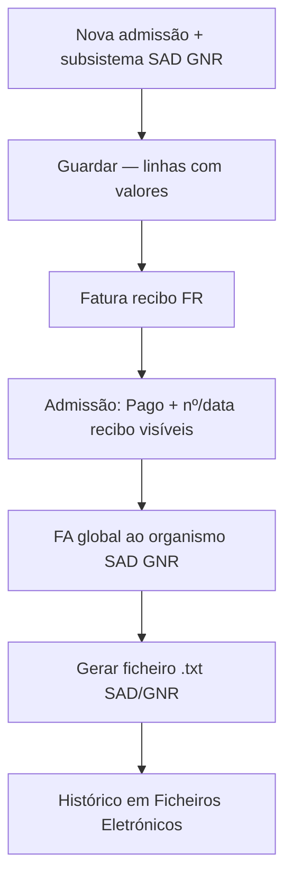

# Plano — Fluxo Admissão → SAD GNR (paridade legado)

**Data:** 2026-06-05  
**Revisão:** 2026-06-05 — Tarefa 1 alinhada ao modelo novo (`DocumentoLightDTO`, helper em Documentos)  
**Âmbito:** Admissões (consultas) + Fatura recibo + FA global SAD GNR + ficheiro `.txt`  
**Princípio:** o fluxo deve ser **semelhante ao legado** (ordem + feedback), **sem** exigir o mesmo ecrã ASP.

**Documentos relacionados:**

| Ficheiro | Papel |
|----------|--------|
| `disparidades-faturacao-legado-vs-novo.md` | Estado geral Faturação / Tfatura |
| `auditoria-area-administrativa-consultas-legado-vs-novo.md` | Admissões / consultas |
| Este ficheiro | **Handoff** para fechar o fluxo SAD GNR ponta a ponta |

**Fonte de verdade legado (obrigatório consultar antes de alterar lógica):**

- `CliCloud.ASPcli/Client/Consultas/AdmissoesEdt.js` — FR, `VG_Pago`, `modFldPagamento_*`
- `CliCloud.ASPcli/Client/Consultas/Services/Admissoes.cs` — `setAdmissaoFaturada`, `UpdateParaPagoFaturacaoCloud`
- `CliCloud.ASPcli/Client/Consultas/FicheiroEletronico.cs` — `criarFicheiroSADGNR`

---

## 1. Objetivo

Garantir que um utilizador do balcão consegue executar, no novo sistema, a mesma sequência mental do legado:



**Critério de sucesso:** mesmo **efeito na base de dados** e **feedback claro** entre passos — não réplica pixel-a-pixel do modal ASP.

---

## 2. O que já está feito (não reimplementar)

### Backend

| Item | Ficheiro / notas |
|------|------------------|
| Flags FR: `Pago=true`, `Faturado=false` | `DocumentoEmissaoAdmissaoFlagsHelper.cs` |
| Emissão desde admissão + sync `Admissao.Pago` | `DocumentoEmissaoService.EmitirDocumentoDesdeAdmissaoAsync` |
| Update admissão **não** altera Pago/Faturado | `AdmissaoAdministrativoService.UpdateAsync` (preserva flags) |
| Totais linha utente/organismo | `AdmissaoServicoValoresHelper.cs` |
| FA global SAD GNR exige `Pago` | `FaturaGlobalObterHelper.cs` + `AdmissoesFaturaGlobalByOrganismoSpec` |
| GET documento para edição/ver | `DocumentoService.GetDocumentoAsync` (entidade + Map) |
| Ficheiro SAD GNR | `FicheiroEletronicoSadGnrHelper.cs`, `FicheiroEletronicoDataHelper.cs` |
| Sync consulta ↔ documento | `AdmissaoFaturacaoPromocaoHelper.cs` → `ConsultaFaturacao` |

### Frontend

| Item | Ficheiro / notas |
|------|------------------|
| Checkbox Pago/Faturado só-leitura (paridade legado) | `admissao-view-edit-modal.tsx` |
| Botão Fatura recibo com `origem=recibo-admissao` | `admissao-view-edit-modal.tsx` |
| Pré-carga FR (utente, linhas, movimentos) | `map-recibo-admissao-precarga.ts`, `novo-documento-page.tsx` |
| `pago: true` no emit FR admissão | `mapEmitirRequestParaOrigem` em `novo-documento-page.tsx` |
| Valores subsistema / isento (V.Org) | `admissao-form-utils.ts` |
| FA global no editor | `documento-fatura-global-dialog.tsx` |
| Ficheiros eletrónicos SAD/GNR | `ficheiros-eletronicos/` + rotas em `ficheiro-eletronico-siglas.ts` |

---

## 3. Lacunas que impedem o fluxo “semelhante ao legado”

### Prioridade P0 — bloqueiam confiança no teste SAD GNR

| # | Lacuna | Legado | Novo hoje | Impacto |
|---|--------|--------|-----------|---------|
| P0.1 | **Nº documento + data recibo** na admissão | `modFldPagamento_NDoc`, `modFldPagamento_Data` preenchidos ao abrir | Campos no form existem mas **nunca são hidratados** (`numDocumento`, `dataRecibo` sempre `''`) | Utilizador não sabe se FR correu |
| P0.2 | **Regresso após emitir FR** | Fica no ecrã admissão com estado actualizado | `novo-documento-page` faz `closeLikeTabBar()` — fecha janela, **sem redirect** à admissão | Fluxo “partido” |
| P0.3 | **Linhas admissão a zero** | Subsistema preenche valores | Operacional: sem subsistema → teste inválido | FR/FA com totais errados |
| P0.4 | **Documento manual** vs FR | `UpdateParaPagoFaturacaoCloud` — fluxo distinto | Abre `novo-documento?admissaoId=` **sem** `origem=recibo-admissao` nem flags explícitas | Pode não marcar `Pago` como esperado |

### Prioridade P1 — paridade operacional (não bloqueia SAD GNR mínimo)

| # | Lacuna | Estado |
|---|--------|--------|
| P1.1 | Reimprimir recibo na admissão | `toast.info('fase 2')` |
| P1.2 | Nota de crédito na admissão | `toast.info('fase 2')` |
| P1.3 | Transferir histórico | `toast.info('fase 2')` |
| P1.4 | Anulação FR → `Pago=false` visível na admissão | BE parcial; FE não refresca recibo |
| P1.5 | Modal FR compacto (pagamento rápido) | Substituído por editor completo — aceitável se P0.1/P0.2 fechados |

### Prioridade P2 — validação E2E / ficheiro

| # | Item |
|---|------|
| P2.1 | Validar totais ficheiro `.txt` vs legado (H2, somas) |
| P2.2 | Reinício backend após deploy de fixes |
| P2.3 | Editar documento FA na listagem (após fix GET) |

---

## 4. Implementação — o que fazer e como

### Princípios de arquitectura (obrigatório na Tarefa 1)

O legado guardava `C_Recibo` / `Datarecib` em `ADMISS`. O projeto novo **normalizou** isso:

| Legado | Modelo novo (fonte de verdade) |
|--------|--------------------------------|
| `C_Recibo`, TFatura | `Documento` + `TipoDocumento` (FR) |
| Ligação admissão ↔ doc | `DocumentoOrigemClinica` |
| Flags na receção | `Admissao.Pago` / `Faturado` + `ConsultaFaturacao` |

**Fazer:**

- **Projeção read-only** no `GET` — mesmo padrão de `utenteNome`, `HydrateUtenteNumeroAsync`, `HydratePagoFaturadoConsultaAsync` (histórico).
- Objeto aninhado `DocumentoLightDTO? ReciboUtente` no `AdmissaoDTO` — reutiliza DTO existente do módulo Documentos.
- Helper de query no módulo **Documentos** (agregado fiscal), consumido por Admissões e Ficheiro Eletrónico.

**Não fazer (poluiria o modelo):**

- Colunas `C_Recibo` / `Datarecib` na entidade `Admissao` ou migration.
- Campos de recibo em `CreateAdmissaoRequest` / `UpdateAdmissaoRequest`.
- Campos planos com nomes legado (`reciboNumero`, `C_Recibo`) no contrato API.
- Resolver recibo só via `ConsultaFaturacao.DocumentoId` (pode ser **FA**, não FR).
- Duplicar a query que já existe em `FicheiroEletronicoDataHelper.ObterDocumentoUtentePorAdmissaoAsync` — **extrair** para helper partilhado.

---

### Tarefa 1 — P0.1: Expor recibo na admissão (BE)

**Objetivo:** `GET admissão/{id}` devolver o FR utente ligado à admissão — equivalente funcional a `modFldPagamento_NDoc` + `modFldPagamento_Data` do legado, **sem** reintroduzir campos fiscais na entidade `Admissao`.

#### Passo 1.1 — Helper partilhado (módulo Documentos)

**Criar** (extrair lógica existente):

```
Backend/CliCloud.Application/Services/Documentos/DocumentoService/DocumentoReciboUtentePorAdmissaoHelper.cs
```

Responsabilidade: dado `admissaoId`, devolver o `Documento?` do **último FR utente emitido e não anulado**.

**Fonte primária (dados novos — suficiente na Fase 1):**

1. `DocumentoOrigemClinicaByAdmissaoIdSpec` (já existe em `DocumentoEmissaoService/Specifications/`)
2. Filtrar com `DocumentoEmissaoAdmissaoFlagsHelper.IsFaturaRecibo(tipo)`
3. Excluir `Anulado`; exigir `EstadoDocumento.Emitido`
4. Ordenar por `Data` / `DataSistemaRegisto` → mais recente

A emissão FR já cria `DocumentoOrigemClinica` via `DocumentoEmissaoClinicaSyncHelper`.

**Fase 2 (só se UAT falhar com BD migrada):** reutilizar os fallbacks já implementados em `FicheiroEletronicoDataHelper.ObterDocumentoUtentePorAdmissaoAsync` (`ConsultaFaturacao`, `DocumentoLinhasReciboUtentePorAdmissaoSpec`). Refactor: Ficheiro Eletrónico passa a chamar o mesmo helper — **uma única fonte de verdade**.

**Regra de negócio:** se existir FA global, o recibo mostrado na admissão continua a ser o **FR utente** (legado: `modFldPagamento` ≠ fatura organismo).

#### Passo 1.2 — DTO aninhado (não campos soltos)

Em `AdmissaoDTO.cs`:

```csharp
using CliCloud.Application.Services.Documentos.DocumentoService.DTOs;

// ...

/// <summary>FR utente ligado à admissão (projeção read-only; legado modFldPagamento_*).</summary>
public DocumentoLightDTO? ReciboUtente { get; set; }
```

**Não** adicionar `ReciboNumero`, `ReciboData`, `ReciboDocumentoId` planos.

#### Passo 1.3 — Hidratação no read path

Em `AdmissaoAdministrativoService.GetByIdAsync`, após `HydrateUtenteNumeroAsync`:

```csharp
Documento? recibo = await DocumentoReciboUtentePorAdmissaoHelper.ObterAsync(_repository, entity.Id);
if (recibo != null)
    dto.ReciboUtente = _mapper.Map<DocumentoLightDTO>(recibo);
```

Opcional: repetir em `GetByConsultaMarcacaoIdAsync`.

**Garantir** mapeamento AutoMapper `Documento` → `DocumentoLightDTO` (ver perfil existente ou mapeamento manual mínimo: `Id`, `NumeroExibicao`, `Data`, `TipoDocumentoAbreviatura`).

**Ficheiros a tocar:**

```
Backend/.../DocumentoService/DocumentoReciboUtentePorAdmissaoHelper.cs          (novo)
Backend/.../DocumentoService/DTOs/DocumentoLightDTO.cs                        (já existe — reutilizar)
Backend/.../AdmissaoAdministrativoService/DTOs/AdmissaoDTO.cs
Backend/.../AdmissaoAdministrativoService/AdmissaoAdministrativoService.cs
Backend/.../FicheirosEletronicosService/FicheiroEletronicoDataHelper.cs        (refactor opcional Fase 2)
```

**Critério de aceitação:**

- Após emitir FR, `GET admissão/{id}` devolve `reciboUtente` com `numeroExibicao` e `data`.
- Admissão sem FR: `reciboUtente: null`.
- `Create` / `Update` admissão **ignoram** `reciboUtente` (não existe no request).
- `pago=true` implica `reciboUtente` preenchido (excepto dados migrados incompletos — aí activar Fase 2).

---

### Tarefa 2 — P0.1: Mostrar recibo na admissão (FE)

**Objetivo:** paridade visual com legado nos campos **já existentes** no modal (`numDocumento`, `dataRecibo`).

**Como:**

1. Em `Frontend/src/types/dtos/consultas/admissao.dtos.ts`:
   - Importar ou espelhar `DocumentoLightDTO` (ou tipo mínimo `{ id, numeroExibicao?, data?, tipoDocumentoAbreviatura? }`)
   - Adicionar `reciboUtente?: DocumentoLightDTO | null` ao `AdmissaoDTO`
   - **Não** incluir `reciboUtente` em `CreateAdmissaoRequest` / `UpdateAdmissaoRequest`

2. Em `admissao-form-utils.ts` → `mapDtoToForm`:

```typescript
numDocumento: dto.reciboUtente?.numeroExibicao ?? '',
dataRecibo: dto.reciboUtente?.data
  ? formatDatePt(dto.reciboUtente.data)  // usar helper de data do projeto
  : '',
```

3. Opcional: link “Ver recibo” se `dto.reciboUtente?.id` → rota ver documento (`mode=view`).

**Ficheiros:**

```
Frontend/src/types/dtos/consultas/admissao.dtos.ts
Frontend/src/pages/area-administrativa/consultas/admissoes/modals/admissao-form-utils.ts
Frontend/src/pages/area-administrativa/consultas/admissoes/modals/admissao-view-edit-modal.tsx  (link opcional)
```

**Critério de aceitação:** reabrir admissão após FR mostra nº e data como no legado; payload de guardar admissão não envia dados de recibo.

---

### Tarefa 3 — P0.2: Fechar ciclo após emitir FR

**Objetivo:** fluxo semelhante — emitir FR → voltar à admissão com dados frescos.

**Como:**

1. Em `novo-documento-page.tsx`, no `handleSubmit` quando `modoReciboAdmissao && admissaoId`:
   - Em vez de só `closeLikeTabBar()`, navegar para:
     ```
     /area-administrativa/consultas/admissoes?editar={admissaoId}&fr=ok
     ```
     (ajustar à rota real do projeto — ver router de admissões)
   - Toast: `Recibo emitido. Admissão marcada como paga.`

2. Na listagem/modal admissões:
   - Se query `fr=ok`, invalidar query `admissao` e abrir modal edit com refresh
   - Limpar query param após abrir

3. Se admissão aberta em **janela separada** (`window-utils`): passar `returnUrl` no navigate para FR:
   ```
   novo-documento?admissaoId=...&origem=recibo-admissao&returnUrl=...
   ```

**Ficheiros:**

```
Frontend/src/pages/area-financeira/faturacao/pages/novo-documento-page.tsx
Frontend/src/pages/area-administrativa/consultas/admissoes/  (listagem ou page que abre modal)
```

**Critério de aceitação:** utilizador não fica “perdido” na faturação; vê admissão com Pago + recibo após emitir.

---

### Tarefa 4 — P0.4: Alinhar Documento manual

**Objetivo:** não confundir com FR; comportamento explícito.

**Opção A (recomendada — mínima):**

- Manter botão “Documento Manual” mas documentar que é emissão **genérica** desde admissão.
- No navigate, usar query dedicada: `origem=documento-manual-admissao`
- Em `mapEmitirRequestParaOrigem`, **não** forçar `pago: true` (só FR faz isso).
- Tooltip no botão: “Associa documento existente / manual — não substitui Fatura recibo.”

**Opção B (paridade legado `UpdateParaPagoFaturacaoCloud`):**

- Endpoint ou flag no emit: associar documento já emitido à admissão e marcar `Pago` sem nova emissão.
- Só implementar se UAT exigir cenário sem FR.

**Ficheiros:**

```
Frontend/src/pages/area-administrativa/consultas/admissoes/modals/admissao-view-edit-modal.tsx
Frontend/src/pages/area-financeira/faturacao/pages/novo-documento-page.tsx
Backend/... (se Opção B)
```

---

### Tarefa 5 — P0.3: Checklist operacional subsistema (sem código obrigatório)

**Antes de cada teste SAD GNR:**

1. Utente com organismo **SAD GNR** activo na aba “Dados do Utente”.
2. Tab “Registo de Serviços” → **Serviços** (subsistema) → adicionar linha.
3. Confirmar na grelha: `Valor Uni` > 0, `V. Org` > 0 (isento: `Val. Utente` = 0, organismo absorve).
4. **Guardar** admissão.
5. Só então **Fatura recibo**.

Se linha tudo a **0**: não é bug de FR — falta subsistema ou organismo não seleccionado.

---

### Tarefa 6 — FA global + ficheiro `.txt` (validação)

**Fluxo FE já existente:**

1. Faturação → Novo documento → tipo **FA** (fatura organismo).
2. Cliente = organismo SAD GNR.
3. Toolbar → **Fatura global** → intervalo datas + organismo + utente (se aplicável).
4. Emitir FA.
5. Ficheiros Eletrónicos → SAD/GNR → seleccionar FA → gerar `.txt`.

**Verificar no BE:**

- `FaturaGlobalObterHelper`: admissões com `Pago=true`, `Faturado!=true`.
- `FicheiroEletronicoSadGnrHelper`: totais vs linhas documento.

**Se falhar “Não existem admissões por faturar”:**

- Admissão sem `Pago` → voltar à Tarefa 3 (FR).
- Admissão já `Faturado=true` → nova admissão ou anular FA incorrecta.

---

## 5. Regras de negócio — referência rápida (não alterar sem rever legado)

| Conceito | Comportamento |
|----------|----------------|
| **Pago** | Indica recibo FR emitido / pagamento registado — **não** editável manualmente na admissão consultas |
| **Faturado** | Indica faturação global ou FA ao organismo — distinto de Pago |
| **FR** | Marca `Pago=true`, `Faturado=false` |
| **FA global** | Marca serviços/admissões como faturados; SAD GNR exige admissão já **Pago** |
| **Guardar admissão** | Nunca sobrescreve `Pago`/`Faturado` |
| **ValorUt = 0** (SAD GNR) | Normal; FR pode ser 0€ utente; organismo fica para FA global |

---

## 6. UAT — roteiro para amanhã (≈ 30–45 min)

### Preparação

- [ ] Backend reiniciado (`dotnet run` com código actual)
- [ ] Frontend dev activo
- [ ] Organismo de teste com `SADGNR = true`
- [ ] Subsistema com serviço e preços configurados

### Passo A — Admissão

- [ ] Nova admissão, utente teste, organismo SAD GNR
- [ ] Subsistema → 1 serviço → valores correctos na grelha
- [ ] Guardar → reabrir → valores persistem

### Passo B — Fatura recibo

- [ ] «Fatura recibo» → editor com título “Fatura recibo — Admissão”
- [ ] Linhas pré-carregadas, cliente = utente
- [ ] Emitir FR com sucesso
- [ ] **(Após Tarefa 3)** regressa à admissão automaticamente
- [ ] **(Após Tarefa 1–2)** `Pago` marcado; API com `reciboUtente` preenchido; modal com nº doc + data recibo

### Passo C — FA global

- [ ] Novo documento FA, organismo SAD GNR
- [ ] Fatura global → intervalo inclui data da admissão
- [ ] Linhas importadas, emitir FA

### Passo D — Ficheiro SAD/GNR

- [ ] Ficheiros Eletrónicos → gerar `.txt`
- [ ] Comparar estrutura/totais com legado (mesmo organismo/período se possível)
- [ ] Registo aparece no histórico

### Registo de resultados (preencher na UAT)

| Passo | OK / FALHA | Notas |
|-------|------------|-------|
| A | | |
| B | | |
| C | | |
| D | | |

---

## 7. Ordem de implementação recomendada

```
1. Tarefa 1.1 — DocumentoReciboUtentePorAdmissaoHelper (Fase 1: DocumentoOrigemClinica)
2. Tarefa 1.2–1.3 — AdmissaoDTO.ReciboUtente + Hydrate em GetByIdAsync
3. Tarefa 2 — FE: reciboUtente → numDocumento / dataRecibo no modal
4. Tarefa 3 — redirect pós-FR
5. UAT A→D
6. Tarefa 1 Fase 2 — consolidar FicheiroEletronicoDataHelper (só se UAT falhar em BD migrada)
7. Tarefa 4 (documento manual) — Opção A
8. Tarefa 6 / P1 — conforme UAT
```

**Estimativa:** P0 Tarefas 1–3 ≈ ½–1 dia; Fase 2 do helper só se necessário.

---

## 8. O que NÃO fazer nesta fase

- Não tornar checkbox **Pago** editável — foge do legado consultas.
- Não usar `framer-motion` / `motion.*` (regra do projeto).
- Não alterar `UpdateAsync` para aceitar `Pago` no payload de admissão.
- Não duplicar lógica de totais — usar `AdmissaoServicoValoresHelper` e `admissao-form-utils`.
- Não implementar modal FR ASP — editor completo é aceitável com redirect + feedback.
- **Não** adicionar `C_Recibo` / `Datarecib` à entidade `Admissao` nem migration.
- **Não** expor recibo como campos planos no DTO — usar `DocumentoLightDTO? ReciboUtente`.
- **Não** copiar query para `AdmissaoAdministrativoService` — extrair para `DocumentoReciboUtentePorAdmissaoHelper`.
- **Não** incluir `reciboUtente` em requests de create/update admissão.

---

## 9. Mapa de ficheiros (referência)

### Admissões

| Ficheiro | Função |
|----------|--------|
| `Frontend/.../admissoes/modals/admissao-view-edit-modal.tsx` | UI admissão, botões FR/manual |
| `Frontend/.../admissoes/modals/admissao-form-utils.ts` | Form state, subsistema, payload |
| `Frontend/.../admissoes/components/listagem-admissoes-table.columns.tsx` | Coluna Pago (readonly) |
| `Backend/.../AdmissaoAdministrativoService.cs` | CRUD, preserva Pago/Faturado |

### Faturação / FR

| Ficheiro | Função |
|----------|--------|
| `Frontend/.../faturacao/pages/novo-documento-page.tsx` | Emissão, pré-carga FR, redirect |
| `Frontend/.../faturacao/utils/map-recibo-admissao-precarga.ts` | Pré-carga admissão → editor |
| `Backend/.../DocumentoEmissaoService.cs` | `EmitirDocumentoDesdeAdmissaoAsync` |
| `Backend/.../DocumentoEmissaoAdmissaoFlagsHelper.cs` | Flags FR |
| `Backend/.../DocumentoService/DocumentoReciboUtentePorAdmissaoHelper.cs` | **Novo** — FR utente por admissão (Tarefa 1) |
| `Backend/.../DocumentoService/DTOs/DocumentoLightDTO.cs` | DTO reutilizado em `AdmissaoDTO.ReciboUtente` |
| `Backend/.../DocumentoOrigemClinicaByAdmissaoIdSpec.cs` | Ligação admissão ↔ documento |
| `Backend/.../FicheiroEletronicoDataHelper.cs` | Lógica a consolidar no helper (Fase 2) |

### SAD GNR

| Ficheiro | Função |
|----------|--------|
| `Backend/.../FaturaGlobalObterHelper.cs` | FA global, exige Pago |
| `Backend/.../FicheiroEletronicoSadGnrHelper.cs` | Geração `.txt` |
| `Frontend/.../ficheiros-eletronicos/` | UI histórico + download |

---

## 10. Estado ao fechar este plano

| Área | Estado |
|------|--------|
| Lógica BE núcleo SAD GNR | ✅ Alinhada |
| Pré-carga FR | ✅ Feita |
| Feedback recibo na admissão (`ReciboUtente`) | ❌ Pendente (P0.1) |
| Redirect pós-FR | ❌ Pendente (P0.2) |
| Documento manual | 🟡 Ambíguo (P0.4) |
| UAT E2E completo | ❌ Por executar |

**Próximo passo amanhã:** Tarefa 1 (helper Documentos + `ReciboUtente`) → Tarefa 2 (FE) → Tarefa 3 (redirect) → UAT secção 6.
