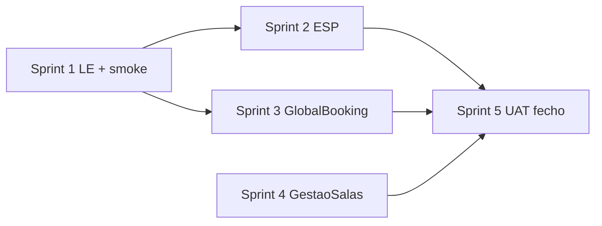

# Plano de implementação — Consultas › Marcações

**Objetivo:** fechar o módulo para produção (5 submenus), alinhado à estrutura nova (REST, Guid, serviços `*-administrativo`).

**Referências:** [`paridade-consultas-marcacoes.md`](./paridade-consultas-marcacoes.md), [`consultas-marcacoes-pendente.md`](./consultas-marcacoes-pendente.md).

**Decisões de negócio:** GlobalBooking na **totalidade**; `GestaoSalas` por clínica; ESP apurado abaixo.

---

## Parte A — Apuramento credenciais ESP

### A.1 O que é «credencial ESP» no legado

Não é um módulo à parte no menu Marcações. É o campo **`Admissao.Credencial`** (texto, até 100 chars no novo) que, quando preenchido, coincide com **`dbo.RequisicoesEsp.NumeroRequisicao`**.

Origem típica da credencial:

| Origem | Legado | Novo |
|--------|--------|------|
| Exames sem papel → marcar consulta | Abre agenda com `numReq` → grava em ADMISS | Deep link `numReq` → `Credencial` na marcação/admissão |
| Ordem entrada / admissões | Campo credencial no registo | `CreateAdmissao` / modal admissão |
| Lista de espera | Campo credencial no Edt | `ListaEsperaConsulta.Credencial` — **sem** sync ESP no legado |

**Conclusão:** ESP aplica-se quando existe **requisição ESP na BD** ligada à credencial da admissão/marcação — não a todas as consultas.

### A.2 Operações legado em `RequisicoesESP` (por fluxo)

| Operação legado | Quando | Efeito |
|-----------------|--------|--------|
| `ObterByName(credencial)` | Sempre que há credencial | Lookup; se não existe, **não faz nada** |
| `UpdateParaAgendado` | Marcar/alterar admissão com credencial (agenda, ordem entrada, `MarcacoesDiarias`) | Estado requisição = **agendada** (data/hora/médico) |
| `UpdateParaCativado` | Desmarcar/anular admissão com credencial | Estado = **cativada** (liberta slot ESP) |
| Bloqueio estado **5** (efetivada) | Tentar cativar ao desmarcar | Erro — não pode anular |
| `UpdateParaRealizado` / data realização | Fecho diário, promover consulta, alguns fechos admissão | Marca exame como realizado |

Comunicação Web Service MSP (agendamento SNS) no legado está **largamente comentada** — não replicar no fecho.

### A.3 O que o projeto novo já tem

| Componente | Função |
|------------|--------|
| `IRequisicaoEspFechoUpdater` / `RequisicaoEspFechoUpdater` | `MarcarRealizadoSeAplicavelAsync` — UPDATE em `dbo.RequisicoesEsp` (estado REAL / data realização) |
| `AdmissaoPromocaoRunner` | Chama ESP ao **promover** admissão → consulta |
| `FechoDiarioAdministrativoService` | Idem no fecho do dia |
| `Admissao.Credencial` | Persistido em marcação, LE, admissão |

### A.4 Lacunas ESP no módulo Marcações (vs legado)

| Fluxo Marcações | Legado | Novo hoje | Necessário para fecho? |
|-----------------|--------|-----------|------------------------|
| **Ordem entrada — anular** | `UpdateParaCativado` + bloqueio efetivada | `AnularOrdemEntradaAsync` **sem** ESP | **Sim** — se usam ESP |
| **Agenda — desmarcar** | `MarcacoesDiarias` → Cativado | `DesmarcarAsync` + sync admissão **sem** ESP | **Sim** |
| **Agenda — criar/editar** com `Credencial` / `numReq` | `UpdateParaAgendado` | Create/update marcação **sem** ESP | **Sim** — fluxo exames→agenda |
| **Admissão — desmarcar** (modal OE/agenda) | `Admissoes` → Cativado | Desmarcar admissão **sem** ESP (verificar endpoint) | **Sim** |
| **Promover / fecho diário** | Realizado | `MarcarRealizadoSeAplicavelAsync` | **Já feito** (fora menu Marcações, mas mesmo domínio) |
| **Lista espera** | Sem ESP | Sem ESP | **Não** |
| **GlobalBooking** | Sem ESP | Sem ESP | **Não** |
| **Troca médicos** | Sem ESP | Sem ESP | **Não** |

### A.5 Decisão ESP para o fecho do módulo Marcações

**Implementar ESP no novo** como serviço transversal de admissão/marcação (não duplicar lógica em cada controller):

1. Estender `IRequisicaoEspFechoUpdater` → renomear conceitualmente para **`IRequisicaoEspSyncService`** com:
   - `MarcarRealizadoSeAplicavelAsync` (existente)
   - `TrySincronizarAgendadoAsync(credencial, data, hora, medicoCodigoLegado ou medicoId)`
   - `TrySincronizarCativadoAsync(credencial)` → retorna erro se efetivada (estado 5)

2. **Invocar** a partir de:
   - `AdmissaoAdministrativoService.AnularOrdemEntradaAsync`
   - `MarcacoesAdministrativoService.DesmarcarAsync` (após sync admissão)
   - `MarcacoesAdministrativoService` Create / Update (quando `Credencial` não vazio)
   - `AdmissaoAdministrativoService` desmarcar admissão (se existir endpoint usado pela OE)

3. **Pré-requisito BD:** tabela `dbo.RequisicoesEsp` (e estados) continua no ambiente — o novo **já assume** isso no `RequisicaoEspFechoUpdater`. Clínicas **sem** ESP: `ObterByName` vazio → no-op (como legado).

4. **Não incluir no fecho Marcações:** WS MSP, `RequisicoesESPLinhas`, relatório ESP — módulo exames/credenciais à parte.

5. **Validação negócio:** confirmar com a clínica se usam **exames sem papel / credenciais ESP** na receção. Se **sim** → ESP é **P0** do Sprint 2 abaixo. Se **não** → manter só `MarcarRealizado` no fecho diário (já feito) e adiar Cativado/Agendado.

---

## Parte B — Plano de implementação (fecho módulo)

### B.0 Já feito (baseline)

- Rotas e permissões 5 submenus
- Agenda: calendário, CRUD, drag, desmarcar, disponibilidade, SMS, CSV, deep links parciais
- Troca médicos: preview + executar
- Ordem entrada: fila, histórico, admissão
- Lista espera: CRUD, converter, obs
- GlobalBooking: API + ecrãs base
- Sync marcação ↔ admissão
- `Clinica.GestaoSalas` na entidade

---

### Sprint 1 — Bloqueadores rápidos (1–2 dias)

| # | Tarefa | Área | Estrutura novo |
|---|--------|------|----------------|
| 1.1 | Passar `utenteId` na query LE | FE `listagem-lista-espera-queries.ts` | 1 linha + filter BE já existe |
| 1.2 | Smoke UAT 5 rotas | QA | Permissões `marcacoes*` |

**Entregável:** LE e Troca/OE/Agenda base validados.

---

### Sprint 2 — Credenciais ESP (2–4 dias) — condicional clínica ESP

| # | Tarefa | BE | FE |
|---|--------|----|----|
| 2.1 | Estender `RequisicaoEspFechoUpdater` → agendado + cativado + erro efetivada | `IRequisicaoEspFechoUpdater.cs`, implementação SQL espelhando legado | — |
| 2.2 | `AnularOrdemEntradaAsync` → `TrySincronizarCativado` | `AdmissaoAdministrativoService` | — |
| 2.3 | `DesmarcarAsync` marcação → cativado se credencial | `MarcacoesAdministrativoService` + `MarcacaoAdmissaoSyncHelper` | — |
| 2.4 | Create/Update marcação com `Credencial` → agendado | `MarcacoesAdministrativoService` (+ médico/data/hora) | — |
| 2.5 | Desmarcar admissão (modal OE) → cativado | `AdmissaoAdministrativoService` desmarcar | — |
| 2.6 | Testes manuais: numReq exames → agenda → desmarcar → estado ESP | — | Fluxo ESP |

**Entregável:** paridade ESP nos fluxos de marcação/desmarcação/ordem entrada.

**Não fazer neste sprint:** WS MSP, linhas MCDT.

---

### Sprint 3 — GlobalBooking totalidade ✅ (fechado 2026-05-20)

Ver [`uat-global-booking-fecho.md`](./uat-global-booking-fecho.md).

### Sprint 3 — GlobalBooking totalidade (referência tarefas)

| # | Tarefa | Prioridade |
|---|--------|------------|
| 3.1 | FE filtros: Estado, Agendado, Recusado, Email pedido/agend., SMS pedido/agend. | P0 |
| 3.2 | Colunas bit na grelha (flags email/SMS) | P1 |
| 3.3 | BE: resolver médico/esp. por `Medico`/`Especialidade` (remover `PedidoConsultaLegacyNamesResolver` dbo) | P0 |
| 3.4 | Script/sync `dbo.PedidosConsulta` → `Consultas.PedidoConsulta` | P0 |
| 3.5 | Modal agendar: horas disponíveis (`obtemHorasDisponivelDoMedico`) — novo endpoint ou reutilizar disponibilidade marcações | P0 |
| 3.6 | UAT: marcar, utente, recusar, email/SMS 1–4, download | P0 |
| 3.7 | Imprimir / `CodigoAdmissao` | P2 — confirmar com negócio |

**Entregável:** paridade `PedidosConsultaLst` operacional.

---

### Sprint 4 — Gestão de salas (4–8 dias) — por clínica

Ler `Clinica.GestaoSalas` (serviço clínica atual / contexto).

| # | `GestaoSalas = false` | `GestaoSalas = true` |
|---|----------------------|----------------------|
| 4.1 | Sem alteração (sala opcional) | Campo sala **obrigatório** no modal marcação |
| 4.2 | — | Validação BE create/update: `SalaId` required |
| 4.3 | — | Calendário **por sala** (`calendarioMarcacoesSalaLst` equivalente) |
| 4.4 | — | Exames sem papel: ao agendar, respeitar ramo GestaoSalas (já abre agenda certa no legado) |

**Entregável:** ramo condicional; clínicas sem flag inalteradas.

**Nota:** `associar-sala` pós-marcação integra-se em 4.1 como ação secundária (alterar sala), não substitui 4.3.

---

### Sprint 5 — Fecho e regressão (2–3 dias)

| # | Tarefa |
|---|--------|
| 5.1 | UAT completo checklist § C |
| 5.2 | Documentar clínicas: GB obrigatório; GestaoSalas por flag; ESP confirmado |
| 5.3 | Opcional P2: `CheckVagas` subset, deep link `c_medico` → `resolve-medico-legado` |

---

## Parte C — Critérios de aceitação (go-live Marcações)

### Submenus

- [ ] **Agenda:** marcar, editar, mover, desmarcar; se `GestaoSalas` → sala obrigatória + calendário por sala
- [ ] **Troca médicos:** preview + executar sem erro
- [ ] **Ordem entrada:** fila + desmarcadas; anular com ESP se credencial ESP
- [ ] **Lista espera:** CRUD, converter, **filtro utente**
- [ ] **GlobalBooking:** filtros, dados, agendar com horas, notificações, ficheiro

### ESP (se clínica usa)

- [ ] Marcar com `numReq` → `RequisicoesEsp` agendado
- [ ] Desmarcar/anular com credencial → cativado (ou erro se efetivada)
- [ ] Promover/fecho → realizado (já existente)

### Fora do go-live

- Tabela semanal legado, Crystal, WS MSP, paridade integral `MarcacoesDiarias.cs`

---

## Parte D — Mapa serviços / ficheiros (estrutura nova)

```
Backend/
  Application/Services/Consultas/
    MarcacoesAdministrativoService/     ← Sprint 2 (ESP), 4 (salas), 3 (horas GB?)
    PedidosConsultaAdministrativoService/ ← Sprint 3
    AdmissaoAdministrativoService/       ← Sprint 2 (ESP anular)
    FechoDiarioAdministrativoService/    ← ESP realizado (já)
  Infrastructure/Persistence/Consultas/
    RequisicaoEspFechoUpdater.cs         ← Sprint 2 estender
Frontend/
  pages/area-administrativa/consultas/
    marcacoes/                           ← Sprint 2, 4
    global-booking/                      ← Sprint 3
    lista-espera/                        ← Sprint 1
    ordem-entrada/                       ← Sprint 2 validação
    troca-medicos/                         ← Sprint 5 UAT
```

---

## Parte E — Ordem e dependências



**Paralelizável:** Sprint 3 (GB) e Sprint 4 (salas) em paralelo após Sprint 1.  
**ESP (Sprint 2)** pode correr em paralelo com GB se equipas separadas.

---

## Histórico

| Data | Notas |
|------|-------|
| 2026-05-21 | Plano de fecho + apuramento ESP legado vs novo |
